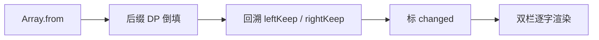

# 字符级 LCS Diff：双栏文本对比高亮的实现

> 场景：左右两栏「修改前 / 修改后」，**标出改过的字**；保存仍用右栏整段原文。  
> **正文以「后缀 DP + 从 `(0,0)` 往右下回溯」为主**（与常见实现一致）；前缀正着填写法见 **§4 参考**，便于对照可视化网站。

- [算法可视化网站](https://alltools.dev/tools/visualizations/lcs-edit-distance-visualizer/?mode=lcs&a=abcd&b=abcffffffd)

## 0、产品上要解决什么

- 左/右对照，**逐字**标出相对另一侧「没对齐上」的字  
- diff 只用于预览；保存不走 `DiffPart[]`，避免算法边界污染数据  

---

## 1、算法叫什么

| 名称 | 含义 |
| --- | --- |
| **子序列** | 按原顺序取字符，**可跳过中间**，不要求连续 |
| **LCS** | 最长公共子序列；长度 = 最多能按顺序对齐多少字 |
| **本文 diff** | 走一条 LCS 路径 → 路径外的下标 `changed: true` |

> 不是 Levenshtein 最小编辑路径，也不是 Myers 行块 diff；短句双栏高亮够用。

---

## 2、整体流程（后缀写法 · 主路径）

```text
left / right
  → Array.from → a、b
  → ① DP（倒填）：dp[i][j] = 后缀 a[i..] 与 b[j..] 的 LCS 长度，答案在 dp[0][0]
  → ② 回溯（从 (0,0) 往 (n,m)）：得到 leftKeep / rightKeep
  → ③ 不在 keep 的下标 → changed: true
  → 按字渲染 <span>
```

```ts
type DiffPart = { value: string; changed: boolean }
```

---

## 3、完整核心代码（后缀 · 主实现）

```ts
type DiffPart = { value: string; changed: boolean }

/**
 * 字符级 LCS diff：左右两栏逐字标「未落在任一 LCS 对齐路径上的字」。
 * 后缀 DP 填表得长度，再从 (0,0) 回溯一条 LCS，不在路径上的下标 changed=true。
 * 仅用于预览高亮；保存仍用 right 原文字符串，不依赖本函数返回值写库。
 */
function buildDiffParts(left: string, right: string) {
  // 按码点拆字（比 split('') 更稳，避免部分 emoji 被拆碎）
  const a = Array.from(left)
  const b = Array.from(right)

  // dp[i][j] = 后缀 a[i..] 与 b[j..] 的 LCS 长度；多一行一列是空后缀边界，值为 0
  const dp = Array.from({ length: a.length + 1 }, () =>
    Array(b.length + 1).fill(0),
  )

  // 倒填：dp[i][j] 依赖 dp[i+1][*] / dp[*][j+1]，须先算「更靠后」的格；整段答案在 dp[0][0]
  for (let i = a.length - 1; i >= 0; i--) {
    for (let j = b.length - 1; j >= 0; j--) {
      dp[i][j] =
        a[i] === b[j]
          ? dp[i + 1][j + 1] + 1 // 相同：成对进入 LCS，长度 +1
          : Math.max(dp[i + 1][j], dp[i][j + 1]) // 不同：丢掉 a[i] 或 b[j] 里 LCS 更长的那条后缀
    }
  }

  // 回溯：沿填表时的转移反走，记下参与本条 LCS 的左右下标
  const leftKeep = new Set<number>()
  const rightKeep = new Set<number>()
  let i = 0
  let j = 0
  while (i < a.length && j < b.length) {
    if (a[i] === b[j]) {
      leftKeep.add(i)
      rightKeep.add(j)
      i++
      j++
    } else if (dp[i + 1][j] >= dp[i][j + 1]) {
      // 与填表 max 同源：最优来自「跳过 a[i]」→ 后缀 i+1
      i++
    } else {
      j++ // 最优来自「跳过 b[j]」
    }
  }
  // 循环结束后未进 keep 的尾部字符（一侧先扫完）自然 changed，无需再处理

  return {
    left: a.map((value, idx) => ({ value, changed: !leftKeep.has(idx) })),
    right: b.map((value, idx) => ({ value, changed: !rightKeep.has(idx) })),
  }
}
```

---

## 3.1 转移方程在说什么（读透第 25 行）

```ts
dp[i][j] = a[i] === b[j]
  ? dp[i + 1][j + 1] + 1
  : Math.max(dp[i + 1][j], dp[i][j + 1])
```

| 分支 | 含义 | 别理解成 |
| --- | --- | --- |
| **相同** | `a[i]`、`b[j]` **可以成对进入 LCS**，长度 = 更短后缀 `dp[i+1][j+1]` **+1** | 「跳过 i、j」——填表是**消费两边**，不是扔掉 |
| **不同** | 这一对不能同时对齐，在「丢掉 `a[i]`」与「丢掉 `b[j]`」里选 **LCS 更长的后缀** | 「数以前有几个相同字」——比的是 **子问题最优长度** |

回溯与填表用**同一套邻居**：

- 相同 → `i++`、`j++`（对应填表时的 `dp[i+1][j+1]`）  
- 不同且 `dp[i+1][j] >= dp[i][j+1]` → `i++`（填表时来自下方）  
- 否则 → `j++`（来自右方）  

`>=` 只在平局时定先丢哪边；LCS 不唯一时高亮可能略不同，预览仍可用。

---

## 3.2 填表与回溯：为什么在表上「方向相反」

表大小 `(n+1)×(m+1)`，**一角是空后缀（base，dp=0），对角是整段（goal，存 LCS 长度）**。

| 阶段 | 后缀写法（本文） | 在表上 |
| --- | --- | --- |
| **填表** | `i,j` 从大到小 | 从 base `(n,m)` **汇总**到 goal `(0,0)` |
| **回溯** | 从 `(0,0)` 出发，`i++`/`j++` | 从 goal **拆回** base `(n,m)` |

不是「for 循环方向必须和回溯相同」，而是：

- **填表** = 小后缀 → 大后缀（依赖已算好的 `dp[i+1][…]`）  
- **回溯** = 大后缀 → 小后缀（查填表时用过的邻居，反着走）

若在前缀表里从 `(0,0)` 仍写 `dp[i+1][j]`、`i++`，读的是**另一套子问题**，会和可视化箭头对不上（见 §4）。

**循环结束**：`i` 或 `j` 先到 `n`/`m` 时 `while` 退出；**未进 keep 的尾部字符**自动 `changed`（例如右侧多插一段）。

---

## 3.3 `Array.from` 与复杂度

- 按码点拆字，优于 `split('')` 处理部分 emoji  
- 时间、空间 O(n·m)；预览短句足够；`useMemo([before, after])` 避免重复填表  

---

## 3.4 手算例一：`left = "abc"`，`right = "axc"`（改一个字）

约定：**行 = left（`a`）**，**列 = right（`b`）**；与下文 §4 前缀表、常见可视化网站行列一致。

```text
left  a:  下标 0   1   2
right b:  下标 0   1   2
LCS 长度 dp[0][0] = 2，例如子序列 "ac"
```

### A. 后缀 DP 表（与 §3 代码同坐标 · 倒填）

`dp[i][j]` = 后缀 `a[i..]` 与 `b[j..]` 的 LCS 长度。行标 `i`、列标 `j`；最右列 / 最下行 `∅` 为空后缀。

```text
              j=0   j=1   j=2   j=∅
              a     x     c    (空)
i=0  a        2     1     1     0    ← 答案 dp[0][0]=2
i=1  b        1     1     1     0
i=2  c        1     1     1     0
i=∅ (空)      0     0     0     0
```

填表顺序（倒填）：从 `i=2,j=2` 往 `i=0,j=0` 推。例：`dp[0][0]` 因 `a===a` → `dp[1][1]+1 = 1+1 = 2`；`dp[0][1]` 因 `a` vs `x` → `max(dp[1][1], dp[0][2]) = 1`。

### B. 前缀 DP 表（对照可视化网站 · 正填）

网站上图表多为这一种：**行/列带 `ε`**，从左上填到右下，答案在 **`dp[3][3]`**（下表行 `c` × 列 `c`）。

```text
              ε     a     x     c
ε             0     0     0     0
a             0     1     1     1
b             0     1     1     1
c             0     1     1     2    ← 答案 = 2
```

**一条常见回溯路径**（从 `(c,c)` 往 `(ε,ε)`，与截图绿线同类）：

```text
(c,c)↖ 匹配 c
  → (b,x)↑  不等时取上（前缀里 dp[i-1][j] 更大）
  → (a,x)←  取左
  → (a,a)↖  匹配 a
  → (ε,ε)
```

得到 LCS 字符串 **`ac`**。箭头含义：**↖ 匹配**、**↑ 丢行字符**、**← 丢列字符**（见 §4.2 与后缀 `i++`/`j++` 的对应关系）。

### C. 后缀代码回溯（`buildDiffParts` 实际走的）

| 步 | i,j | 当前字 | 动作 | leftKeep | rightKeep |
| --- | --- | --- | --- | --- | --- |
| 1 | 0,0 | a=a | 匹配，i++,j++ | {0} | {0} |
| 2 | 1,1 | b≠x | `dp[2][1]=1` ≥ `dp[1][2]=0` → **i++** | {0} | {0} |
| 3 | 2,1 | c≠x | `dp[3][1]=0` < `dp[2][2]=1` → **j++** | {0} | {0} |
| 4 | 2,2 | c=c | 匹配，i++,j++ | {0,2} | {0,2} |
| 5 | 3,3 | 越界 | 结束 | {0,2} | {0,2} |

第 2 步：不能在这里 **j++** 丢掉右边的 `x` 就结束——还需第 3 步 **j++** 扫过 `x`，第 4 步在 `c,c` 对齐。

### D. 转成 `changed`（UI）

| 下标 | 左字符 | 在 leftKeep? | changed | 右字符 | 在 rightKeep? | changed |
| --- | --- | --- | --- | --- | --- | --- |
| 0 | a | 是 | 否 | a | 是 | 否 |
| 1 | b | 否 | **是** | x | 否 | **是** |
| 2 | c | 是 | 否 | c | 是 | 否 |

左栏：`a` + 红 **`b`** + `c`；右栏：`a` + 红 **`x`** + `c`。



---

## 3.5 手算例二：`left = "abcd"`，`right = "abcffffffd"`（中间插入长串）

典型 **「中间多一段、两头仍对齐」**：LCS 为 `abcd`，`dp[0][0] = 4`。

```text
left  a  b  c  d
      0  1  2  3

right a  b  c  f  f  f  f  f  f  f  d
      0  1  2  3  4  5  6  7  8  9  10
```

### A. 后缀 DP 表（节选 · 看关键行）

全表为 `5×12`（含 `∅` 边界）。下面列出 **答案行 `i=0`** 与 **`i=3`（字符 `d`）** 一行，看出「对齐 `d` 前要扫过右侧多个 `f`」。

```text
（列 j：）  0   1   2   3   4   5   6   7   8   9  10  j=∅
           a   b   c   f   f   f   f   f   f   f   d

i=0  a     4   3   3   3   3   3   3   3   3   3   1   0   ← dp[0][0]=4

i=3  d     1   1   1   1   1   1   1   1   1   1   1   0
```

- `dp[0][0]=4`：整段 LCS 即 `abcd`。  
- `dp[3][3]`：`d` 对 `f` 时值为 **1**（后面还能在右串末尾对上一个 `d`）；`dp[4][3]=0`（左已空）< `dp[3][4]=1` → 回溯时必须 **j++**，不能 **i++** 丢掉左边的 `d`。

### B. 前缀 DP 表（答案角）

行 `abcd`、列 `abcffffffd`，答案在 **`dp[4][10]`**（左 `d` × 右 `d`），值也为 **4**（表略，结构与 §3.4-B 相同，规模更大）。

### 预期高亮（直觉）

| 侧 | keep 下标 | changed |
| --- | --- | --- |
| 左 | 0,1,2,3（全串） | 无 |
| 右 | 0,1,2,9（a,b,c,d） | **3～8** 共 7 个 `f` |

右侧中间插入的 `fffffff` 整段标红；两端 `abcd` 与左侧对齐，不标。

### C. 后缀回溯 walkthrough

| 步 | i,j | 比较 | 动作 | leftKeep | rightKeep |
| --- | --- | --- | --- | --- | --- |
| 1 | 0,0 | a=a | 匹配 | {0} | {0} |
| 2 | 1,1 | b=b | 匹配 | {0,1} | {0,1} |
| 3 | 2,2 | c=c | 匹配 | {0,1,2} | {0,1,2} |
| 4 | 3,3 | d≠f | `dp[4][3]=0` < `dp[3][4]=1` → **j++** | {0,1,2,3} | {0,1,2} |
| 5～10 | 3,4…3,8 | d 对 f×6 | 连续 **j++** | 同上 | 同上 |
| 11 | 3,9 | d=d | 匹配 | {0,1,2,3} | {0,1,2,9} |
| 12 | 4,10 | 结束 | — | 最终左全 keep | 右 3～8 不在 keep |

### D. 转成 `changed`

| 侧 | keep 下标 | 高亮（changed）字符 |
| --- | --- | --- |
| 左 | 0,1,2,3 | 无 |
| 右 | 0,1,2,9 | **j=3～8** 共 7 个 `f` |

要点：在 `(3,3)` **不能** `i++` 丢掉左边的 `d`；必须沿右侧 **j++** 扫过 `fffffff`，再在 `j=9` 与左边的 `d` 匹配。

### E. 和「只改一个字」例子的对比

| 例子 | 差异形态 | 高亮大致位置 |
| --- | --- | --- |
| abc / axc | 同长、单点替换 | 中间各 1 字 |
| abcd / abcffffffd | 右侧插入连续重复 | 右侧一段连续红字 |

---

## 3.6 渲染

```tsx
const diff = useMemo(() => buildDiffParts(before, after), [before, after])
// part.changed → 包一层高亮 <span>
```

---

## 4、前缀正填写法（仅作参考 · 对照可视化）

教材、 [LCS 可视化](https://alltools.dev/tools/visualizations/lcs-edit-distance-visualizer/) 多为：**行/列从 ε 到整串，填表 `(0,0)→(n,m)`，回溯 `(n,m)→(0,0)`**。

### 4.1 代码（与后缀等价，勿混用邻居下标）

```ts
/** 前缀版：与 buildDiffParts 输出一致，便于对照网站 DP 表 */
function buildDiffPartsPrefix(left: string, right: string) {
  const a = Array.from(left)
  const b = Array.from(right)
  const n = a.length
  const m = b.length
  const dp = Array.from({ length: n + 1 }, () => Array(m + 1).fill(0))

  for (let i = 1; i <= n; i++) {
    for (let j = 1; j <= m; j++) {
      if (a[i - 1] === b[j - 1]) {
        dp[i][j] = dp[i - 1][j - 1] + 1
      } else {
        dp[i][j] = Math.max(dp[i - 1][j], dp[i][j - 1])
      }
    }
  }

  const leftKeep = new Set<number>()
  const rightKeep = new Set<number>()
  let i = n
  let j = m
  while (i > 0 && j > 0) {
    if (a[i - 1] === b[j - 1]) {
      leftKeep.add(i - 1)
      rightKeep.add(j - 1)
      i--
      j--
    } else if (dp[i - 1][j] >= dp[i][j - 1]) {
      i--
    } else {
      j--
    }
  }

  return {
    left: a.map((value, idx) => ({ value, changed: !leftKeep.has(idx) })),
    right: b.map((value, idx) => ({ value, changed: !rightKeep.has(idx) })),
  }
}
```

### 4.2 后缀 ↔ 前缀 对照（读图用）

| | 后缀（正文主实现） | 前缀（可视化常见） |
| --- | --- | --- |
| `dp[i][j]` | `a[i..]` 与 `b[j..]` | `a[0..i)` 与 `b[0..j)` |
| 答案格 | `dp[0][0]` | `dp[n][m]` |
| 填表方向 | `i,j` ↓ | `i,j` ↑ |
| 回溯起点 | `(0,0)` | `(n,m)` |
| 回溯方向 | `i++, j++` | `i--, j--` |
| 不等时比较 | `dp[i+1][j]` vs `dp[i][j+1]` | `dp[i-1][j]` vs `dp[i][j-1]` |

**数字相同**（如 `abcd` / `abcffffffd` 的 LCS 长度都是 4），但 **在表上走的边相反**。不要在前缀图上用 `dp[i+1][j]` + `i++`。

### 4.3 读图：`abc` × `axc` 与截图的对应

常见截图布局（行 `abc`、列 `axc`）即本节 **§3.4-B 前缀表**：

- 右下角 **`(c,c)=2`** = LCS 长度  
- 绿线回溯：`(c,c)→(b,x)→(a,x)→(a,a)→(ε,ε)` → 子序列 **`ac`**  
- 格子里 **↖** = 字符相同、**↑/←** = 不等时从哪个邻居继承（对应前缀回溯的 `i--` / `j--`）

与 **§3 后缀代码** 的对应（不要混坐标）：

| 截图（前缀回溯） | 后缀 `buildDiffParts` |
| --- | --- |
| 从 `(c,c)` 往 `(ε,ε)`，`i--,j--` | 从 `(0,0)` 往 `(n,m)`，`i++,j++` |
| 不等时 **↑**（看 `dp[i-1][j]`） | 不等且 `dp[i+1][j]` 更大 → **`i++`** |
| 不等时 **←**（看 `dp[i][j-1]`） | 否则 **`j++`** |

在线工具示例：[LCS 可视化](https://alltools.dev/tools/visualizations/lcs-edit-distance-visualizer/)（输入两行字符串，选 LCS 模式，看填表与 Traceback）。

---

## 5、常见困惑（探索笔记）

### 5.1 回溯能否和填表同向？

不能混用。填表是 **base → goal 汇总**；回溯是 **goal → base 拆决策**。同向走会查到「不是当前格依赖的邻居」，数字对不上。

### 5.2 第二步一直 `i++` 然后 while 结束？

后缀 `abc`/`axc`：第二步 `i++` 后还有 `j++` 与匹配，不会一路 `i++` 到底。  
若 **`i` 推到 `n` 就退出**：说明左串已扫完、右串可能还剩字——未进 keep 的右侧尾部会标红；要确认是否用对了前缀/后缀哪套比较。

### 5.3 和可视化箭头

前缀图上的 **↑** ≈ 回溯 `i--` / 看 `dp[i-1][j]`；**←** ≈ `j--`。  
后缀实现里的 **`i++`** 是往表右下（空后缀）走，在前缀图上对应的是 **往回** 的另一侧，不要混。

---

## 6、难度与选型（自评）

| 维度 | 档位 |
| --- | --- |
| LeetCode LCS 长度 | Medium |
| 本文（+ 回溯 + diff UI） | 理解成本中等；代码量仍小 |
| Myers / 行级 patch | 更难，另一赛道 |

短句双栏：**自写 LCS 性价比高**；不必为预览上 Myers。

---

## 7、边界与保存

| 情况 | 行为 |
| --- | --- |
| 完全相同 | 无高亮 |
| 一侧空 | 另一侧全 changed |
| LCS 不唯一 | 高亮可能略异，保存仍用右栏全文 |
| 保存 | **只用 right 字符串**，不用 diff 片段拼接 |

---

## 8、总结

| 步骤 | 记忆 |
| --- | --- |
| DP（后缀） | 相同：`dp[i+1][j+1]+1`；不同：`max` 丢一边 |
| 回溯 | 从 `dp[0][0]` 往 `(n,m)`；相同对角；不同跟 `max` 反查 |
| diff | 不在 keep → `changed` |
| 参考 | 前缀写法见 §4，对照网站；**工程主路径仍用 §3 后缀** |

**一句话**：DP 记「后缀还能对上多长」；回溯沿填表邻居反着走到空；`abcd` vs `abcffffffd` 会把中间插入段标红、两头 `abcd` 对齐不标。
