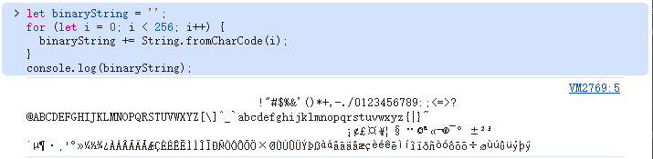

# crypto
## 基本概念
### 对称加密
- Cipher 对称加密
  - cipher 加密 aes/des
  - decipher 解密
- generateKey(type,options,callback) 生成一个key，hmac/aes（不需要数据）
  - type:hmac/aes
  - options
    - length
      - hmac: 8/2的31次方-1
      - aes: 128/192/256
  - callback(err/key)
  ```js
  const crypto = require("crypto");
  crypto.generateKey("hmac", { length: 64 }, (err, key) => {
    console.log('key1',key.export().toString('hex')) // cf300de75defe77c
  });
  crypto.generateKey("aes", { length: 256 }, (err, key) => {
    console.log('key2',key.export().toString('hex')) // c33c897b2809f4d9232d495102f7d3ef0db28c6f3f503b427c87bf2e270b0c7a
  });
  ```
### 非对称加密
- generateKeyPair(type, options, callback) 生成公钥、私钥
  - type:'rsa', 'rsa-pss', 'dsa', 'ec', 'ed25519', 'ed448', 'x25519', 'x448', or 'dh'
  - options
    - modulusLength: number Key size in bits (RSA, DSA) 2048
  - callback
    - err
    - publicKey
    - privateKey
  - 参考：`ssh-keygen -t rsa -b 2048 -C "email@example.com" -f ~/.ssh/id_rsa`
  ```js
  const crypto = require("crypto");
  crypto.generateKeyPair(
    "rsa",
    {
      modulusLength: 2048,
      publicKeyEncoding: {
        type: "spki", // 公钥的标准格式
        format: "pem",
        passphrase: "top secret",
      },
      privateKeyEncoding: {
        type: "pkcs8", // 支持公钥和私钥的新式密钥格式。
        format: "pem",
        // 如果指定，则将使用基于 PKCS#5 v2.0 密码的加密，使用给定的密码和密码对私钥进行加密
        cipher: "aes-256-cbc", // AES-256-CBC是一种对称加密算法
        passphrase: "top secret", // 加密的密码
      },
    },
    (err, publicKey, ) => {
      console.log("publicKey",publicKey)
      console.log("privateKey",privateKey)
    }
  );
  ```
- Base64 编码的公钥被解析为标准化的 KeyObject
  ```js
  const iPublicKey = crypto.createPublicKey({
    key: Buffer.from(base64PublicKey, 'base64'),
    format: 'der', // 二进制
    type: 'spki', // Subject Public Key Info 结构化的密钥对象
  })
  ```
### 对称加密、非对称加密（对比）
- 1、密钥管理：
  - 对称加密（Symmetric Encryption）：
    - 使用同一个密钥进行加密和解密
    - 这意味着通信双方必须事先共享这个密钥，密钥的保密性至关重要。
  - 非对称加密（Asymmetric Encryption）：
    - 使用一对密钥，即公钥（Public Key）和私钥（Private Key）
    - 公钥可以公开给任何人，而私钥必须由密钥的拥有者，发送者使用接收者的公钥加密数据，接收者使用自己的私钥解密数据。
- 2、加密效率：
  - 对称加密： 通常比非对称加密更快，因为它使用的算法更简单，计算量更小
  - 非对称加密： 由于需要进行更复杂的数学运算，加密和解密速度相对较慢。
- 3、安全性：
  - 对称加密： 安全性依赖于密钥的保密性。如果密钥泄露，任何人都能够解密数据。密钥的安全分发是一个挑战。
  - 非对称加密： 由于私钥不需要在网络上传输，因此安全性更高。即使公钥被泄露，也无法解密数据。
- 4、应用场景：
  - 对称加密：
    - 适用于加密大量数据，例如文件加密、数据库加密、内部通信等
    - 常见的对称加密算法包括 AES、DES、3DES
  - 非对称加密：
    - 适用于密钥交换、数字签名、身份验证等
    - 常见的非对称加密算法包括 RSA、Diffie-Hellman 等
- 5、混合加密：
  - 在实际应用中，通常会将对称加密和非对称加密结合使用，以发挥各自的优势
  - 例如，可以使用非对称加密来安全地交换对称密钥，然后使用对称加密来加密大量数据。
  - HTTPS 协议中的 TLS/SSL 握手过程就使用了这种混合加密方式
### 数据摘要 (sha-256)
- 数据摘要
  - 是一种生成数据哈希值的技术，它将任意长度的数据作为输入，使用哈希函数（例如SHA-256）生成一个固定长度的哈希值，通常称为摘要。
  - 由于哈希值具有唯一性和不可逆性，因此可以用于验证数据完整性和身份验证。
  - 作用：数据完整性验证、生成密钥
- createHash(algorithm[,options]) 传同一个值，生成相同的hash值
  - algorithm: gost-mac、md4、md5、md_gost94、ripemd160、sha1、sha224、sha256、sha384、sha512、streebog256、streebog512、whirlpool
    ```js
    const crypto = require("crypto");
    const data = "12345";
    const hash1 = crypto.createHash("sha256");
    const hash2 = crypto.createHash("sha256");
    const hash3 = crypto.createHash("sha256");
    const hash4 = crypto.createHash("sha256");
    // digest(摘要) 参数值有几种格式：'base64' | 'base64url' | 'hex' | 'binary'
    // - 'base64'：Base64编码使用64个字符来表示二进制数据，包括A-Z、a-z、0-9和两个额外字符。
    // - 'base64url'：与Base64编码类似，它将+和/字符替换为-和_
    // - 'hex'：将二进制数据转换为十六进制格式的文本。
    // - 'binary'：直接将二进制数据转换为字符串，不进行编码。这种方式只适用于使用可打印字符的二进制数据。
    const hashValue1 = hash1.update(data).digest("hex").toString();
    const hashValue2 = hash2.update(data).digest("base64").toString();
    const hashValue3 = hash3.update(data).digest("base64url").toString();
    const hashValue4 = hash4.update(data).digest("binary").toString();
    console.log("hex");
    console.log("hashValue1", hashValue1); // 5ec3f2c84cfbbc50fcc4c101c8fd628cde57d1f54163057d7f3e0f6e0a9a1a71
    console.log("base64");
    console.log("hashValue2", hashValue2); // XsPyyEz7vFD8xMEByP1ijN5X0fVBYwV9fz4PbgqaGnE=
    console.log("base64url");
    console.log("hashValue3", hashValue3); // XsPyyEz7vFD8xMEByP1ijN5X0fVBYwV9fz4PbgqaGnE
    console.log("binary");
    console.log("hashValue4", hashValue4); // hashValue4 ^ÃòÈLû¼PüÄÁÈýbÞWÑõAc}>n ␦q
    ```
  - SHA-256 是一种哈希算法，用于生成消息摘要，广泛用于数字签名，以验证数据的来源和完整性
  - HMAC 是一种密钥相关的哈希算法（在传统哈希函数的基础上增加了一个密钥）
    - 它使用密钥和消息作为输入，使用哈希函数（例如SHA-256）进行哈希运算，而生成一个长度固定的消息认证码，用于验证消息的完整性和身份验证。
    - HMAC适用于需要更高安全性的场景，例如网络通信、API安全和数字签名等。
    - HMAC-SHA256是一种基于SHA-256哈希算法和HMAC（Hash-based Message Authentication Code）技术的加密算法
      ```js
      const secretKey = 'secret*****************'; // 密钥
      const message = 'Hello, world!'; // 要加密的消息
      // 将密钥转换为Uint8Array数组
      const secretKeyBytes = new TextEncoder().encode(secretKey);
      // 将消息转换为Uint8Array数组
      const messageBytes = new TextEncoder().encode(message);
      // 使用HMAC-SHA256算法进行加密
      const hmacKey = await window.crypto.subtle.importKey(
        'raw',
        secretKeyBytes,
        { name: 'HMAC', hash: 'SHA-256' },
        true,
        ['sign', 'verify']
      );
      const encryptedBytes = await window.crypto.subtle.sign(
        'HMAC',
        hmacKey,
        messageBytes
      );
      // 将加密后的数据转换为Base64编码的字符串
      const encryptedString = btoa(String.fromCharCode(...new Uint8Array(encryptedBytes))); //'YkGb8v4VsXEEm6SLHV2Q10IEIeiLjWsuVNi3pJdNlEc='
      ```
### 数字签名 (rsa / ECDSA)
- 数字签名
  - 一种用于确保数据完整性和身份验证的技术，
  - 它使用非对称加密算法，例如RSA，将数据的哈希值进行加密，并将其与数据一起传输。
  - 主要作用：加密、解密
- RSA（Rivest–Shamir–Adleman）是一种公钥加密算法
  - RSA算法依赖于公钥和私钥。
  - 公钥是公开的，用于加密消息，而私钥是保密的，用于解密消息。
  - RSA的安全性基于两个大质数的乘积的因数分解的实际困难性，这些质数被用于生成密钥。
### 加密、解密
- 公钥加密 `crypto.publicEncrypt(key, buffer)`
- 私钥解密 `crypto.privateDecrypt(privateKey, buffer)`
  ```js
  // publicKey 和 privateKey 从 generateKeyPair中获得
  const data = "12345";
  console.log("pwd", data);
  // 加密由前端完成（模拟前端加密）
  // 1 hash
  const hash = crypto.createHash("sha256");
  const hashValue = hash.update(data).digest("hex").toString();
    // 有安全漏洞
    // node --security-revert=CVE-2023-46809 ./index.js 恢复使用
    // const padding = crypto.constants.RSA_PKCS1_PADDING;
  const padding = crypto.constants.RSA_OAEP_PADDING;
  // 3 publicEncrypt
  const encryptValue = crypto
    .publicEncrypt(
      {
        key: publicKey, // key 必须是一个标准化的公钥对象（KeyObject）或者 PEM 格式的公钥字符串。
        padding,
      },
      Buffer.from(hashValue, "hex")
    )
    .toString("base64");
  // },Buffer.from(hashValue, 'utf-8')).toString('hex')
  console.log("encryptValue 加密", encryptValue);
  // jv/0aEq67MXs5dkw9HQZf/9Rcv/t5TUATe8ONgh0YBnln1Pme7Sek0aIETQnGwkRbHYiOpKaOB5/5p7xDEHuHfvIm/2AySFc9y0nbl+MNv+1MTPXniifT5V6AN6BLdo6/LEPpZdFu47h5mcQMI+bkumjMOKWV4RwJizJmPNGdPj45RB5PMgF4uFbx+S62DvI3HfoPUB9Hb/n2Q6OspyqvBgYZUnNQLsrnBsjIbLdg0wdh7WsbPpD90I9qJeiO2N1htHBIwdXnk7oIyCTGxn71hMdQDvYSPvvpmC0/w4Cfhlf/UZV81q8EWB9NMKfOS6bcZWWLh7Domc6rFEgeCn5SA==
  // 解密由后端完成
  const decryptValue = crypto
    .privateDecrypt(
      {
        passphrase: "top secret",
        key: privateKey,
        padding,
      },
      Buffer.from(encryptValue, "base64")
    )
    .toString("hex");
  // }, Buffer.from(encryptValue, 'hex')).toString('utf-8');
  console.log("decryptValue 解密", decryptValue);
  // 5994471abb01112afcc18159f6cc74b4f511b99806da59b3caf5a9c173cacfc5
  ```
## crypto 整体思路
- 1、后端生成
  - 生成公钥、私钥
  - 并存储
- 2、前端注册
  - 获取公钥
  - 密码hash（消息摘要）
  - [公钥加密](#前端公钥加密)
  - 传给后端
  - 私钥解密
  - 存储数据库
- 3、前端登录
  - 获取公钥
  - 密码hash
  - [公钥加密](#前端公钥加密)
  - 传给后端
  - 私钥解密
  - 密码是否正确
### 前端公钥加密
- 两种方式：jsencrypt库 / 原生window.crypto.subtle
- 1、jsencrypt 专注于使用RSA算法进行公钥加密
  ```js
  import hashSha256 from "crypto-js/sha256";
  import jsencrypt from "jsencrypt";
  const form = {
    password: "123",
  };
  const publicKey = `-----BEGIN PUBLIC KEY-----
  MIIBIjANBgkqhkiG9w0BAQEFAAOCAQ8AMIIBCgKCAQEAv29TH2Ukhs9RnKHmPrLO
  jwFmvvQCJh7jy6GFQgMoQdh408qcqI43fu09SrdZwmvBYTYImnCWDnpbvJjUAex6
  B2XFgIFxaZ403MhQNomJnmG/5q3dN9Zjucb0jeShkuvYvtEfy5Q2tBv5mC8DxR1G
  WO3/t7cZlI6bkZjvznmUPx2sJC9PzSmqAscn1nrO7zB8SNn2rxFeW+m73XHIgKDj
  PBL3yFHI5xuk2BF18cK5TkGL6sND8eHAE4+gPqoR/RR2QvRBujFU60hHnxxbaawi
  LDI93ShX6uSs/D7E/i6N3vDIKgiWxmmpXHb/Wk2IqyDEmOYxECh1Y75gnw6x0H4A
  kQIDAQAB
  -----END PUBLIC KEY-----`;
  // 2、密码hash
  const hashValue = hashSha256(form.password).toString();
  // 3、公钥加密
  const JSencrypt = new jsencrypt();
  JSencrypt.setPublicKey(publicKey);
  const encryptValue = JSencrypt.encrypt(hashValue);
  console.log(encryptValue);
  ```
- 2、window.crypto.subtle 支持多种加密算法，适用于各种加密需求
  - 处理思路
    - 公钥处理(DER解码过程)：公钥处理为buffer (1,2,3,4)
    - 加密处理：得到一个buffer (5,6)
    - base64处理：将buffer转换为base64(7)
  - 处理过程
    - 1、截取公钥有效部分 `subPem()`
    - 2、将有效部分通过 window.atob() base64 解码为二进制数据 `binaryToBuffer`
    - 3、将二进制数据存储到一个buffer `bufView[i] = str.charCodeAt(i)`
    - 4、window.crypto.subtle.importKey导入buffer 得到 iPublicKey
      ```js
        window.crypto.subtle.importKey("spki", binaryDer, algorithm, true, ["encrypt"]);
        /**
        * 第1个参数
         * format: 用于描述要导入的密钥的数据格式
         * "spki" server端生成的公钥格式为spki，这里即设置为spki，spki全称 SubjectPublicKeyInfo 格式，你可以使用此格式来导入/导出 RSA 和椭圆曲线算法的公钥
         * "pkcs8" server端生成的私钥格式为pkcs8，你可以使用此格式导入或导出 RSA 和椭圆曲线算法的私钥
        * 第2个参数
          * keyData 密钥 (ArrayBuffer、TypedArray、DataView)
        * 第3个参数
          * algorithm 定义了要导入的密钥的类型和特定于算法的额外参数(RsaHashedKeyGenParams)
          * algorithm 定义了要导入的密钥的类型和特定于算法的额外参数(RsaHashedKeyGenParams)
           * name: RSASSA-PKCS1-v1_5 / RSA-PSS / RSA-OAEP
           * modulusLength: 2048/4096
           * publicExponent: new Uint8Array([0x01, 0x00, 0x01])
           * hash: SHA-256 / SHA-384 / SHA-512
        * 第4个参数
          * extractable 是否可能使用 SubtleCrypto.exportKey() 或 SubtleCrypto.wrapKey() 方法来导出密钥
        * 第5个参数
          * keyUsages 一个数组，表示生成出来的密钥可被用于做什么:encrypt 加密 /decrypt 解密 /sign 签名 /verify 验证签名
        */
    - 5、TextEncoder 将密码转为二进制数据，得到一个Uint8Array类型dataBytes
      - 先将密码hash digestMessage
      - `const dataBytes = new TextEncoder().encode("**********")`
    - 6、使用 iPublicKey,dataBytes进行加密，得到一个ArrayBuffer
      - `window.crypto.subtle.encrypt(algorithm,iPublicKey,dataBytes);`
    - 7、base64 处理：对 ArrayBuffer，转为Uint8Array，fromCharCode转换为utf-16,window.btoa()再转为base64
      - `window.btoa(String.fromCharCode(...new Uint8Array(encryptedData)))`
  - 完整代码
    ```js
    // PEM 格式
    // PEM 格式是一种使用 ASCII 编码二进制数据的方法
    // 由头部、尾部和中间 base64 编码 的二进制数据组成
    // ASN.1/DER 格式的二进制表示（ASN.1 是一种描述性语言，DER 是其编码规则）
    // ASN.1 编码常用于公钥或证书的数据格式化，比如 PEM 文件中 BEGIN PUBLIC KEY 和 END PUBLIC KEY 部分的数据。
    const publicKey = `-----BEGIN PUBLIC KEY-----
    MIIBIjANBgkqhkiG9w0BAQEFAAOCAQ8AMIIBCgKCAQEAv29TH2Ukhs9RnKHmPrLO
    jwFmvvQCJh7jy6GFQgMoQdh408qcqI43fu09SrdZwmvBYTYImnCWDnpbvJjUAex6
    B2XFgIFxaZ403MhQNomJnmG/5q3dN9Zjucb0jeShkuvYvtEfy5Q2tBv5mC8DxR1G
    WO3/t7cZlI6bkZjvznmUPx2sJC9PzSmqAscn1nrO7zB8SNn2rxFeW+m73XHIgKDj
    PBL3yFHI5xuk2BF18cK5TkGL6sND8eHAE4+gPqoR/RR2QvRBujFU60hHnxxbaawi
    LDI93ShX6uSs/D7E/i6N3vDIKgiWxmmpXHb/Wk2IqyDEmOYxECh1Y75gnw6x0H4A
    kQIDAQAB
    -----END PUBLIC KEY-----`;
    const algorithm = {
      name: "RSA-OAEP",
      hash: { name: "SHA-256" },
      modulusLength: 2048,
      publicExponent: new Uint8Array([0x01, 0x00, 0x01]),
    };
    const subPem = (pem) => {
    	// 获取 PEM 字符串在头部和尾部之间的部分
      const pemHeader = '-----BEGIN PUBLIC KEY-----'
    	const pemFooter = '-----END PUBLIC KEY-----'
      // 长度 -1 是 因为公钥 的 pemFooter前有空格
    	const pemContents = pem.substring(pemHeader.length, pem.length - pemFooter.length -1 )
      // console.log("pemContents",pemContents)
      return pemContents
    }
    // 将二进制数据到一个buffer
    function binaryToBuffer(str) {
      // 创建一个buffer
      const buf = new ArrayBuffer(str.length) //
      const bufView = new Uint8Array(buf)
      console.log("length",str.length) // 294
      for (let i = 0, strLen = str.length; i < strLen; i++) {
        //二进制数据的十六进制值
        // console.log(str[i])
        // charCodeAt 指定 index 处字符的 UTF-16 代码单元值
        // 得到是一个10进制的数值。存储到Uint8Array中
        //  48 130 1 34
        // console.log(str.charCodeAt(i))
        // 找到对应码位值，并存储到bufView中
        bufView[i] = str.charCodeAt(i)
      }
      return buf
    }
    async function importRsaKey (publicKey){
    	const pemContents = subPem(publicKey)
    	const binaryDerString = window.atob(pemContents)
      console.log("binaryDerString",binaryDerString)
      // 二进制数据的十六进制值
      //'0\x82\x01"0\r\x06\t*\x86H\x86÷\r\x01\x01\x01\x05\x00\x03\x82\x01\x0F\x000\x82\x01\n\x02\x82\x01\x01\x00¿oS\x1Fe$\x86ÏQ\x9C¡æ>²Î\x8F\x01f¾ô\x02&\x1EãË¡\x85B\x03(AØxÓÊ\x9C¨\x8E7~í=J·YÂkÁa6\b\x9Ap\x96\x0Ez[¼\x98Ô\x01ìz\x07eÅ\x80\x81qi\x9E4ÜÈP6\x89\x89\x9Ea¿æ­Ý7Öc¹Æô\x8Dä¡\x92ëؾÑ\x1FË\x946´\x1Bù\x98/\x03Å\x1DFXíÿ··\x19\x94\x8E\x9B\x91\x98ïÎy\x94?\x1D¬$/OÍ)ª\x02Ç\'ÖzÎï0|HÙö¯\x11^[é»ÝqÈ\x80 ã<\x12÷ÈQÈç\x1B¤Ø\x11uñ¹NA\x8BêÃCñáÀ\x13\x8F >ª\x11ý\x14vBôAº1TëHG\x9F\x1C[i¬",2=Ý(Wêä¬ü>Äþ.\x8DÞðÈ*\b\x96Æi©\\vÿZM\x88« Ä\x98æ1\x10(uc¾`\x9F\x0E±Ð~\x00\x91\x02\x03\x01\x00\x01'
      // 从浏览器拷贝
      // 0‚"0	*†H†÷ 
    	const binaryDer = binaryToBuffer(binaryDerString)
    	const iPublicKey = await window.crypto.subtle.importKey('spki', binaryDer, algorithm, true, ['encrypt'])
      return iPublicKey
    }
    async function digestMessage(message) {
      const msgUint8 = new TextEncoder().encode(message); // 编码为（utf-8）Uint8Array
      const hashBuffer = await crypto.subtle.digest("SHA-256", msgUint8); // 计算消息的哈希值
      const hashArray = Array.from(new Uint8Array(hashBuffer)); // 将缓冲区转换为字节数组
      const hashHex = hashArray.map((b) => b.toString(16).padStart(2, "0")).join(""); // 将字节数组转换为十六进制字符串
      return hashHex;
    }
    async function BufferToBase64 (encryptedData){
      // const u = new Uint8Array(encryptedData)
    	// console.log(u) // length 256 [172,241,120,25,...]
    	// console.log(...new Uint8Array(encryptedData))  // 172 172 241 120 25
    	// const str = String.fromCharCode(...new Uint8Array(encryptedData))
    	// console.log(str) // ~SÊw=˜£î&Q¤²Vþ?½¨ôqÈ¢ªt.Þ4ªÌYgO¼b 8›d‹"Cr@£Ä"␏ñàR{ ·Ò2§ð{‹öÓmÜ
    	// const encryptedString = window.btoa(str);
      // console.log(encryptedString)
      const encryptedString = await window.btoa(String.fromCharCode(...new Uint8Array(encryptedData)));
      return encryptedString
    }

    const iPublicKey = await importRsaKey(publicKey)
    const pwd = "********************";
    const digestPwd = await digestMessage(pwd)
    const dataBytes = new TextEncoder().encode(digestPwd);
    const encryptedData = await window.crypto.subtle.encrypt(
      algorithm,
      iPublicKey,
      dataBytes
    );
    const encryptedString = await BufferToBase64(encryptedData)
    ```
### 前端机密公钥2 &I
1、更通用的方案是前端不hash、不加密，前端通过 HTTPS 将密码发送到后端，后端生成盐值并使用强哈希算法（如 bcrypt、Argon2）对密码进行哈希处理。
2、增加前端hash、加密的缺点：
  - 复杂性：减少前端代码的复杂性，降低开发和维护成本
  - 加密：它需要密钥管理（生成、存储、轮换公钥和私钥）、前端加密和后端解密等额外步骤，还有一定的性能开销
    - 安全地分发公钥：通过 HTTPS 安全地获取公钥，并验证公钥的指纹。
    - 保护私钥的安全：使用硬件安全模块 (HSM) 来保护私钥的安全。
    - 定期更新密钥对：定期更新密钥对可以降低密钥泄露的风险。
  - 风险性：前端 JavaScript 代码对用户是可见的，黑客可以分析代码并找到漏洞，例如篡改哈希算法或注入恶意代码，给黑客大规模破解提供便利
  - 前端hash弱点：黑客可以使用彩虹表或字典攻击在离线状态下破解哈希后的密码，尤其是在没有加盐的情况下
3、后端加盐和hash
  - 哈希或加密的主要目的是保护存储在服务器上的密码，防止数据库泄露后密码被破解。它们无法阻止黑客在传输过程中获取数据。
  - 防止大规模破解：如果数据库泄露，黑客获取了大量的哈希密码，但由于每个密码都使用了不同的盐值，黑客无法使用彩虹表或字典攻击批量破解密码。
  - 增加破解难度：即使黑客针对单个哈希密码进行破解，加盐也会增加破解的难度和时间成本。
  - 保护其他用户：如果黑客破解了一个用户的密码，但由于每个用户的密码都使用了不同的盐值，黑客无法使用该密码登录其他用户的账户。
4、最佳方案
  - 保证https，保证传输安全，
  - 使用 POST 请求将密码发送到后端
  - 其他：双因素认证 (2FA)：双因素认证可以提供额外的安全保障。
  - 除了密码之外，用户还需要提供第二种身份验证方式，例如短信验证码、TOTP 令牌或生物识别信息。
总结：
  - HTTPS 解决的是传输安全问题，
  - 后端加盐哈希解决的是存储安全问题，
  - 前端加密或哈希无法同时解决这两个问题，反而可能增加复杂性和风险。
### 加盐 &I
- 加盐
  - 增强密码安全性的技术
  - 指的是在密码进行哈希处理之前，先向密码添加一段随机的数据，这个随机数据被称为“盐”
- 为什么需要加盐？
  - 防止彩虹表攻击: 彩虹表是一种预先计算好的哈希值表，攻击者可以使用它来快速查找密码对应的哈希值。加盐可以防止彩虹表攻击，因为即使两个用户使用相同的密码，由于盐的不同，他们的哈希值也会不同
  - 防止字典攻击: 字典攻击是指攻击者使用常见的密码列表（字典）来尝试破解密码。加盐可以增加字典攻击的难度，因为攻击者需要为每个盐值都生成一个字典
  - 增加破解难度: 加盐增加了破解密码所需的计算量，使得暴力破解更加困难
- 加盐的工作原理
  - 生成盐: 当用户创建账户或更改密码时，系统会生成一个随机的盐值。
  - 组合盐和密码: 将盐值添加到用户的密码中。通常是将盐值附加到密码的开头或结尾
  - 哈希: 使用哈希函数（如 SHA-256、bcrypt 或 Argon2）对组合后的字符串进行哈希处理
  - 存储: 将盐值和哈希后的密码一起存储在数据库中。
  - 验证: 当用户登录时，系统会从数据库中检索盐值，将其添加到用户输入的密码中，然后进行哈希处理。 将计算出的哈希值与数据库中存储的哈希值进行比较，以验证密码是否正确。
### 加密引申概念
- \u
  - \u：表示Unicode码点
  - \u4E00
    - \uXXXX：XXXX 是一个4位的十六进制数，范围是0000到FFFF
  - `\u{1F600}`
    - \u{X}：ES6 的扩展语法，支持超过 4 位的 Unicode 码点（即码点大于 FFFF 的字符）。括号中的 X 是1-6位的十六进制数
    ```js
    // \u4E00 表示汉字“一”（Unicode 码点为 U+4E00）
    "一".charCodeAt(0).toString(16) // 4e00
    console.log("一".charCodeAt(0)) // 19968
    console.log("一".charCodeAt(0).toString(16)) //4e00
    ```
- \x
  - \x 用于表示 单字节字符 的十六进制值（十六进制字节、十六进制转义序列）
  - 范围：从 \x00 到 \xFF 的范围（即 0 到 255 的十进制值）
  - 适合用于表示 ASCII 或扩展 ASCII 范围内的字符（不适用于超出 255 的字符）
  - \u是包含 \x，\x是\u的一个特例，表示Unicode 的前 256 个字符（即 U+0000 到 U+00FF）
  - 从密钥base64解码后，得到是
  - 使用：处理二进制数据
  ```js
  console.log("\x41") // A
  console.log("\u0041") // A
  ```
- 二进制字符串：
  - 二进制数（0 和 1）
  - 在计算机系统中，通常用来表示以 字节 (byte) 为单位的数据
  - 计算机设计约定，计算机最小的数据存储单位是 字节 (byte)，每个字节由 8 位组成。
  - 二进制字符串由单字节数据表示，每个字节包含 8 位，最大值是 2^8 - 1 = 255，最小值是 0，范围是 0–255。
- 单字节字符
  - 单字节字符通常是指可以用一个字节（8位）表示的字符
  - 0–31 是控制字符，32–126 是可打印字符，127 是删除字符，128–255 是扩展字符。
  - ASCII 字符：
    - 7 位编码，表示 128 个字符（0x00 到 0x7F），
    - 前 33 个 ASCII 码位是非打印的控制码，包括回车、换行、制表符以及一些源自电报码的过时的非打印码（控制字符）
    - 32–126（可打印字符）
  - 扩展 ASCII 字符：
    - 使用 8 位（一个字节）表示字符，增加了 128 个额外字符（0x80 到 0xFF）
    - 8 位编码（0–255） 是后来由不同厂商和系统扩展的，不是 ASCII 的官方定义，而是兼容 ASCII 的其他编码方式，
    - ISO 8859-1 (Latin-1)：这是基于 ASCII 的扩展编码，增加了 128–255 范围的字符（例如常见的西欧语言字符，如 é、ä）
    - Windows-1252：微软基于 ISO 8859-1 的扩展，增加了一些符号字符
  ```js
  // 生成二进制字符串的所有值
  let binaryString = '';
  for (let i = 0; i < 256; i++) {
    binaryString += String.fromCharCode(i);
  }
  console.log(binaryString);
  ```
  
- 十六进制数字
  - 0xffff
  - 每个十六进制字符占用 4 位二进制
  - ffff 是 16 位二进制数（1111111111111111）
  ```js
  // 16进制转换为2进制
  const hex = "1f"; // 示例十六进制字符串
  const binary = parseInt(hex, 16).toString(2).padStart(hex.length * 4, '0');
  console.log(binary); // 输出: "00011111"
  ```
  ```js
  function hexToBinary(hex) {
    return hex
      .split('') // 将字符串拆分成单个字符
      .map(char => parseInt(char, 16).toString(2).padStart(4, '0')) // 每个字符转为二进制并补齐 4 位
      .join(''); // 合并为完整二进制字符串
  }
  const hexString = "1fa9";
  console.log(hexToBinary(hexString)); // 输出: "0001111110101001"
  ```
- Uint8Array
  - 范围
    - Uint8Array 的元素要求是一个 整数值（number 类型，范围是 0 到 255）2**8
    - Uint16Array 的元素要求是一个 整数值，范围是 0 到 65535（16 位无符号整数） 2**16
  - 存储前编码选择
    - 无需编码：解码后的二进制字符串（0-255 范围），直接存储每个字符的字节值
      ```js
      const binaryString = '\x49\x50\x51'; // "IPQ" 的二进制表示
      const buffer = new Uint8Array(binaryString.length);
      for (let i = 0; i < binaryString.length; i++) {
        buffer[i] = binaryString.charCodeAt(i); // 直接存储每个字符的字节值
      }
      console.log(buffer); // 输出: Uint8Array(3) [ 73, 80, 81 ]
      ```
    - UTF-8：适合存储小范围字符（ASCII + Unicode 的变长编码）。
      ```js
      const text = "123我和你";
      const utf8Array = new TextEncoder().encode(text); // 使用 UTF-8 编码
      console.log(utf8Array); // Uint8Array(12): 对应每个字符的 UTF-8 字节
      ```
    - UTF-16：适合存储全范围 Unicode 字符（可能占用更多字节）。
  - 当你用 Uint8Array 读取 ArrayBuffer 的数据时，会以十进制的数字表示每个字节的值
- ArrayBuffer
  - 浏览器用于存储原始二进制数据的一种数据结构。它只存储 字节（byte） 的值，范围是 0-255
  - 存储的数据是二进制数据的 16 进制表示
  
- 表示10进制
  - 16进制 Hex 0xffff
  - 10进制 Decimal 65535
  - 8 进制 Octal 0o177777
  - 2进制 Binary 0b1111111111111111
- 浏览器 UTF-8 到 UTF-16
  - 过程
    - `解析和加载数据到内存时完成`
    - 浏览器根据 HTTP 响应头中的 Content-Type 和 charset 指定的编码（如 utf-8），将字节流解码为字符串。
    - 数据从字节流解码为字符串后，浏览器会在内存中存储这些字符串，并将它们表示为 UTF-16 格式
  - 转换
    - UTF-8 是一种变长编码，浏览器需要逐字节解析 UTF-8 字符串，并将其转换为对应的 Unicode 码点（即字符的编号）
    - 再根据 UTF-16 的规则，将这些码点存储为 UTF-16 编码：如果码点小于 0x10000，直接存储为 2 字节，如果码点大于等于 0x10000，将其分为两个代理对存储
    - 这个过程通常是由浏览器底层的 C++ 解码库（如 ICU 或 libiconv）高效完成的
  - 比对
    - UTF-8：互联网传输数据，采用UTF-8 编码，它能以较小的字节数表示常见字符（如 ASCII 字符只占 1 字节），大大减少了网络传输的大小
    - UTF-16：ECMAScript 标准明确规定，JavaScript 字符串的编码方式是 UTF-16，js 的前身是基于 UCS-2（Unicode 的早期版本，固定 2 字节编码），后来扩展为支持代理对的 UTF-16
- UTF-8 / UTF-16
  - utf-16
    - UTF-16 是一种 Unicode 的实现方式，其中：
    - 大多数常见字符（如英文字符、基本的中文字符）可以用 1 个 16 位单元（2 字节） 表示。
    - 更高的 Unicode 字符（如一些 emoji 或特殊符号）需要用 2 个 16 位单元（4 字节） 来表示，称为 代理对（surrogate pair）。
  - uft-8
    - 浏览器的数据传输（如 HTML、JSON、文本文件等）通常是基于 UTF-8 的。
    - 字符的长度根据其码点范围不同，使用 1–4 个字节来表示。
    - 英文字符（ASCII 范围 0–127）只需要 1 个字节。
    - 中文字符（范围较高）通常需要 3 个字节。
    - 特殊符号和 emoji 可能需要 4 个字节。
  - 对比
    - 两者的编码范围相同，均能表示完整的 Unicode 字符集
    - UTF-8 用变长字节来编码，适合存储和传输。
    - UTF-16 用固定长度单元（大多数情况下 2 字节）来表示，适合内存操作。
- base64
  - 解码base64为什么不需要TextEncoder
    - base64编码的密钥，window.atob解码Base64，得到一个二进制形式的字节序列，不需要再次用 TextEncoder 去编码
    - 如果你试图直接对 Base64 解码后的字符串用 TextEncoder，TextEncoder 会将字符串再按照 UTF-8 编码规则 重新编码
    - UTF-8 将文本（字符串）编码成二进制格式以便存储或传输
    - Base64 解码后的数据实际上是二进制的，不需要再次编码成 UTF-8
  - base64原理
    -  8-bit 二进制数据（字节流） 转换成了 6-bit 的字符流，然后再映射到一组 Base64 字符集：A-Z、a-z、0-9、+、/。
    -  将文本形式的数据还原成原始的字节序列，它已经是二进制数据的字符表示。
    -  可以直接被映射为字节序列（Uint8Array）
  - 解码
    - 密钥
      - base64密钥window.atob()解密，得到二进制的字符串
      - 密钥本质上是二进制数据，它可能是随机生成的字节流，没有对应的可读字符表示。在这种情况下，Base64 编码后的字符串可以解码还原为原始的二进制字节流。
      - 但是，Base64 解码后的结果不会是普通字符串，而是一个二进制字符串（即每个字符对应一个字节值，可能不可打印）。
      - 使用charCodeAt是因为二进制字符串中的每个字符实际上代表一个字节的值（范围是 0~255 的整数值）
      - JavaScript 字符串的基础是 UTF-16
    - 普通字符串
      - window.atob(window.btoa("我和你"))得到的是普通字符串（实际上这里是不成功的，window.btoa 最高为 0x7f的码位，255）
      - 这是因为普通字符串本身就是可读的字符序列，Base64 仅仅对其重新编码，而没有改变其本质。
- TextEncoder
  - 实现思路
    - 遍历字符串中的每个字符
    - 如果码点在 U+0000 至 U+007F（ASCII 范围），直接转为单字节。
    - 如果码点在 U+0080 至 U+07FF，用两字节表示。
    - 如果码点在 U+0800 至 U+FFFF，用三字节表示。
    - 如果码点在 U+10000 至 U+10FFFF，用四字节表示。
- 测试案例分析
  - 非 ASCII 字符(大于255)的码位值会被Uint8Array截断
    ```js
    const str = "123我和你"
    const buf = new ArrayBuffer(str.length);
    const bufView = new Uint8Array(buf);
    for (let i = 0, strLen = str.length; i < strLen; i++) {
      /**
        * console.log(str.charCodeAt(i))
        * 非 ASCII 字符（如 "我" 和 "和"），它们的编码值是两个字节的 UTF-16 值,无法直接表示为单字节（Uint8Array），因此会截断
        * ArrayBuffer 的长度是按照字符串长度分配的，而不是字符编码的实际字节数，因此对于非 ASCII 字符（如 "我和你"）多字节 的处理会出现截断
        * 例如：
        * "我".charCodeAt(0) 25105 "我" 的 UTF-16 编码是 0x6211（十进制为 25105）
        * String.fromCharCode("25105") '我'
        * 但 Uint8Array 只能存储单字节值（0-255）
        * new Uint8Array([25105]) => new Uint8Array([17]) 因此只保留了低字节部分 0x11，高字节被丢弃。
        * 使用 str.charCodeAt(i) + Uint8Array 的方式并不适合处理非 ASCII 字符，它会导致截断和错误，尤其是在处理 Unicode 字符串时
       */
      bufView[i] = str.charCodeAt(i);
    }
    console.log("bufView1", bufView);
    // TextEncoder 是专门用于将字符串转换为 Uint8Array 的现代工具，默认使用 UTF-8 编码。
    // UTF-8 是一种变长编码格式，ASCII 字符用单字节表示，非 ASCII 字符用多字节表示，因此可以正确编码字符串中的所有字符。
    console.log("bufView2", new TextEncoder().encode(str));
    ```
  - 打印0-127（单字节） 和 0-128（单字节+1个多字节）结果
    ```js
    // 这里打印是相同的
    function testLengthDiff (length){
      let binaryString = '';
      for (let i = 0; i < length; i++) {
        binaryString += String.fromCharCode(i);
      }
      console.log(binaryString)
      console.log("TextEncoder",new TextEncoder().encode(binaryString))
      const buf = new ArrayBuffer(binaryString.length);
      const bufView = new Uint8Array(buf);
      for (let i = 0;i<binaryString.length;i++){
        bufView[i] = binaryString.charCodeAt(i)
      }
      console.log("bufView",bufView)
    }
    testLengthDiff(128)
    /**
     * 128 (0 - 127)
     * 在 0 - 127 位，TextEncoder 与 bufView 打印相同
     */
    testLengthDiff(129)
    /**
     * 129 (0 - 128)
     * 在 0 - 127 位，TextEncoder 与 bufView 打印相同，
     * 128 位处理发生了变化
     * TextEncoder 结果长度是130，128位 为 194，129位 为 128
     * bufView 结果长度是129，128位 为 128
     * 因为bufView长度是根据binaryString的长度生成的，binaryString长度只有129
     * binaryString 128位 已经不是单字节 是双字节
     * 所以会出现截断
     * 128位 实际应该返回两个字节
     */
    ```
  - utf-8编码 与 utf-16编码  在 0-255 范围内，对多字节的不同处理及返回
    ```js
    function base64ToUint8Array1(base64) {
      const binaryString = window.atob(base64);
      // 将字符串转换为 Uint8Array
      const len = binaryString.length;
      const uint8Array = new Uint8Array(len);
      for (let i = 0; i < len; i++) {
        uint8Array[i] = binaryString.charCodeAt(i);
      }
      return uint8Array;
    }
    function base64ToUint8Array2(base64){
      const binaryString = window.atob(base64);
      return new TextEncoder().encode(binaryString)
    }
    // 示例 Base64 公钥
    const base64PublicKey = "MII"; // 填入你的 Base64 公钥
    const uint8Array1 = base64ToUint8Array1(base64PublicKey);
    const uint8Array2 = base64ToUint8Array2(base64PublicKey);
    console.log(uint8Array1);
    // [48, 130]
    console.log(uint8Array2);
    // [48, 194, 130]
    /**
      * base64解码后的二进制字符串，范围是0-255，超过了0-127，遇到了多字节处理
      * TextEncoder 是 UTF-8编码，会根据字节长度全部回显，
      * 例如：194, 130（第2和第3位）；
      * charCodeAt只返回一个字节，130（第2位）
      * uint8Array1 的长度为 2，因为它直接使用了字符的 Unicode 编码（UTF-16），其中 \x82 被视为一个字符。
      * uint8Array2 的长度为 3，因为它使用 UTF-8 编码，\x82 被编码为两个字节。
      * 因此，您所说的“归根结底是因为底层的 UTF-16 编码规则和 UTF-8 编码规则不同导致的”是正确的。
      * 这两种编码方式在处理字符时的字节长度不同，导致了最终结果的差异。
     */
    ```
