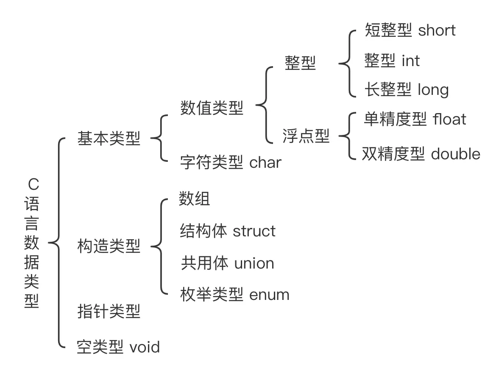

# c 语言
## 基础概念
- 编译 & 编译器
  - 编译器：指的是把源代码转为电脑能理解的二进制码的工具。
  - 这个转换的过程，称为编译。
  - 由编译器编译出来的二进制程序被称为可执行程序，Windows 下的可执行程序：.exe
- 编译器
  - [GCC（GNU C Compiler）](https://gcc.gnu.org/)
     - GNU 是国际著名的自由软件基金会，GNU 是“GNU is Not Unix”（GNU 不是 Unix）
     - Linux 就是“Linux Is Not Unix”（Linux 不是 Unix）
   - MinGW：（Minimalist GNU on Windows）MinGW 就是 GCC 的 Windows 版本，只能编译32位程序，已停更
   - MinGW-W64 GCC：MinGW-w64是MinGW的升级版，编译64位和32位程序 [下载](https://sourceforge.net/projects/mingw-w64/)（目前只能下载源码）
- 基本工具
  - 文本编辑器：Test Editor
  - 编译器：Compiler
  - 调试器：Debugger
- IDE 集成开发环境
  - 集合了这三种工具的功能。这种软件被称为 IDE（Integrated Development Environment）。
  - Clion：跨平台的IDE（JetBrains）收费
  - Code::Blocks ：免费，开源，跨平台的 IDE。（Code::Blocks 的开发环境搭建起来非常快，几乎不需要什么配置。）
  - VScode：跨平台
  - Xcode：mac
## vscode 调试 C语言
- MinGW-W64 编译器安装
  - 之前安装方式，通过sourceforge，直接下载预编译版本exe，
  - 现在sourceforge只有MinGW-W64的源代码，无法下载安装包，
  - 官网建议使用[Pre-built Toolchains](https://www.mingw-w64.org/downloads/)来安装，
  - 针对不同操作系统：Arch Linux、Cygwin、Debian、Fedora、LLVM-MinGW、MacPorts、MinGW-W64-builds、MSYS2、Ubuntu、w64devkit、WinLibs.com等
  - WinLibs.com：直接下载安装包
- 编译测试
```bash
# 编译hello.c，生成一个hello.exe
gcc hello.c -o hello
```
- code runner（vscode 插件）
  - 安装：C代码使用了scanf，需要在终端输入所以需要使能code runner的Run In Terminal功能
  - 编译：右侧会出现一个运行按钮，点击这个运行按钮，就能编译并运行这个C代码
  - settings.json配置
    ```json
    // 支持 *.c 多文件编译
    {
      "code-runner.runInTerminal": true,
      "code-runner.executorMap": {
          "c": "cd $dir && gcc *.c -o $fileNameWithoutExt && $dir$fileNameWithoutExt",
      }
    }
    ```
- vscode 编译 以及 调试
  - 安装 C/C++ for Visual Studio Code 插件
  - 以非调试模式运行（快捷键 ctrl+f5）
  - C++(GDB/LLDB)
  - task.json 配置（编译 c -> *.exe）
    ```json
    {
      "tasks": [
        {
          "type": "cppbuild",
          "label": "C/C++: gcc.exe 生成活动文件",
          "command": "E:\\MinGW\\bin\\gcc.exe",
          "args": [
            "-fdiagnostics-color=always",
            "-g",
            "${fileDirname}/*.c",
            "-o",
            "${fileDirname}\\${fileBasenameNoExtension}.exe"
          ],
          "options": {
            "cwd": "E:\\MinGW\\bin"
          },
          "problemMatcher": [
            "$gcc"
          ],
          "group": {
            "kind": "build",
            "isDefault": true
          },
          "detail": "调试器生成的任务。"
        }
      ],
      "version": "2.0.0"
    }
    ```
  - launch.json（调试c）
    ```json
    {
      // 使用 IntelliSense 了解相关属性
      // 悬停以查看现有属性的描述。
      // 欲了解更多信息，请访问: https://go.microsoft.com/fwlink/?linkid=830387
      "version": "0.2.0",
      "configurations": [
        {
          "name": "C/C++: gcc build and debug active file",
          "type": "cppdbg",
          "request": "launch",
          "program": "${fileDirname}/${fileBasenameNoExtension}.exe", // 可执行文件路径
          "args": [],
          "stopAtEntry": false,
          "cwd": "${workspaceFolder}", // 工作区根目录
          "environment": [],
          "externalConsole": false,
          "MIMode": "gdb",
          "miDebuggerPath": "D:\\Program Files\\mingw64\\bin\\gdb.exe", // 替换为你的 GDB 路径
          "setupCommands": [
              {
                  "description": "Enable pretty-printing for gdb",
                  "text": "-enable-pretty-printing",
                  "ignoreFailures": true
              }
          ],
          "preLaunchTask": "C/C++: gcc build active file" // 确保与 tasks.json 中的 label 匹配
        }
      ]
    }
    ```
- 參考：
  - [一篇带你用VS Code调试C代码](https://www.51cto.com/article/703699.html)
## Code::Blocks
- 程序类型
  - 窗口程序
  - 控制台程序
    - Windows 中它被称为 cmd 命令提示符（Windows 环境下的虚拟 DOS 窗口
    - macOS 操作系统中，我们也可以打开控制台的，只要运行 Terminal
## 内存
- 内存特点
  - 高速但是低容量的存储器
  - 大容量但是低速的存储器
- 内存类型
  - 寄存器（Register）：位于处理器（Processor）上，存取速度非常快
  - 高速缓存（Cache）：用于链接寄存器和内存。
  - 内存（Memory）：这是我们编程时最常打交道的存储器
  - 硬盘（Hard Disk）： Windows 电脑里的 C 盘，D 盘
- 读取
  - 硬盘：读取硬盘大概要耗费 8 毫秒，比较慢，相对电脑的处理速度
  - CPU：1 GHz 对应每秒 10 亿次
  - 内存：基本上只和内存打交道
  - 寄存器和高速缓存：我们基本不关心，这是电脑的事（汇编语言（Assembly，简称 ASM），我们经常会用到寄存器）
## 变量
- 变量名
  - 只能包含英文的大小写字母，数字和下划线（_），其他一律禁止。
  - 必须以字母开头。
- 命名习惯：
  - 变量名都以小写字母开头
  - 如果变量名有好几个单词组成，那么除了第一个单词的首字母小写之外，其他单词的首字母都大写。
- 数据类型
  
- 数字类型
  | 类型名      | 最小值      | 最大值     |
  |-------------|-------------|------------|
  | signed char | -128        | 127        |
  | int         | -32768      | 32767      |
  | long        | -2147483648 | 2147483647 |
  |float|	-1 x 10^37	|1 x 10^37
  |double |-1 x 10^37|	1 x 10^37|
- signed 和 unsigned 的区别
  - signed 最开始有正号或者负号（正数或负数），如 7，-5，9.2，-23.8，等。
  - unsigned 是无符号数，只能是正数或零，如 35，7461，61.789，等。
  - unsigned相比 signed 类型的优势是可以储存两倍于 signed 类型的最大值：例如 signed char 最大值是 127，unsigned char 最大值是 255。
- 通用
  - char，int，long：C语言最初创建多种整数类型的目的是为了节约内存
  - 对于整数，一般用 int
  - 对于浮点数，一般用 double
  ```c
  int numberOfDogs = 7;
  ```
  - 常量
  ```c
  const int NUMBER_OF_DOGS = 7;
  ```
## 变量显示
  | 格式 | 类型   |
  |------|--------|
  | %d   | int    |
  | %ld  | long   |
  | %f   | float  |
  | %f   | double |

  - printf 负责输出

    <<< ./hello.c#printf

  - scanf 负责输入

    <<< ./hello.c#scanf

  - scanf 和 printf 函数还有一点差异：
    - 对于 float 和 double 来说，printf 里面他们的替代符号都是 %f，
    - 但是在 scanf 里面却不一样，float 是 %f，而 double 是 %lf 。
## 运算
- 基础运算
- 变量运算
- 缩写

  <<< ./hello.c#operation

- 数学库
  - fabs 绝对值
  - ceil 向上取整
  - pow 数字乘方
  - sqrt 平方根
  - sin, cos, tan 这三个函数是计算正弦，余弦，正切的值。
  - asin, acos, atan 这三个函数是计算反正弦，反余弦，反正切的值。
  - exp 这个函数是特殊的乘方形式，返回以 e（自然对数的底数，近似等于2.7182）为底数的指数运算的值。
  - log 这个函数返回以 e 为底的对数值（我们学数学时也写成 ln）。
  - log10 这个函数返回以 10 为底的对数值。

    <<< ./hello.c#math

## 条件表达式

| 符号 | 含义     |
|------|--------|
| ==   | 等于     |
| >    | 大于     |
| <    | 小于     |
| >=   | 大于等于 |
| <=   | 小于等于 |
| !=   | 不等于   |

- if else
- switch
- 三元表达式

  <<< ./hello.c#condition

## 循环
- while 循环
- do...while 循环
- for 循环

  <<< ./hello.c#loop

## 函数

- 函数类型：函数返回值的类型。
- 函数名：从给变量命名的规则。
- 函数的参数（对应输入）
- 函数体：大括号规定了函数的起始和结束范围
- 根据函数类型，函数可以分为两类：
  - 返回一个值的函数。这样的函数，我们将其类型定为对应的值的类型（char，int，long，double，等）。
  - 不返回任何值的函数。这样的函数，我们将其类型定为 void（void表示“空的，无效的”）。

## 模块化

- 函数原型：
  - `double rectangleArea(double length, double width);`
  - 把这一整行放置在 main 函数前面。
  - 简写：`double rectangleArea(double, double);`
- 文件类型
  - .h 文件：header file，表示“头文件”，这些文件包含了函数的原型。
  - .c 文件：source file，表示“源文件”，包含了函数本身（定义）。

```c
#include <stdlib.h>
#include <stdio.h>
#include "game.h"
```
- 区别
  - <> 用于引入标准库的头文件。
    - 对于 IDE，这些头文件一般位于 IDE 安装目录的 include 文件夹中；
    - 在 Linux 操作系统下，则一般位于系统的 include 文件夹里。
  - "" 用于引入自定义的头文件。这些头文件位于你自己的项目的目录中。
- 标准库文件
    - 头文件位置：D:\xxx\mingw64\include *.h
    - 库文件或 Library 文件（编译之后的二进制码）：D:\Program Files\mingw64\lib
      - 静态链接库：*.a 或者 *.lib（Visual C++）
      -  动态链接库：.dll 结尾（windows）、.so 结尾（Linux）


## 参考
- [C语言探索之旅](https://www.jianshu.com/nb/4555196)
- 第一部分
  - [C语言探索之旅 | 第一部分第一课：什么是编程？](https://www.jianshu.com/p/7f84ae8c7ef5)
  - [C语言探索之旅 | 第一部分第二课：工欲善其事，必先利其器](https://www.jianshu.com/p/60caadd22c88)
  - [C语言探索之旅 | 第一部分第三课：你的第一个程序](https://www.jianshu.com/p/c73fecacd006)
  - [C语言探索之旅 | 第一部分第四课：变量的世界（一），内存那档事](https://www.jianshu.com/p/e2954324e76d)
  - [C语言探索之旅 | 第一部分第五课：变量的世界（二），变量声明](https://www.jianshu.com/p/8db33987cb49)
  - [C语言探索之旅 | 第一部分第六课：变量的世界（三），显示变量内容](https://www.jianshu.com/p/497355a6ba4d)
  - [C语言探索之旅 | 第一部分第七课：运算那点事](https://www.jianshu.com/p/7bc4493ebb4f)
  - [C语言探索之旅 | 第一部分第八课：条件表达式](https://www.jianshu.com/p/49fdba563d53)
  - [C语言探索之旅 | 第一部分练习题](https://www.jianshu.com/p/3cd80b95092a)
- 第二部分
  - [C语言探索之旅 | 第二部分第一课：模块化编程](https://www.jianshu.com/p/2070cfd368ca)
  - [C语言探索之旅 | 第二部分第二课：进击的指针，C语言的王牌！](https://www.jianshu.com/p/e5e685b67501)
  - [C语言探索之旅 | 第二部分第三课：数组](https://zhuanlan.zhihu.com/p/145294371)
  - [C语言探索之旅 | 第二部分第四课：字符串](https://www.jianshu.com/p/2be7006765ec)
  - [C语言探索之旅 | 第二部分第五课：预处理](https://www.jianshu.com/p/cb83bb7e9141)
  - [C语言探索之旅 | 第二部分第六课：创建你自己的变量类型](https://www.jianshu.com/p/39b41aa5cca7)
  - [C语言探索之旅 | 第二部分第七课：文件读写](https://www.jianshu.com/p/4adb95073745)
  - [C语言探索之旅 | 第二部分第八课：动态分配](https://www.jianshu.com/p/bbce8f04faf1)
  - [C语言探索之旅 | 第二部分第九课：实战"悬挂小人"游戏](https://www.jianshu.com/p/6cbf452666bd)
  - [C语言探索之旅 | 第二部分第十课： 实战"悬挂小人"游戏答案](https://www.jianshu.com/p/b239b1774f4b)
  - [C语言探索之旅 | 第二部分第十一课：练习题和习作](https://www.jianshu.com/p/30d4754ea2b7)
