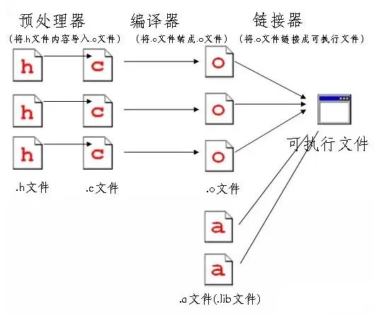

# c 语言
## 1.1 基础概念
- 编译 & 编译器
  - 编译器：指的是把源代码转为电脑能理解的二进制码的工具。
  - 这个转换的过程，称为编译。
  - 由编译器编译出来的二进制程序被称为可执行程序，Windows 下的可执行程序：.exe
- 编译器
  - [GCC（GNU C Compiler）](https://gcc.gnu.org/)
     - GNU 是国际著名的自由软件基金会，GNU 是“GNU is Not Unix”（GNU 不是 Unix）
     - Linux 就是“Linux Is Not Unix”（Linux 不是 Unix）
   - MinGW：（Minimalist GNU on Windows）MinGW 就是 GCC 的 Windows 版本，只能编译32位程序，已停更
   - MinGW-W64 GCC：MinGW-w64是MinGW的升级版，编译64位和32位程序 [下载](https://sourceforge.net/projects/mingw-w64/)（目前只能下载源码）
- 基本工具
  - 文本编辑器：Test Editor
  - 编译器：Compiler
  - 调试器：Debugger
- IDE 集成开发环境
  - 集合了这三种工具的功能。这种软件被称为 IDE（Integrated Development Environment）。
  - Clion：跨平台的IDE（JetBrains）收费
  - Code::Blocks ：免费，开源，跨平台的 IDE。（Code::Blocks 的开发环境搭建起来非常快，几乎不需要什么配置。）
  - VScode：跨平台
  - Xcode：mac
## 1.2 开发工具
### vscode 调试 C语言
- MinGW-W64 编译器安装
  - 之前安装方式，通过sourceforge，直接下载预编译版本exe，
  - 现在sourceforge只有MinGW-W64的源代码，无法下载安装包，
  - 官网建议使用[Pre-built Toolchains](https://www.mingw-w64.org/downloads/)来安装，
  - 针对不同操作系统：Arch Linux、Cygwin、Debian、Fedora、LLVM-MinGW、MacPorts、MinGW-W64-builds、MSYS2、Ubuntu、w64devkit、WinLibs.com等
  - WinLibs.com：直接下载安装包
- 编译测试
```bash
# 编译hello.c，生成一个hello.exe
gcc hello.c -o hello
```
- code runner（vscode 插件）
  - 安装：C代码使用了scanf，需要在终端输入所以需要使能code runner的Run In Terminal功能
  - 编译：右侧会出现一个运行按钮，点击这个运行按钮，就能编译并运行这个C代码
  - settings.json配置
    ```json
    // 支持 *.c 多文件编译
    {
      "code-runner.runInTerminal": true,
      "code-runner.executorMap": {
          "c": "cd $dir && gcc *.c -o $fileNameWithoutExt && $dir$fileNameWithoutExt",
      }
    }
    ```
- vscode 编译 以及 调试
  - 安装 C/C++ for Visual Studio Code 插件
  - 以非调试模式运行（快捷键 ctrl+f5）
  - C++(GDB/LLDB)
  - task.json 配置（编译 c -> *.exe）
    ```json
    {
      "tasks": [
        {
          "type": "cppbuild",
          "label": "C/C++: gcc build",
          "command": "D:\\Program Files\\mingw64\\bin\\gcc.exe",
          "args": [
            "-fdiagnostics-color=always",
            "-g",
            "${fileDirname}\\*.c" ,
            "${fileDirname}\\Headers\\*.h",
            "${fileDirname}\\Sources\\*.c",
            "-o",
            "${fileDirname}\\${fileBasenameNoExtension}.exe"
          ],
          "options": {
            "cwd": "${workspaceFolder}\\docs\\computer-science\\C", //gcc 命令应该在你的项目源代码所在的目录下执行
          },
          "problemMatcher": ["$gcc"],
          "group": {
            "kind": "build",
            "isDefault": true
          },
          "detail": "调试器生成的任务"
        },
      ],
      "version": "2.0.0"
    }
    ```
  - launch.json（调试c）
    ```json
    {
      // 使用 IntelliSense 了解相关属性
      // 悬停以查看现有属性的描述。
      // 欲了解更多信息，请访问: https://go.microsoft.com/fwlink/?linkid=830387
      "version": "0.2.0",
      "configurations": [
        {
          "name": "C/C++: gcc build and debug active file",
          "type": "cppdbg",
          "request": "launch",
          "program": "${fileDirname}/${fileBasenameNoExtension}.exe", // 可执行文件路径
          "args": [],
          "stopAtEntry": false,
          "cwd": "${workspaceFolder}", // 工作区根目录
          "environment": [],
          "externalConsole": false,
          "MIMode": "gdb",
          "miDebuggerPath": "D:\\Program Files\\mingw64\\bin\\gdb.exe", // 替换为你的 GDB 路径
          "setupCommands": [
              {
                  "description": "Enable pretty-printing for gdb",
                  "text": "-enable-pretty-printing",
                  "ignoreFailures": true
              }
          ],
          "preLaunchTask": "C/C++: gcc build active file" // 确保与 tasks.json 中的 label 匹配
        }
      ]
    }
    ```
- 參考：
  - [一篇带你用VS Code调试C代码](https://www.51cto.com/article/703699.html)
### Code::Blocks
- 程序类型
  - 窗口程序
  - 控制台程序
    - Windows 中它被称为 cmd 命令提示符（Windows 环境下的虚拟 DOS 窗口
    - macOS 操作系统中，我们也可以打开控制台的，只要运行 Terminal
## 1.4 内存
- 内存特点
  - 高速但是低容量的存储器
  - 大容量但是低速的存储器
- 内存类型
  - 寄存器（Register）：位于处理器（Processor）上，存取速度非常快
  - 高速缓存（Cache）：用于链接寄存器和内存。
  - 内存（Memory）：这是我们编程时最常打交道的存储器
  - 硬盘（Hard Disk）： Windows 电脑里的 C 盘，D 盘
- 读取
  - 硬盘：读取硬盘大概要耗费 8 毫秒，比较慢，相对电脑的处理速度
  - CPU：1 GHz 对应每秒 10 亿次
  - 内存：基本上只和内存打交道
  - 寄存器和高速缓存：我们基本不关心，这是电脑的事（汇编语言（Assembly，简称 ASM），我们经常会用到寄存器）
## 1.5 变量
- 变量名
  - 只能包含英文的大小写字母，数字和下划线（_），其他一律禁止。
  - 必须以字母开头。
- 命名习惯：
  - 变量名都以小写字母开头
  - 如果变量名有好几个单词组成，那么除了第一个单词的首字母小写之外，其他单词的首字母都大写。
- 数据类型
  
- 数字类型
  | 类型名      | 最小值      | 最大值     |
  |-------------|-------------|------------|
  | signed char | -128        | 127        |
  | int         | -32768      | 32767      |
  | long        | -2147483648 | 2147483647 |
  |float|	-1 x 10^37	|1 x 10^37
  |double |-1 x 10^37|	1 x 10^37|
- signed 和 unsigned 的区别
  - signed 最开始有正号或者负号（正数或负数），如 7，-5，9.2，-23.8，等。
  - unsigned 是无符号数，只能是正数或零，如 35，7461，61.789，等。
  - unsigned相比 signed 类型的优势是可以储存两倍于 signed 类型的最大值：例如 signed char 最大值是 127，unsigned char 最大值是 255（0-255）。
- 通用
  - char，int，long：C语言最初创建多种整数类型的目的是为了节约内存
  - 对于整数，一般用 int
  - 对于浮点数，一般用 double
  ```c
  int numberOfDogs = 7;
  ```
  - 常量
  ```c
  const int NUMBER_OF_DOGS = 7;
  ```
## 1.6 变量显示
  | 格式 | 类型   |
  |------|--------|
  | %d   | int    |
  | %ld  | long   |
  | %f   | float  |
  | %f   | double |
  | %c   | char   |
  | %s   | string |

  - printf 负责输出

    <<< @/submodule/c-play/Sources/s1.c#printf

  - scanf 负责输入

    <<< @/submodule/c-play/Sources/s1.c#scanf

  - scanf 和 printf 函数还有一点差异：
    - 对于 float 和 double 来说，printf 里面他们的替代符号都是 %f，
    - 但是在 scanf 里面却不一样，float 是 %f，而 double 是 %lf 。

    <<< @/submodule/c-play/Sources/s1.c#printfAndScanf

## 1.7 运算
- 基础运算
- 变量运算
- 缩写

  <<< @/submodule/c-play/Sources/s1.c#operation

- 数学库
  - fabs 绝对值
  - ceil 向上取整
  - pow 数字乘方
  - sqrt 平方根
  - sin, cos, tan 这三个函数是计算正弦，余弦，正切的值。
  - asin, acos, atan 这三个函数是计算反正弦，反余弦，反正切的值。
  - exp 这个函数是特殊的乘方形式，返回以 e（自然对数的底数，近似等于2.7182）为底数的指数运算的值。
  - log 这个函数返回以 e 为底的对数值（我们学数学时也写成 ln）。
  - log10 这个函数返回以 10 为底的对数值。

    <<< @/submodule/c-play/Sources/s1.c#math

## 1.8 条件表达式

| 符号 | 含义     |
|------|--------|
| ==   | 等于     |
| >    | 大于     |
| <    | 小于     |
| >=   | 大于等于 |
| <=   | 小于等于 |
| !=   | 不等于   |

- if else
- switch
- 三元表达式

  <<< @/submodule/c-play/Sources/s1.c#condition

## 1.9 循环
- while 循环
- do...while 循环
- for 循环

  <<< @/submodule/c-play/Sources/s1.c#loop

## 1.11 函数

- 函数类型：函数返回值的类型。
- 函数名：从给变量命名的规则。
- 函数的参数（对应输入）
- 函数体：大括号规定了函数的起始和结束范围
- 根据函数类型，函数可以分为两类：
  - 返回一个值的函数。这样的函数，我们将其类型定为对应的值的类型（char，int，long，double，等）。
  - 不返回任何值的函数。这样的函数，我们将其类型定为 void（void表示“空的，无效的”）。

## 2.1模块化

- 函数原型：（是给电脑的一个提示或指示）
  - `double rectangleArea(double length, double width);`
  - 把这一整行放置在 main 函数前面。就可以在main中调用rectangleArea函数（rectangleArea函数定义在任何位置）
  - 简写：`double rectangleArea(double, double);`
- 文件类型
  - .h 文件：header file，表示“头文件”，这些文件包含了函数的原型。
  - .c 文件：source file，表示“源文件”，包含了函数本身（定义）。

```c
#include <stdlib.h>
#include <stdio.h>
#include "game.h"
```
- 区别
  - <> 用于引入标准库的头文件。
    - 对于 IDE，这些头文件一般位于 IDE 安装目录的 include 文件夹中；
    - 在 Linux 操作系统下，则一般位于系统的 include 文件夹里。
  - "" 用于引入自定义的头文件。这些头文件位于你自己的项目的目录中。
- 标准库文件
    - 头文件位置：D:\xxx\mingw64\include *.h
    - 库文件或 Library 文件：.a文件（.c文件编译之后的二进制码）：D:\Program Files\mingw64\lib
      - 静态链接库：*.a 或者 *.lib（Visual C++）
      - 动态链接库：.dll 结尾（windows）、.so 结尾（Linux）

- 编译原理
  - 预处理器：
    - 编译之前做一些预备工作，执行预处理命令，以 # 开头，
    - 例如`#include <stdio.h>`：预处理器在执行时会把上面这句指令替换为 stdio.h 文件的内容
  - 编译：
    - 把 .c 文件先转换成 .o 文件
    - o 文件一般叫做目标文件（o 是 object 的首字母，表示“目标”），是临时的二进制文件，会被用于之后生成最终的可执行二进制文件。
    - o 文件一般会在编译完成后被删除，也可以保留不删除，不需c文件重新生成o文件（缓存）
  - 链接器（linker）：
    - 链接器把所有 .o 文件链接起来，“制作成”一个“大块头”：最终的可执行文件
    - 最终的可执行文件：在 Windows下是 .exe 文件；在 Linux 下有不少种形式
    - 还需要负责链接标准库文件，把.o文件和标准库文件.a文件整合在一起

  
- 变量和函数的作用范围
  - 函数的私有变量（局部变量）
    - 只在函数中可以访问
  - 能被所有文件使用的全局变量（请避免使用）
    - 可以被项目的所有文件访问
  - 只能在一个文件里被访问的全局变量
    ```C
    static int result = 0;
    ```
  - 函数的 static（静态）变量
    - 函数内部的变量如果加了 static，那么在函数结束后，这个变量也不会销毁，它的值会保持。
    - 下一次我们再调用这个函数时，此变量会延用上一次的值。
    ```C
    int multipleTwo(int number)
    {
      static int result = 0;   // 静态变量 result 在函数第一次被调用时创建
      result = 2 * number;

      return result;
    }   // 变量 result 在函数结束时不会被销毁
    ```

    <<< @/submodule/c-play/Sources/s2.1.c#static

  - 一个文件中的局部函数（本地函数或静态函数）只能被本文件的函数所调用
    ```C
    static int multipleTwo(int number)
    {
        // 指令
    }
    ```
- 重构（项目目录结构）
  - task.json 调整 支持 ./Headers/\*.h ./Sources/\*.c
    ```json
    // task.json args做调整
    {
      ...,
      "args": [
                "-fdiagnostics-color=always",
                "-g",
                "${fileDirname}\\*.c" ,
                "${fileDirname}\\Headers\\*.h",
                "${fileDirname}\\Sources\\*.c",
                "-o",
                "${fileDirname}\\${fileBasenameNoExtension}.exe"
              ],
    }
    ```
- Makefile
  - 定义
    - Makefile 是一个文本文件，用于自动化构建（编译、链接等）项目。
    - 它包含了一系列规则，定义了如何从源文件生成目标文件和最终的可执行文件。
    - Makefile 主要用于 C/C++ 项目，但也可以用于其他类型的项目。
  - 基本语法
    ```Makefile
    目标文件: 依赖文件
        命令
    ```

  <<< @/submodule/c-play/Makefile

  - task.json 配置 make
  ```json
  {
    "tasks": [
      {
        "type": "cppbuild",
        "label": "C/C++: make build",
        "command": "D:\\Program Files\\mingw64\\bin\\mingw32-make.exe",
        "args": [
          "-f", // 指定 Makefile 的路径
          "${workspaceFolder}\\docs\\computer-science\\C\\Makefile", // Makefile 的相对路径
          "all"
        ],
        "options": {
          "cwd": "${workspaceFolder}\\docs\\computer-science\\C"
        },
        "problemMatcher": ["$gcc"],
        "group": {
          "kind": "build",
          "isDefault": true
        },
        "detail": "使用 make 构建"
      }
    ],
    "version": "2.0.0"
  }
  ```
  - 参考：
    - [make 手册](https://www.gnu.org/software/make/manual/make.html)
## 2.2 指针
- C语言的函数参数默认是传值调用的（也叫值传递），就是说当我们传给函数的参数一个变量时，事实上传递的是这个变量的一份拷贝，并不是这个变量本身！
- 为了显示变量的地址，我们需要使用符号组合 %p（p 是 pointer 的首字母，pointer 就是英语“指针”的意思）。

- 指针大小
  - 在 32 位系统下，不管什么样的指针类型，其大小都为 4 个 Byte（字节，等于 8 个二进制位，也就是 8 个比特位）。
  - 在 64 位系统下，不管什么样的指针类型，其大小都为 8 个 Byte。
- 指针的一个优势就是用来传递给函数，作为函数的参数，使得在函数里修改指针所指向的变量的值，就直接在内存上修改了

- 指针基础关键代码

<<< @/submodule/c-play/Sources/s2.2.c#pointer

<<< @/submodule/c-play/Sources/s2.2.c#pointerPassingValues

## 2.3 数组
数组是在内存中具有连续地址的一系列相同类型的变量的集合。
- 数组创建
- c 标准
  - C89（1989 年制定）
  - C99（1999 年制定）
  - C11（2011 年制定）
-  C99：可以有大小可变的数组
   ```C
   // 从版本 C99 开始，允许创建大小可变的数组，也就是元素的个数是一个变量：
   int variable = 5;
   int array[variable];
   ```
-  C89：不允许有大小可变的数组
- 使用：动态分配（之后课程会讲）

<<< @/submodule/c-play/Sources/s2.3.c#array

## 2.4 字符串类型

- 字符类型
  - char 类型一般用来储存一个字符，注意，是 一个 字符。
- 字符串：其实就是字符的数组
- 字符串的两种声明方式

  <<< @/submodule/c-play/Sources/s2.4.c#character1

| 名称 | 内容 |
| --- | --- |
| 代码段 | 可执行代码、字符串常量 |
| 数据段 | 已初始化全局变量、已初始化全局静态变量、局部静态变量、常量数据 |
| BSS 段 | 未初始化全局变量，未初始化全局静态变量 |
| 栈 | 局部变量、函数参数 |
| 堆 | 动态内存分配 |

- 一个可执行二进制程序（更确切的说，在 Linux 操作系统下为一个进程单元）在存储（没有调入到内存运行）时拥有 3 个部分，分别是代码段、数据段和 BSS 段
  - (1) 代码段（code segment / text segment）：存放 CPU 执行的机器指令。通常代码段是可共享的，这使得需要频繁被执行的程序只需要在内存中拥有一份拷贝即可。代码段也通常是只读的，这样可以防止其他程序意外地修改其指令。另外，代码段还规划了局部数据所申请的内存空间信息。
  - 代码段通常是指用来存放程序执行代码的一块内存区域。这部分区域的大小在程序运行前就已经确定，并且内存区域通常属于只读，某些架构也允许代码段为可写，即允许修改程序。在代码段中，也有可能包含一些只读的常数变量，例如字符串常量等。
  - (2) 数据段（data segment）：或称全局初始化数据段/静态数据段(initialized data segment / data segment)。该段包含了在程序中明确被初始化的全局变量、静态变量(包括全局静态变量和局部静态变量)和常量数据。
  - (3) 未初始化数据段：也称 BSS（Block Started by Symbol）。该段存入的是全局未初始化变量、静态未初始化变量。
  而当程序被加载到内存单元时，则需要另外两个域：栈和堆。
  - (4) 栈（stack）：存放函数的参数值、局部变量的值，以及在进行任务切换时存放当前任务的上下文内容。
  - (5) 堆（heap）：用于动态内存分配（之后的课程马上会讲到），就是使用 malloc / free 系列函数来管理的内存空间。

- 数组与指针
  - 指针就是指针：指针变量在 32 位系统下，永远占 4 个 byte（字节）；在 64 位系统下，永远占 8 个 byte（字节）。其值为某一个内存的地址。指针可以指向任何地方，但不是任何地方你都能通过这个指针变量访问到。
  - 数组就是数组：其大小与元素的类型和个数有关。定义数组时必须指定其元素的类型和个数。数组可以存任何类型的数据，但不能存函数。
- 常用函数

  <<< @/submodule/c-play/Sources/s2.4.c#character2

## 2.5 预处理
- include 包含文件
- define 预处理常量
  ```C
  // 1、预处理器会把由 #define 定义的所有的名称替换成对应的值。
  // 第一，因为预处理常量不用储存在内存里。
  // 第二，预处理常量的替换会发生在所有引入 #define 语句的文件里。(它可以作用于所有函数，只要函数里有那个名称，都会替换为对应的数值。)(嵌入式开发)
  // 通常来说，#define 语句放在 .h 头文件中，和函数原型那些家伙在一起。
  #define LIFE_NUMBER 7
  // 2、用于数组大小（维度）的 #define
  #define MAX_DIMENSION 2000

  int main(int argc, char *argv[])
  {
      char string1[MAX_DIMENSION], string2[MAX_DIMENSION];
      // ...
  }
  // 3、在 #define 中的计算
  #define WINDOW_WIDTH 800
  #define WINDOW_HEIGHT 600
  #define PIXEL_NUMBER (WINDOW_WIDTH * WINDOW_HEIGHT) //尽量多用括号括起来
  // 4、系统预先定义好的预处理常量
  /*
    __LINE__ ：当前行号。
    __FILE__ ：当前文件名。
    __DATE__ ：编译时的日期。
    __TIME__ ：编译时的时刻。
  */
  printf("错误在文件 %s 的第 %d 行\n", __FILE__, __LINE__);
  printf("此文件在 %s %s 被编译\n", __DATE__, __TIME__);
  // 5、不带数值的 #define
  #define CONSTANT
  // 6、#define 还可以用来替换… 一整个代码体（宏）
  // 擅长图形界面编程的 wxWidgets 和 Qt，就大量使用了宏。
  #include <stdio.h>
  #define HELLO() printf("Hello\n");
  #define PRESENT_YOURSELF() printf("您好, 我叫 Oscar\n"); \
                             printf("我住在浙江杭州\n"); \
                             printf("我喜欢游泳\n");
  #define MATURE(age) if (age >= 18) \
                      printf("你成年了\n");
  int main(int argc, char *argv[])
  {
      HELLO()
      PRESENT_YOURSELF()
      MATURE(25)
      return 0;
  }
  // 7、#if 条件编译
  #define VALUE 10
  #if VALUE > 20
      printf("VALUE 大于 20\n");
  #elif VALUE > 5
      printf("VALUE 大于 5 且不大于 20\n");
  #else
      printf("VALUE 不大于 5\n");
  #endif
  // 8、#ifdef 条件编译
  #define WINDOWS
  #ifdef WINDOWS
  /* 当 WINDOWS 已经被定义的时候要编译的代码 */
  #endif
  #ifdef LINUX
  /* 当 LINUX 已经被定义的时候要编译的代码 */
  #endif
  #ifdef MAC
  /* 当 MAC 已经被定义的时候要编译的代码 */
  #endif
  // 9、#ifndef 条件编译
  #ifndef DEF_FILENAME  // 如果此预处理常量还未被定义，即是说这个文件未被包含过
  #define DEF_FILENAME  // 定义此预处理常量，以避免重复包含
  /* file.h 文件的内容 (其他的 #include，函数原型，#define，等...) */
  #endif
  ```
- 其他预处理
## 2.6 创建你自己的变量类型
- C语言也可以模拟面向对象编程
- “自定义的变量类型”，我们来看三种：struct，union 和 enum
- struct 结构体
  - 一系列变量的集合，但是这些变量可以是不同类型的
  - typedef 是 C语言的一个关键字，是 type（表示“类型”）和 define（表示“定义”）的缩合，“类型定义”。

  <<< @/submodule/c-play/Sources/s2.6.c#struct

- union 联合

  <<< @/submodule/c-play/Sources/s2.6.c#union

- enum 枚举

  <<< @/submodule/c-play/Sources/s2.6.c#enum

- 对比
  ```C
  //示例一
  #include <stdio.h>
  typedef struct Person
  {
      char firstName[100]; // 名
      char lastName[100];  // 姓
      char address[1000];  // 地址
      int age;  // 年龄
      int boy;  // 性别，布尔值 : 1 = boy（表示“男孩”）, 0 = girl（表示“女孩”）
  } Per;
  Per user = {"", "", "", 0, 0};
  scanf("%s", user.firstName);
  Per players[2] = {
      {"Ming", "Xiao", "", 0, 0},
      {"Hong", "Da", "", 0, 0}
  };
  /*
    lastName[100] 不允许全部替换一个字符串
    players[1].lastName 表示数组的首地址，它是一个常量，不能被修改。
    当您尝试 players[1].lastName = "xiaoming";
    尝试将字符串字面量 "xiaoming" 的地址赋值给 players[1].lastName，这是不允许的。
  */
  // players[1].lastName = "xiaoming"; // 会报错 -->
  strcpy(players[1].lastName, "xiaoming"); // 使用strcpy替换
  printf("players[1].lastName= %s \n",players[1].lastName);
  ```
  ```C
  //示例二
  #include <stdio.h>
  typedef struct Person
  {
      char firstName[100];
      char *lastName;
      char address[1000];
      int age;
      int boy;
  } Per;
  Per user = {"", "", "", 0, 0};
  /*
    user.lastName 是一个字符指针，而您没有为它分配内存空间
    scanf("%s", user.lastName); 尝试将用户输入的数据写入到 user.lastName 指向的内存地址
  */
  // scanf("%s", user.firstName);// 会报错
  user.lastName = (char*)malloc(100 * sizeof(char)); //先分配内存
  scanf("%s", user.firstName);// 再存储
  Per players[2] = {
      {"Ming", "Xiao", "", 0, 0},
      {"Hong", "Da", "", 0, 0}
  };
  players[1].lastName = "xiaoming";
  printf("players[1].lastName= %s \n",players[1].lastName);
  ```
## 2.7 文件读写

- openMode ：
  - r ：只读。r 是 read（表示"读"）的首字母。这个模式下，我们只能读文件，而不能对文件写入。文件必须已经存在。
  - w ：只写。w 是 write（表示"写"）的首字母。这个模式下，只能写入，不能读出文件的内容。如果文件不存在，将会被创建。
  - a ：追加。a 是 append（表示"追加"）的首字母。这个模式下，从文件的末尾开始写入。如果文件不存在，将会被创建。
  - r+ ：读和写。这个模式下，可以读和写文件，但文件也必须已经存在。
  - w+ ：读和写。预先会删除文件内容。这个模式下，如果文件存在且内容不为空，则内容首先会被清空。如果文件不存在，将会被创建。
  - a+ ：读写追加。这个模式下，读写文件都是从文件末尾开始。如果文件不存在，将会被创建。
  - 如果你添加 b 后，会变成 rb，wb，ab，rb+，wb+，ab+ ），该文件就会以二进制模式打开。
  - r，w 和 r+ 用得比较多
- 读取
  - 读取文件时，有一个“游标”（cursor），会跟随移动。
- 换行与回车
  - 每行后面加两个表示结束的字符。
  - 一个叫做“回车”，告诉打字机把打印头定位在`左边界`；
  - 另一个叫做“换行”，告诉打字机把纸`向下`移一行。
  - 区别
    - 在 Unix/Linux 系统里，每行结尾只有“<换行>”，即 "\n"；
    - 在 Windows 系统里面，每行结尾是“<换行><回车>”，即 "\n\r"；
    - 在 macOS 系统里，每行结尾是“<回车>”，即 "\r"。
  - 处理
    - Linux 中遇到换行符会进行“回车 + 换行”的操作，回车符反而只会作为控制字符显示，不发生回车的操作。
    - 而 Windows 中要“回车符 + 换行符”才会实现“回车+换行"，缺少一个控制符或者顺序不对都不能正确的另起一行。

## 2.8 动态分配
- 动态分配
  - 更偏手动的创建变量的方式，我们称为“动态分配”
  - 在内存中“预置”一定空间大小，在编译时还不知道到底会用多少
  - 使用这个技术，我们可以创建大小可变的数组

- 内存大小
 - 在 -128 至 127 之间的数（char 类型）：占用1字节
 - int 类型：4个字节
 - double 类型：8个字节

- 操作
  - 调用 malloc 函数来申请内存空间。
  - 检测 malloc 函数的返回值，以得知操作系统是否成功为我们的程序分配了这块内存空间。
  - 一旦使用完这块内存，不再需要时，必须用 free 函数来释放占用的内存，不然可能会造成内存泄漏。
  - 
一旦使用完这块内存，不再需要时，必须用 free 函数来释放占用的内存，不然可能会造成内存泄漏。

- malloc 分配的内存是在堆上，一般的局部变量（自动分配的）大多是在栈上。(堆和栈的区别，还有内存的其他区域，如静态区等)
```C
void* malloc(size_t numOctetsToAllocate);
/*
numOctetsToAllocate，
  就是需要申请的内存空间大小（用字节数表示）
size_t（之前的课程有提到过）
  其实和 int 是类似的，就是一个 define 宏定义，实际上很多时候就是 int。
  可以将 sizeof(int) 置于 malloc 的括号中，表示要申请 int 类型的大小的空间。
void* 返回一个指针，指向操作系统分配的内存的首地址malloc
  函数并不知道你要创建的变量是什么类型的。
  实际上，你只给它传递了一个参数： 在内存中你需要申请的字节数。
  如果你申请 4 个字节，那么有可能是 int 类型，也有可能是 long 类型。
  正因为 malloc 不知道自己应该返回什么变量类型（它也无所谓，只要分配了一块内存就可以了），所以它会返回 void* 这个类型。这是一个可以表示任意指针类型的指针
*/
```
- 动态数组：动态分配最常被用来创建在运行时才知道大小的变量，例如动态数组

>>> ./Sources/s2.8.c#dynamicArray

## 参考
- [C语言探索之旅](https://www.jianshu.com/nb/4555196)
- 第一部分
  - [C语言探索之旅 | 第一部分第一课：什么是编程？](https://www.jianshu.com/p/7f84ae8c7ef5)
  - [C语言探索之旅 | 第一部分第二课：工欲善其事，必先利其器](https://www.jianshu.com/p/60caadd22c88)
  - [C语言探索之旅 | 第一部分第三课：你的第一个程序](https://www.jianshu.com/p/c73fecacd006)
  - [C语言探索之旅 | 第一部分第四课：变量的世界（一），内存那档事](https://www.jianshu.com/p/e2954324e76d)
  - [C语言探索之旅 | 第一部分第五课：变量的世界（二），变量声明](https://www.jianshu.com/p/8db33987cb49)
  - [C语言探索之旅 | 第一部分第六课：变量的世界（三），显示变量内容](https://www.jianshu.com/p/497355a6ba4d)
  - [C语言探索之旅 | 第一部分第七课：运算那点事](https://www.jianshu.com/p/7bc4493ebb4f)
  - [C语言探索之旅 | 第一部分第八课：条件表达式](https://www.jianshu.com/p/49fdba563d53)
  - [C语言探索之旅 | 第一部分第九课：循环语句](https://www.jianshu.com/p/9193259c0724)
  - [C语言探索之旅 | 第一部分第十课：第一个C语言小游戏](https://www.jianshu.com/p/7d03f054c2d1)
  - [C语言探索之旅 | 第一部分第十一课：函数](https://www.jianshu.com/p/148564646b7f)
  - [C语言探索之旅 | 第一部分练习题](https://www.jianshu.com/p/3cd80b95092a)
- 第二部分
  - [C语言探索之旅 | 第二部分第一课：模块化编程](https://www.jianshu.com/p/2070cfd368ca)
  - [C语言探索之旅 | 第二部分第二课：进击的指针，C语言的王牌！](https://www.jianshu.com/p/e5e685b67501)
  - [C语言探索之旅 | 第二部分第三课：数组](https://zhuanlan.zhihu.com/p/145294371)
  - [C语言探索之旅 | 第二部分第四课：字符串](https://www.jianshu.com/p/2be7006765ec)
  - [C语言探索之旅 | 第二部分第五课：预处理](https://www.jianshu.com/p/cb83bb7e9141)
  - [C语言探索之旅 | 第二部分第六课：创建你自己的变量类型](https://www.jianshu.com/p/39b41aa5cca7)
  - [C语言探索之旅 | 第二部分第七课：文件读写](https://www.jianshu.com/p/4adb95073745)
  - [C语言探索之旅 | 第二部分第八课：动态分配](https://www.jianshu.com/p/bbce8f04faf1)
  - [C语言探索之旅 | 第二部分第九课：实战"悬挂小人"游戏](https://www.jianshu.com/p/6cbf452666bd)
  - [C语言探索之旅 | 第二部分第十课：实战"悬挂小人"游戏答案](https://www.jianshu.com/p/b239b1774f4b)
  - [C语言探索之旅 | 第二部分第十一课：练习题和习作](https://www.jianshu.com/p/30d4754ea2b7)
