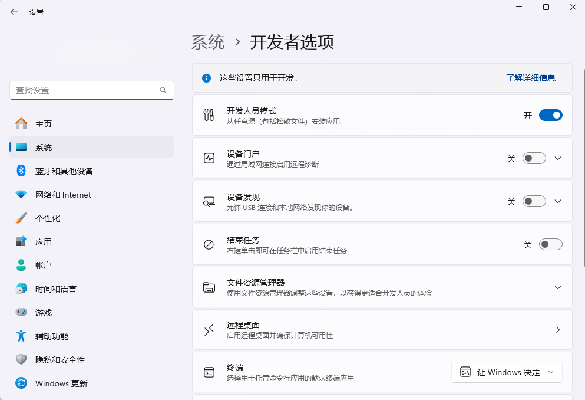

# windows
## 文件
hosts 文件位置：
```bash
C:\Windows\System32\drivers\etc
```
## 快捷键
### 查找特殊符号
- Windows: 按下 Win + ;（或 Win + .）调出 Emoji 面板。
- Mac: 按 Control + Command + Space 调出字符选择器。
## 命令行
### 生成一个2G的文件
```bash
# 此方法会创建一个稀疏文件，即只在磁盘上分配元数据，实际数据块在写入时才分配
fsutil file createnew test2.txt 2147483648
```
```bash
# 使用 PowerShell 提供了更灵活的方式来创建文件，并且不需要管理员权限
$fileStream = [System.IO.File]::Create("test1.txt")
if ($fileStream) {
    $fileStream.SetLength(2GB)
    $fileStream.Close()
} else {
    Write-Error "Failed to create file test1.txt"
}
```
### 权限
#### icacls
- Windows 自带的命令行工具
- 用于显示或修改指定文件或目录的访问控制列表 (ACL)
```bash
icacls test.txt
# test.txt NT AUTHORITY\SYSTEM:(I)(F)
#          BUILTIN\Administrators:(I)(F)
#          USER:(I)(M)

# Successfully processed 1 files; Failed processing 0 files
```
#### 开发者模式
windows -> 设置 -> 开发者选项 -> 开发者模式 (获取到管理员权限，创建软连接等)


## tools
- [chocolatey](https://chocolatey.org/) Windows 包管理，类似Linux 上的 apt 或 yum
