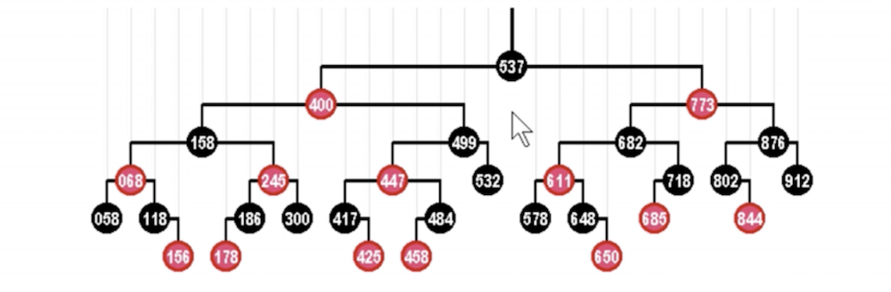
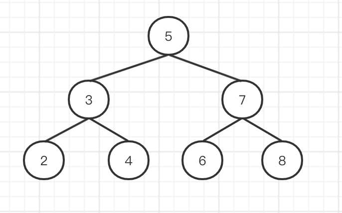
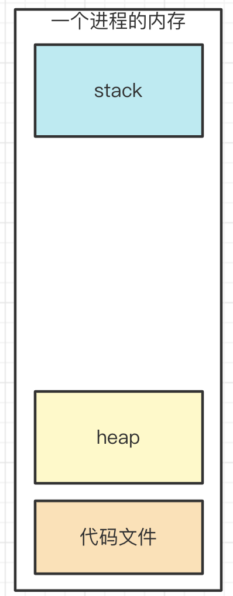

# 算法
## 复杂度
### 时间复杂度
- 复杂度用 `O` 表示，说的是**数量级**，而不是具体的数字，如
  - `O(2)` `O(3)` `O(100)` 其实都是 `O(1)`
  - `O(n)` `O(2 * n)` 其实都是 `O(n)`
- 常见的时间复杂度
  - `O(1)` 无循环
  - `O(n)` 普通的循环
  - `O(logn)` 有循环，但其中使用了二分法，例如：二分查找算法
  - `O(n*logn)` 嵌套循环，一层是普通循环，一层有二分算法。例如：快速排序算法。
  - `O(n^2)` 两个普通循环的嵌套，例如常见的冒泡排序。


### 空间复杂度
- 前端算法通常不太考虑空间复杂度，或者它比时间复杂度要次要的多。
- 因为前端环境，通常内存都是足够的，或者内存不够通常也是其他因素（如媒体文件）。
## 算法思维
### 贪心
- 贪心
  - 贪心算法就是每一步都做当前看起来最优的选择，希望最终得到全局最优解。
  - 它不考虑后续步骤的影响，只根据当前情况选择“最好”的选项。
- 示例：
  - 找零钱问题：假设你要用最少的硬币凑出18元，硬币面额有5元、2元、1元。
  - 贪心得做法：每次都先用面额最大的硬币，直到不能继续再用，剩余部分用次大面额硬币解决，依次类推。
  - 过程：5 + 5 + 5 + 2 + 1 = 18，用了5个硬币。
### 二分
- 二分
  - 二分法是一种高效查找方法，前提是数据是`排好序`的。
  - 它每次比较目标值和中间值大小，缩小查找范围为一半，重复直到找到目标或范围为空。
- 例子
  - 查找数字：在排序数组`[1, 3, 5, 7, 9, 11]`中查找7。
  - 对比中间元素：第3个元素是7，刚好找到。
  - 若中间没找到，判断目标和中间大小，决定搜索左半边还是右半边。
### 动态规划
- 动态规划
  - 是一种通过把问题拆解为子问题，存储子问题结果避免重复计算，最终合成答案的算法。
  - 适合有重叠子问题和最优子结构性质的问题。
  - 把一个大问题，拆解为不同的小问题，递归向下（动态规划），再转换为循环来解决问题。
  - 动态规划的核心思想是考虑最后一步的可能性，而不是考虑整个跳跃过程。
- 例子
  - 斐波那契数列：`fib(n) = fib(n-1) + fib(n-2)`，前两个数为1。
  - 直接递归会重复计算很多`fib(小的值)`；
  - 动态规划会先计算并存储`fib(1), fib(2)…`，避免重复，效率大幅提升。

## 数据结构
### 栈 Stack
- 先进后出
- 在 JS 中，栈一般情况下用数组实现：数组的push 和 pop 方法 就是栈的体现（先进后出）


### 队列 Queue
- 先进先出
- 在 JS 中，使用数组的 push , unshift 队列的体现（先进先出）
  - 但是考虑到数组的 `unshift` 方法，会导致数组的所有元素都要往后移动，增加复杂度
  - 可是使用[两个栈实现队列](#用两个栈实现一个队列)，就可以避免这个问题。


### 链表 Linked List
- 链表是一种物理结构（非逻辑结构），是数组的补充。
- 数组需要一段连续的内存空间，而链表不需要。
- 结构
  - 单向链表 `{ value, next }`
  - 双向链表 `{ value, prev, next }`
- 两者对比
  - 链表：查询慢，新增和删除较快
  - 数组：查询快，新增和删除较慢


### 树
- 树
  - 树，大家应该都知道，如前端常见的 DOM 树、vdom 结构。
- 二叉树
  - 二叉树，顾名思义，就是每个节点最多能有两个子节点。
- 二叉树的遍历
  - 前序遍历：root -> left -> right
  - 中序遍历：left -> root -> right
  - 后序遍历：left -> right -> root
- 高级二叉树
  - 二叉搜索树 BST
    - 如果左右不平衡，也无法做到最优。
    - 极端情况下，它就成了链表 —— 这不是我们想要的。
  - 平衡二叉搜索树 BBST ：
    - 要求树左右尽量平衡
    - 树高度 `h` 约等于 `logn`
    - 查找、增删，时间复杂度都等于 `O(logn)`

  - 红黑树：
    - 一种自动平衡的二叉树
    - 节点分 红/黑 两种颜色，通过颜色转换来维持树的平衡
    - 相比于普通平衡二叉树，它维持平衡的效率更高

    

  - B 树：
    - 物理上是多叉树，但逻辑上是一个 BST 。
    - 用于高效 I/O ，如关系型数据库就用 B 树来组织数据结构。

    

#### 二叉搜索树 BST
- 特点：
  - 左节点（包括其后代） <= 根节点
  - 右节点（包括其后代） >= 根节点
- 优点
  - 1、快速查找：
    - BST保证了节点按一定顺序排列：左子树节点的值都小于根节点，右子树节点的值都大于根节点
    - 查找某个元素时，不用遍历所有节点，而是通过比较值沿着树向左或向右子树递归查找，时间复杂度平均为 `O(log n)`，远快于链表的线性查找 `O(n)`。
  - 2、动态数据结构，支持动态更新
    - BST支持动态插入和删除操作，且这些操作在平均情况下也能保持 `O(log n)` 的时间复杂度。相比于有序数组频繁插入删除代价高，BST更适合动态变化的数据。
  - 3、有序遍历与排序
    - 对BST进行中序遍历，可以得到一个有序的序列。这使得BST可用于实现排序（例如树排序），并方便进行范围查询。
  - 4、实现抽象数据类型
    - BST是实现集合（set）、映射（map）、优先队列等抽象数据结构的基础。它通过高效的查找、插入及删除保证操作的速度。
  - 5、结构简单，易于理解和实现
    - 相较于哈希表等复杂数据结构，BST结构直观，通过递归实现非常方便，适合初学者理解树结构和递归算法。
- 总结：
  - 通过保持节点有序，实现高效动态查找、插入和删除操作，是许多高效数据结构和算法的基础。
- 场景:
  - 需要高效的元素查找、范围查询，比如：
    - 实现字典、映射（Map）
    - 数据库索引
    - 数据排序和动态集合操作
  - 需要支持按键值区间遍历或查找特定区间元素
  - 需要灵活插入、删除且保持顺序关系



### 堆
- JS 执行时代码中的变量
  - 值类型 - 存储到栈
  - 引用类型 - 存储到堆
  - 在 JavaScript 中，堆（Heap）是电脑中一块专门用来存放动态分配内存的区域，所有复杂数据类型（对象、数组、函数等）都是存放在这块堆的内存空间内。
  
- 堆的特点：
  - 节点的值，总是不大于（或不小于）其父节点的值
  - 完全二叉树（堆是一棵完全二叉树，即除了最后一层外，每层节点都被填满，且最后一层节点尽可能左对齐。）
  - 堆就像一个大金字塔，每层都比下一层大（或小），顶端是最大（或最小）的宝石。这个结构方便我们快速找到最大或最小值。
  - 堆用来帮你快速选出“最重要”的东西，比如任务优先级最高的。
  
- 堆，虽然逻辑上是二叉树，但实际上它使用数组来存储的。
  
  ```js
  // 上图是一个堆（从小到大），可以用数组表示
  const heap = [-1, 10, 14, 25, 33, 81, 82, 99] // 忽略 0 节点
  // 节点关系
  const parentIndex = Math.floor(i / 2)
  const leftIndex = 2 * i
  const rightIndex = 2 * i + 1
  ```
- 堆的排序规则，没有 BST 那么严格，这就造成了
  - 查询比 BST 慢
  - 增删比 BST 快，维持平衡也更快
  - 但整体复杂度都是 `O(logn)` 级别，即树的高度
- 但结合堆的应用场景
  - 一般使用内存地址（栈中保存了）来查询，不会直接从根节点搜索（因为堆的物理结构是数组，所以查询复杂度就是 `O(1)`）
- 总结
  - 物理结构是数组（空间更小），逻辑结构是二叉树（操作更快）
  - 适用于“堆栈”结构
- v8如何实现
  - V8中的堆数据结构实现是这种物理上用数组存储，逻辑上表现为二叉树的经典设计模式、
  - 用数组实现堆
    - 空间紧凑：数组是连续内存空间，比链式二叉树减少了额外指针开销，节省内存。
    - 索引计算简单：利用数组索引即可快速定位父节点和左右子节点，无需额外指针。
    - 数组映射成二叉树 `父节点索引：Math.floor((i - 1) / 2)` `左子节点索引：2 * i + 1` `右子节点索引：2 * i + 2`
  - 插入（Insert）：
    - 先把元素放到数组末尾，模拟二叉树“最底层、最右端”添加节点。
    - 然后通过“上浮（bubble up）”操作，逐步和父节点比较并交换，维持堆的性质。
  - 删除堆顶（Extract）：
    - 将根节点与数组末尾元素交换，删除末尾（原根节点）。
    - 然后通过“下沉（sink down）”操作，将新的根节点逐步和子节点比较并交换，恢复堆结构。

### 性能
- 数组：查找易，增删难（因为需要移动元素）
- 链表：增删易，查找难（因为需要遍历）
- 二叉搜索树 BST ：查找易，增删易（使用二分算法，将两者优点结合起来 ）

## 题目
### 旋转数组
- 题目
  - 定义一个函数，实现数组的旋转。
  - 如输入 `[1, 2, 3, 4, 5, 6, 7]` 和 `key = 3`， 输出 `[5, 6, 7, 1, 2, 3, 4]`
- 思路1
  - 将 `k` 后面的元素，挨个 `pop` 然后 `unshift` 到数组前面
- 思路2
  - 将 `k` 后面的所有元素拿出来作为 `part1`
  - 将 `k` 前面的所有元素拿出来作为 `part2`
  - 返回 `part1.concat(part2)`
- 性能对比
  - 时间复杂度
    - 思路1 - 看代码时间复杂度是 `O(n)`，**但数组是有序结构 `unshift` 本身就是 `O(n)` 复杂度**，所以实际复杂度是 `O(n^2)`
    - 思路2 - `O(1)`。`slice` 和 `concat` 不会修改原数组，而数组是有序结构，复杂度是 `O(1)` 。
  - 空间复杂度
    - 思路1 - `O(1)`
    - 思路2 - `O(n)`

<<< ./ts/1-array-rotate.ts

### 括号匹配
- 题目
  - 一个字符串内部可能包含 `{ }` `( )` `[ ]` 三种括号，判断该字符串是否是括号匹配的。<br>
  - 如 `(a{b}c)` 就是匹配的， `{a(b` 和 `{a(b}c)` 就是不匹配的。
- 思路
  - 遇到左括号 `{ ( [` 则压栈
  - 遇到右括号 `} ) ]` 则判断栈顶，相同的则出栈
  - 最后判断栈 length 是否为 0

<<< ./ts/2-match-bracket.ts

### 用两个栈实现一个队列
- 题目
  - 请用两个栈，来实现队列的功能，实现功能 `add` `delete` `length` 。
- 思路
  - 队列 add
      - 往 stack1 push 元素
  - 队列 delete
      - 将 stack1 所有元素 pop 出来，push 到 stack2
      - 将 stack2 执行一次 pop
      - 再将 stack2 所有元素 pop 出来，push 进 stack1

<<< ./ts/3-two-stacks-one-queue.ts

### 反转单向链表
- 题目
  - 定义一个函数，输入一个单向链表的头节点，反转该链表，并输出反转之后的头节点
- 思路
  - 至少要存储 3 个指针 `prevNode` `curNode` `nextNode`
- 性能对比
  - 时间复杂度 `O(n)`

<<< ./ts/4-reverse-link-list.ts

### 二分查找
- 题目
  - 用 Javascript 实现二分查找（针对有序数组），说明它的时间复杂度
- 思路
  - 递归 - 代码逻辑更加简洁
  - 循环 - 性能更好（就调用一次函数，而递归需要调用很多次函数，创建函数作用域会消耗时间）
- 性能对比
  - 时间复杂度 `O(logn)`

<<< ./ts/5-binary-search.ts

### 两数之和
- 题目
  - 输入一个递增的数字数组，和一个数字 `n` 。找出两个数之和等于 `n` 的两个数字。
  - 例如输入 `[1, 2, 4, 7, 11, 15]` 和 `15` ，返回两个数 `[4, 11]`
- 题目的要点
  - 递增，从小打大排序
  - 只需要两个数字，而不是多个
- 思路一：常规思路
  - 嵌套循环，找个一个数，然后再遍历剩余的数，求和，判断。
  - 时间复杂度 `O(n^2)` ，基本不可用。
- 思路2：利用递增的特性
  - 数组是递增的
    - 随便找两个数
    - 如果和大于 n ，则需要向前寻找
    - 如果和小于 n ，则需要向后寻找 —— **二分法**
  - 双指针（指针就是索引，如数组的 index）
    - i 指向头，j 指向尾， 求 i + j 的和
    - 和如果大于 n ，则说明需要减少，则 j 向前移动（递增特性）
    - 和如果小于 n ，则说明需要增加，则 i 向后移动（递增特性）
- 性能对比
  - 思路1：时间复杂度 `O(n^2)`
  - 思路1：时间复杂度降低到 `O(n)`

<<< ./ts/6-two-numbers-sum.ts

### 求二叉搜索树的第 K 小的值

- 题目
  - 一个二叉搜索树，求其中的第 K 小的节点的值。
  - 如下图，第 3 小的节点是 `4`


- 思路
  - 分析题目
    - 根据 BST 的特点，中序遍历的结果，正好是按照从小到大排序的结果。<br>
    - 所以，中序遍历，求数组的 `arr[k]` 即可。

<<< ./ts/7-binary-search-tree.ts

### 斐波那契数列 &I
- 题目
  - 用 Javascript 计算第 n 个斐波那契数列的值，注意时间复杂度。
- 思路
  - 分析
    - 斐波那契数列很好理解
    - `f(0) = 0`
    - `f(1) = 1`
    - `f(n) = f(n - 1) + f(n - 2)` 前两个值的和
  - 思路1：递归计算
    - 但这种方式会导致很多重复计算。
    - 时间复杂度是 `O(2^n)` ，爆炸式增长，不可用。（可以试试 `n: 100` ，程序会卡死）
  - 思路2：循环
    - 不用递归，用循环，记录中间结果。时间复杂度降低到 `O(n)`
- 性能对比
  - 思路1：时间复杂度 `O(2^n)`
  - 思路2：时间复杂度 `O(n)`

<<< ./ts/9-fibonacci.ts

### 青蛙跳台阶
- 题目
  - 一只青蛙，一次可以跳 1 个台阶，也可以跳 2 个台阶，问该青蛙跳上 n 级台阶，总共有多少种方式？
- 思路1：递归
  - `f(1) = 1` 跳 1 级台阶，只有一种方式
  - `f(2) = 2` 跳 2 级台阶，有两种方式
  - `f(n) = f(n - 1) + fn(n - 2)` 跳 n 级，可拆分为两个问题
    - 第一次跳，要么 1 级，要么 2 级，只有这两种
    - 第一次跳 1 级，剩下有 `f(n - 1)` 种方式
    - 第一次跳 2 级，剩下有 `f(n - 2)` 种方式
- 思路2：动态规划
  - 青蛙要跳上第 i 级台阶，有两种可能：
    - 从第 i-1 级台阶跳 1 级上来。
    - 从第 i-2 级台阶跳 2 级上来。
    - 两种方式是互斥的：指的是最后一步只能选择一种跳法 (从 n-1 跳 1 步，或者从 n-2 跳 2 步)
  - 因此，跳上第 i 级台阶的总跳法数等于跳上第 i-1 级台阶的跳法数加上跳上第 i-2 级台阶的跳法数。
  - 动态规划的核心思想是考虑最后一步的可能性，而不是考虑整个跳跃过程。

<<< ./ts/9-frog-jump.ts

### 移动 0
- 题目
  - 定义一个函数，将数组种所有的 `0` 都移动到末尾，例如输入 `[1, 0, 3, 0, 11, 0]` 输出 `[1, 3, 11, 0, 0, 0]`。
  - 要求： `只移动 `0` ，其他数字顺序不变` `考虑时间复杂度` `必须在原数组就行操作`
- 思路1：非原数组操作
  - 定义 `part1` `part2` 两个空数组
  - 遍历数组，非 `0` push 到 `part1` ，`0` push 到 `part2`
  - 返回 `part1.concat(part2)`
  - 所以，遇到类似问题，要提前问面试官：**是否能在原数组基础上修改？**
- 思路2：原数组操作
  - 遍历数组
  - 遇到 `0` 则 push 到数组末尾
  - 然后用 splice 截取掉当前元素
- 思路3：双指针
  - 指针1 指向第一个 0 ，指针2 指向第一个非 0
  - 把指针1 和 指针2 进行交换
  - 指针向后移
- 分析性能
  - 思路1：非原数组操作
    - 时间复杂度 `O(n)` 空间复杂度 `O(n)` ，
  - 思路2：原数组操作
    - 空间复杂度没有问题 `O(1)`
    - 时间复杂度：看似是 `O(n)`
    - 但实际上 `splice` 和 `unshift` 一样，修改数组结构，时间复杂度是 `O(n)`
    - 总体看来时间复杂度是 `O(n^2)`，不可用
  - 思路3：双指针
    - 时间复杂度 `O(n)`
    - 空间复杂度 `O(1)`

<<< ./ts/10-move-zero.ts

### 连续最多的字符
- 题目
  - 给一个字符串，找出连续最多的字符，以及次数。<br>
  - 例如字符串 `'aabbcccddeeee11223'` 连续最多的是 `e` ，4 次。
- 思路1：传统方式
  - 嵌套循环，找出每个字符的连续次数，并记录比较。
- 思路2：双指针
  - 指针1 指向第一个字符，指针2 指向第二个字符
  - 如果两个字符相同，则指针2 向后移
  - 如果两个字符不同，则指针1 指向指针2 的位置，指针2 向后移
- 分析性能
  - 思路1：时间复杂度看似是 `O(n^2)`，因为是嵌套循环。 **但实际上它的时间复杂度是 `O(n)`，因为循环中有跳转**。
  - 思路2：
    - 时间复杂度 `O(n)`
    - 空间复杂度 `O(1)`

<<< ./ts/11-continuous-char.ts

### 快速排序 &I
- 题目
  - 用 Javascript 实现快速排序，并说明时间复杂度。
- 思路
  - 快速排序是基础算法之一，算法思路是固定的
    - 找到中间位置 midValue
    - 遍历数组，小于 midValue 放在 left ，大于 midValue 放在 right
    - 继续递归，concat 拼接
  - `splice` 和 `slice`
    - 代码实现时，获取 midValue 可以通过 `splice` 和 `slice` 两种方式
    - 理论分析，`slice` 要优于 `splice` ，因为 `splice` 会修改原数组。<br>
    - 但实际性能测试发现两者接近。
    - 但是，即便如此还是倾向于选择 `slice` —— **因为它不会改动原数组**，类似于函数式编程
- 性能分析
  - 快速排序 时间复杂度 `O(n*logn)` —— 有遍历，有二分
  - 普通的排序算法（如冒泡排序）时间复杂度时 `O(n^2)`

<<< ./ts/12-quick-sort.ts

1,   2,   3,   4,   5,   6,   7,   8,
    9,  11,  22,  33,  44,  55,  66,  77,
   88,  99, 101, 111, 121, 131, 141, 151,
  161, 171, 181, 191

### 1-10000 之间的对称数（回文）
- 题目
  - 打印 1-10000 之间的对称数
  - `11,  22,  33,  44,  55,  66,  77,  88,  99, 101, 111, 121, 131, 141, 151` (这些就是回文数字)
- 思路1：使用数组反转
  - 数字转换为字符串
  - 字符串转换为数组 reverse ，再 join 生成字符串
  - 比较前后的字符串
- 思路2：使用字符串头尾比较
  - 数字转换为字符串
  - 字符串头尾比较
  - 还可以使用**栈**（但栈会用到数组，性能不如直接操作字符串）
    - 数字转换为字符串，求长度
    - 如果长度是偶数，则用栈比较
    - 如果长度是奇数，则忽略中间的数字，其他的用栈比较
- 思路3：生成反转数
  - 通过 `%` 和 `Math.floor` 将数字生成一个反转数
  - 比较前后的数字
- 性能分析
- 时间复杂度看似相当，都是 `O(n)`
  - 思路1
    - 涉及到了数组的转换和操作，就需要耗费大量的时间
    - 数组 reverse 需要时间
    - 数组和字符串的转换需要时间
  - 思路2/3
    - 数字操作最快。电脑的原型就是计算器，所以处理数字是最快的。

<<< ./ts/13-palindrome-number.ts

### 搜索单词 - 字符串前缀匹配
- 题目
  - 请描述算法思路，不要求写出代码。
    - 先给一个英文单词库（数组），里面有几十万个英文单词
    - 再给一个输入框，输入字母，搜索单词
    - 输入英文字母，要实时给出搜索结果，按前缀匹配
  - 要求
    - 尽量快
    - 不要使用防抖（输入过程中就及时识别）
- 思路1：常规思路
  - `keyup` 之后，拿当前的单词，遍历词库数组，通过 `indexOf` 来前缀匹配。
- 思路2：优化数据结构（Trie 树（字典树））
  - 英文字母一共 26 个，可按照第一个字母分组，分为 26 组。这样搜索次数就减少很多。
  - 可按照第二个、第三个字母分组。
  - 即，在程序初始化时，把数组变成一个树，然后按照字母顺序在树中查找。
  ```js
  const arr = [
      'abs',
      'arab',
      'array',
      'arrow',
      'boot',
      'boss',
      // 更多...
  ]
  const obj = {
      a: {
          b: {
              s: {}
          },
          r: {
              a: {
                  b: {}
              },
              r: {
                  a: {
                      y: {}
                  },
                  o: {
                      w: {}
                  }
              }
          }
      },
      b: {
          o: {
              o: {
                  t: {}
              },
              s: {
                  s: {}
              }
          }
      },
      // 更多...
  }
  ```
- 性能分析
  - 思路1
    - 算法思路的时间复杂度是 `O(n)`
    - 外加 `indexOf` 也需要时间复杂度。实际的复杂度要超过 `O(n)`
  - 思路2
    - 时间复杂度就大幅度减少，从 `O(n)` 降低到 `O(m)` （`m` 是单词的最大长度）
- 划重点
  - 对于已经明确的范围的数据，可以考虑使用哈希表
  - 以空间换时间

<<< ./ts/14-search-word.ts

### 数字千分位
- 题目
  - 将数字按照千分位生成字符串，即每三位加一个逗号。不考虑小数。<br>
  - 如输入数字 `78100200300` 返回字符串 `'78,100,200,300'`
- 思路
  - 使用数组
  - 使用正则表达式
  - 使用字符串拆分
- 性能分析
  - 数组转换，影响性能
  - 正则表达式，性能较差
  - 操作字符串，性能较好

<<< ./ts/15-thousands-format.ts

### 切换字母大小写
- 题目
  - 切换字母大小写，输入 `'aBc'` 输出 `'AbC'`
- 思路
  - 需要判断字母是大写还是小写
  - 正则表达式
  - `charCodeAt` 获取 ASCII 码（ASCII 码表，可以网上搜索）
- 性能分析
  - 正则表达式性能较差
  - ASCII 码性能较好

<<< ./ts/16-switch-letter-case.ts


### 遍历 DOM 树
- 题目
  - 写一个函数遍历 DOM 树，分别用深度优先和广度优先
  - 注意回顾 “Node 和 Element 和区别”

  

- 思路
  - 深度优先
    - 一般通过`递归`实现
    - 递归：就递归遍历子节点，便利执行这个动作，直到没有子节点为止。
    - 深度优先的结果 `<div> <p> "hello" <b> "world"  注释 <ul> <li> "a" <li> "b"`
    - 深度优先遍历，可以使用栈代替递归，递归本质上就是栈。(深度优先可以不用递归吗？)
    - 栈：获取当前节点，子节点`反转再遍历`，子节点`push`入栈，在将栈中的节点`pop`出栈，重复这个过程。(保证左子节点一直处于栈顶，达到深度优先)
  - 广度优先
    - 一般通过`队列`实现
    - 队列：获取当前节点，便利子节点，子节点`unshift`入队列头部，在将队列中的节点`pop`出队列尾部，重复这个过程。（保证统一层级的节点最先遍历）
    - 广度优先的结果 `<div> <p>  注释 <ul> "hello" <b> <li> <li> "world" "a" "b"`
- 划重点
  - 递归和非递归哪个更好？
  - 递归逻辑更加清晰，但容易出现 `stack overflow` 错误（可使用`尾递归`，编译器有优化）
  - 非递归效率更高，但使用栈，逻辑稍微复杂一些

<<< ./ts/17-dom-traverse.ts

