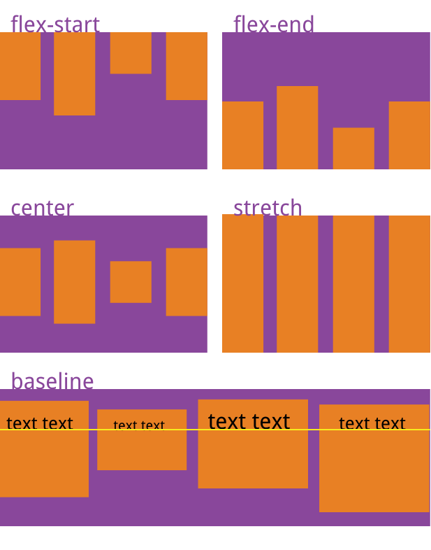
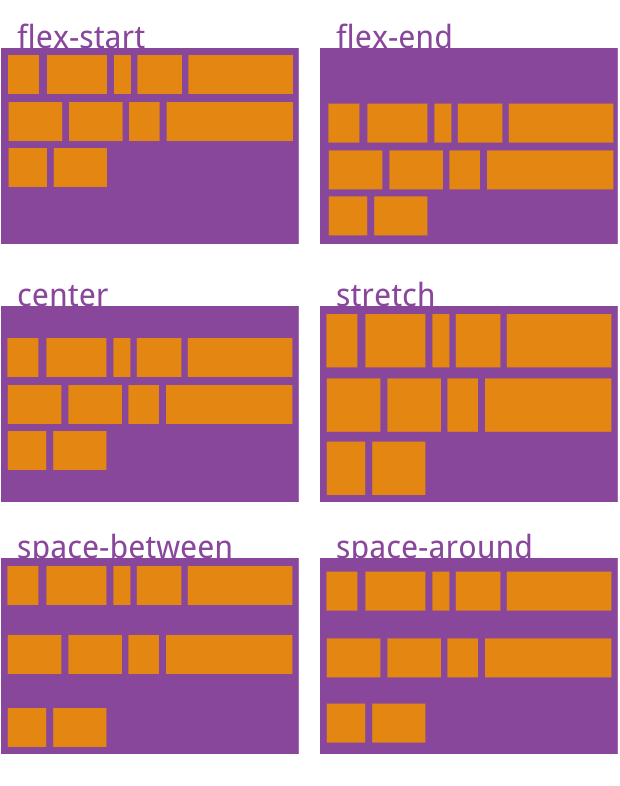
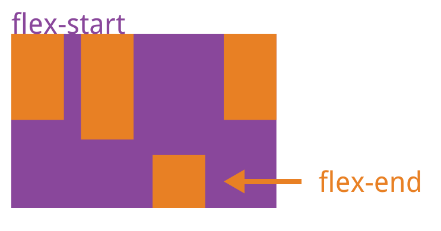

## flex

### 基础语法

- 水平的主轴（main axis）
- 垂直的交叉轴（cross axis）

#### 容器的属性
flex-direction
```css
.box {
  flex-direction: row | row-reverse | column | column-reverse;
}
```
flex-wrap
```css
.box {
  align-items: flex-start | flex-end | center | baseline | stretch;
}
```
flex-flow
```css
.box {
  flex-flow: \<flex-direction> || \<flex-wrap>;
}
```
justify-content
```css
.box {
  justify-content: flex-start | flex-end | center | space-between | space-around;
}
```
align-items
- baseline: 项目的第一行文字的基线对齐。
- stretch（默认值）：如果项目未设置高度或设为auto，将占满整个容器的高度。
```css
.box {
  align-items: flex-start | flex-end | center | baseline | stretch;
}
```


align-content（多根轴线的对齐方式，只有一根轴线，该属性不起作用）
```css
.box {
  align-content: flex-start | flex-end | center | space-between | space-around | stretch;
}
```


#### 项目的属性
order
```css
.item {
  order: <integer>;
}
```
flex-grow
```css
.item {
  flex-grow: <number>; /* default 0 */
}
```
flex-shrink
```css
.item {
  flex-shrink: <number>; /* default 1 */
}
```
flex-basis 在分配多余空间之前，项目占据的主轴空间
```css
.item {
  flex-basis: <length> | auto; /* default auto */
}
```
flex
```css
.item {
  flex: none | [ <'flex-grow'> <'flex-shrink'>? || <'flex-basis'> ]
}
```
align-self 允许单个项目有与其他项目不一样的对齐方式，可覆盖align-items属性
```css
.item {
  align-self: auto | flex-start | flex-end | center | baseline | stretch;
}
```


参考：[Flex 布局教程：语法篇](https://www.ruanyifeng.com/blog/2015/07/flex-grammar.html)

### 进阶

#### 深入理解1-缩写语法

- flex属性是flex-grow，flex-shrink和flex-basis这3个CSS属性的缩写
- 建议使用单值缩写，而不是完整的3个属性值，因为单值属性所对应的flex计算值根据开发者日常最常用的使用进行了优化。

| 单值语法 | 单值语法 | 备注 |
| ----------- | ----------- | ----------- |
| flex: initial | flex: 0 1 auto |初始值，常用|
| flex: 0 | flex: 0 1 0% |适用场景少|
| flex: none | flex: 0 0 auto |推荐：适合不换行的内容固定或者较少的小控件元素上|
| flex: 1 | flex: 1 1 0% |推荐：适合平分场景|
| flex: auto | flex: 1 1 auto |适用场景少：适合按各自内容多少占比（基于内容动态适配的布局）|


- 助记：
  - flex: initial 就是 0 1 auto
  - flex: 0 在初始基础上，主要是flex-basis 为 0，
  - flex: none 是flex-grow/flex-shrink 为 0
  - flex: 1 是flex-grow/flex-shrink 为 1，flex-basis 为 0
  - flex: auto 是flex-grow/flex-shrink 为 1，flex-basis 为 auto，全部有值
- 区别
  - flex-basis 为 0，元素的最终尺寸表现为最小内容宽度；
  - flex-basis 为 auto，最终尺寸通常表现为最大内容宽度。

参考：[flex:0 flex:1 flex:none flex:auto应该在什么场景下使用？](https://www.zhangxinxu.com/wordpress/2020/10/css-flex-0-1-none/)


#### 深入理解2-缩写语法2
flex: none | auto | [ <'flex-grow'> <'flex-shrink'>? || <'flex-basis'> ]
```css
flex: auto;
flex: none;

/* 1个值，flex-grow，
此时flex-shrink和flex-basis的值分别是1和0% */
flex: 1;

/* 1个值，flex-basis，
此时flex-grow和flex-shrink都是1 */
flex: 100px;

/* 2个值，flex-grow和flex-basis，
此时flex-shrink使用默认值0 */
flex: 1 100px;

/* 2个值，flex-grow和flex-shrink，
此时flex-basis计算值是0%*/
flex: 1 1;

/* 3个值 */
/* flex: [ <'flex-grow'> <'flex-shrink'> <'flex-basis'> ] */
/* 长度值表示flex-basis，其余2个数值分别表示flex-grow和flex-shrink */
flex: 1 1 100px;
flex: 1 2 50%；
flex: 50% 1 2;
```

参考：[CSS flex属性深入理解](https://www.zhangxinxu.com/wordpress/2019/12/css-flex-deep/)

#### 深入理解3-flex-basis
1、flex-basis和box-sizing关系：宽度100+，设置border-box，宽度还是100+
```css
/* 宽度100+，有border+padding等 */
item-zxx:nth-child(1) {
    width: 100px;
}
/* 宽度100*/
item-zxx:nth-child(2) {
    width: 100px; 
    box-sizing: border-box;
}
/* 宽度100+，有border+padding等 */
item-zxx:nth-child(3) {
    flex-basis: 100px;
}
/* 宽度100+，有border+padding等 */
item-zxx:nth-child(4) {
    flex-basis: 100px; 
    box-sizing: border-box;
}
```
2、flex-basis和width的关系

- min-width > || max-width > flex-basis > width > Content Size
- 优先级：flex-basis > width
  - width: 200px + flex-basis: 100px = 100px
  - width:100px + flex-basis:auto = 100px
  - content + flex-basis:100px = max(content, flex-basis) = 大于等于100px（英文内容，不折行）
  - content + flex-basis:100px = 100px（英文内容，折行）
  - content + flex-basis:100px + width + 是否折行 多种因素掺杂又不一致


- 特殊情况：width > flex-basis
  - 建议：flex-basis数值属性值和width数值属性值不要同时使用
  - 因为之前有浏览器有表现[不一致](https://www.zhangxinxu.com/study/201912/flex-basis-width-content-demo.php)
  - 现在已一致（firefox、edge与chrome一致了）
  - width 只有100px;
  ```css
  item-zxx:nth-child(3) {
      box-sizing: border-box;
      width: 100px;
      flex-basis: 100px;
      /* 最终宽带是100 */
  }
  ```
3、flex-basis 关键字 [参考mdn](https://developer.mozilla.org/zh-CN/docs/Web/CSS/flex-basis#%E7%BB%93%E6%9E%9C)
```css
/* 根据flex子项的内容自动调整大小 */
flex-basis: content;
/* 内部尺寸关键字 */
flex-basis: fill;
flex-basis: max-content;
flex-basis: min-content;
flex-basis: fit-content;
```

4、 flex-basis 与 max-width/min-width
- 实现一个每一项最小宽度是100像素，尽可能填满整个容器，不再使用max-width/min-width
```css
.container {
    display: flex;
    flex-wrap: wrap;
}
.item {
    flex-basis: 100px;
    flex-grow: 1;
}
```
参考：[Oh My God，CSS flex-basis原来有这么多细节](https://www.zhangxinxu.com/wordpress/2019/12/css-flex-basis/)
