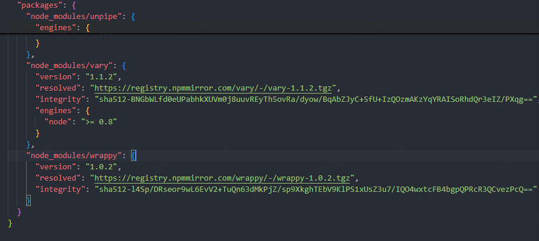

# package.json
## 配置
### 基础
```json
{
  "name": "project", // 项目名称、包含组织名（Scope)，如 @myorg/project
  "version": "1.0.0", // 项目版本
  "description": "", // 项目描述
  "keywords": ["vue", "react", "typescript"], // 项目关键词
  "main": "index.js", // 项目入口文件
  "scripts": { // 指定运行脚本命令的 npm 命令行缩写
    "test": "echo \"Error: no test specified\" && exit 1"
  },
  "author": "",// 作者
  "license": "ISC", // 许可证
  "contributors": [ // 贡献者
    "name <email>",
    "name2 <email2>"
  ],
  "files": [  // 必包含，不需要制定字段  package.json、README、LICENSE 或 LICENCE、main 字段指定的文件、bin 字段指定的文件
    "dist"// 指定发布到npm的文件
  ],
  "homepage": "", // 项目主页
  "bugs": "", // 项目bugs
  "repository": "", // 项目仓库
  "private": true, // 是否私有
  "workspaces": [ // 工作区
    "packages/*"
  ],
  "engines": { // 指定项目运行所需的环境，包括 node, npm 等。
    "node": ">=10.0.0", // node 是项目运行所需的 Node.js 版本。
    "npm": ">=6.0.0" // npm 是项目运行所需的 npm 版本。
  },
  "os": [ // 指定操作系统
    "darwin", // macOS（苹果电脑使用的Unix系统）
    "linux", // Linux 系统
    "win32" // Windows 系统，（无论 32 位还是 64 位都用这个名字）
  ],
  "cpu": [ // 指定 CPU 架构
    "x64", // 64 位
    "!arm" // 非 arm 架构
  ],
  "workspaces": [ // 工作区 
    "packages/*"
  ],
  "publishConfig":{
    "registry":"https://registry.npmjs.org/" // 设置发布地址(私有npm)
  },
  "bin": {
    "my-package": "./bin/my-package.js"
  },
  // 非标准
  // 打包工具（Webpack，rollup 等）扩展的字段，类似于 main 字段，只不过用于指定项目的 ES Module 入口文件。
  "module": "index.mjs",
  // Webpack 在构建时有一个 target 配置项，默认为 web。如果使用 import 语法引入模块，优先级 browser > module > main；如果使用 require 语法引入模块，优先级 main > module > browser。
  "browser": {
    "./index.js": "./dist/my-lib.js"
  },
  // 由 CDN 服务商扩展的字段，用于指定项目在 CDN 上的入口文件。
  "unpkg": "dist/vue.global.js",
  "jsdelivr": "dist/vue.global.js",
  "type":"commonjs", // node字段 模块格式 缺少“类型”字段或 commonjs 则将.js文件视为commonjs,需要使用 ES Module，可以使用 .mjs 后缀。
  "type": "module",  // node字段 模块格式 ES module，所有 .js 文件都会被当作 ES Module 处理。如果需要使用 CommonJS，可以使用 .cjs 后缀。
  "imports": {
    "#utils/*": "./src/utils/*",
    "#config": "./src/config.js"
  },
  "exports": {
    ".": {
      "import": "./index.js",
      "require": "./index.cjs",
      "types": "./index.d.ts"
      "default": "./index.js"
    },
    "./module": {
      "import": "./module.js",
      "require": "./module.cjs",
      "types": "./module.d.ts"
      "default": "./module.js"
    }
  },
  "types": "index.d.ts", // 由 TypeScript 扩展的字段，用于指定项目的类型定义文件
  "sideEffects": false // 是否开启副作用
}
```
参考：
- [npm package-json](https://docs.npmjs.com/cli/v10/configuring-npm/package-json)
- [nodejs package-json](https://nodejs.org/api/packages.html)
- [webpack package-exports](https://webpack.js.org/guides/package-exports/)
- [package-browser-field-spec](https://github.com/defunctzombie/package-browser-field-spec) browser 字段
- [typescript declaration-files](https://www.typescriptlang.org/docs/handbook/declaration-files/publishing.html#including-declarations-in-your-npm-package)
### version 版本
- 版本阶段
- alpha 预览版：大量bug、内测、验证核心功能 `v1.0.0-alpha`
- beta 测试版：性能问题（次要bug）、公测、收集用户反馈 `v1.0.0-beta`
- rc 候选发布版：功能完善（不再新增特性）、少量bug(仅修复关键缺陷)、没有严重问题则转为正式版 `v1.0.0-rc1`
- GA/stable(稳定版)/LTS(长期支持版) 正式发布版：功能完善、少量bug `v1.0.0`
- 版本对比：
  - 1.0.0 主版本号.次版本号.补丁版本号
  - 主版本 >=1
    - ~1.1.2 匹配范围：>=1.1.2 <1.2.0（1.1.x）
    - ^1.1.2 匹配范围：>=1.1.2 <2.0.0（1.x.x）
    - `行为不一致`
  - 主版本 = 0
    - ^0.1.2 匹配范围：>=0.1.2 <0.2.0（1.1.x）
    - ~0.1.2 匹配范围：>=0.1.2 <0.2.0（1.1.x）
    - `行为一致`
  - 参考：[语义化版本 2.0.0](https://semver.org/lang/zh-CN/)
- 同时安装不同版本
  ```bash
  npm install vue2@npm:vue@^2.6.14
  npm install vue3@npm:vue@^3.2.37
  ```
  ```bash
  pnpm add @antv/x6-v2@npm:@antv/x6@^2.18.1 -D
  # 别名 @antv/x6-v2
  # 连接 @npm
  # 找对应包 @antv/x6@^2.18.1
  ```
  ```json
  {
    "devDependencies":{
      "@antv/x6-v2": "npm:@antv/x6@^2.18.1",
    }
  }
  ```
### scripts
- && 串行执行
- & 并行执行
- 如果启动一个nodejs http服务，串行会阻塞，第二个命令不执行
```json
{
  "scripts": {
    "dev": "npm run dev1 && npm run dev2", // 串行执行
    "prod": "npm run prod1 & npm run prod2" // 并行执行
  }
}
```
### bin
- `pnpm dev` 或者 `yarn start`
- 启动脚本运行前会先自动新建一个命令行环境，然后把当前目录下的node_modules/.bin加入系统环境变量中，
- 接着执行scripts配置节指定的脚本的内容，执行完成后再把node_modules/.bin从系统环境变量中删除。
- 所以，当前目录下的node_modules/.bin子目录里面的所有脚本，都可以直接用脚本名调用，不必加上路径
### workspaces
- 从单个顶部级别的root软件包中管理多个软件包的支持。
- 删除了手动使用NPM链接以将引用添加到应链接到当前Node_modules文件夹中的软件包中的需要。
- 将文件夹软件包/*链接到当前工作dir的node_modules文件夹
- 嵌套工作空间
```json
{
  "workspaces": ["packages/a"]
}
```
```bash
npm init -w ./packages/a # 在packages/a目录下初始化package.json 确保package.json中配置了workspaces
npm install abbrev -w a #给工作区a安装abbrev依赖
npm run test --workspace=a #特定工作区的上下文中运行给定命令 相当于 cd packages/a && npm run test
npm run test --workspace=packages
```
<<< @/submodule/play/packages/npm/packages/a/index.js
<<< @/submodule/play/packages/npm/index.js#workspaces
### imports
仅适用于软件包本身内部导入指定符的私有映射
“导入”字段中的条目必须始终以＃开始，以确保它们与外部软件包指定符的歧义。

```json
{
  "imports": {
    "#utils/*": "./src/utils/*",
    "#config": "./src/config.js",
    "#dep": { //“导入”字段允许映射到外部软件包。dep-node-native
      "node": "node-fetch-native",
      "default": "./dep-polyfill.js"
    }
  },
  "dependencies": {
    "node-fetch-native": "^1.6.6"
  }
}
```
<<< @/submodule/play/packages/npm/index.js#imports{1,10}

### exports
"exports" 提供了 "main" 的现代替代方案
- 允许定义多个入口点
- 支持不同环境

确保导出每个先前支持的入口点
```json
{
  "name": "my-package",
  "exports": {
    ".": "./lib/index.js",
    "./lib": "./lib/index.js",
    "./lib/index": "./lib/index.js",
    "./lib/index.js": "./lib/index.js",
    "./feature": "./feature/index.js",
    "./feature/index": "./feature/index.js",
    "./feature/index.js": "./feature/index.js",
    "./package.json": "./package.json"
  }
}
```
支持导出全部文件
```json
{
  "name": "es-module-package",
  "exports": {
    ".": "./lib/index.js",
    "./lib": "./lib/index.js",
    "./lib/*": "./lib/*.js",
    "./lib/*.js": "./lib/*.js",
    "./feature": "./feature/index.js",
    "./feature/*": "./feature/*.js",
    "./feature/*.js": "./feature/*.js",
    "./features/private-internal/*": null, // 排除private-internal，不导出
    "./package.json": "./package.json"
  }
}
```
```js
import featureInternal from 'es-module-package/features/private-internal/m.js';
// Throws: ERR_PACKAGE_PATH_NOT_EXPORTED
import featureX from 'es-module-package/features/x.js';
// Loads ./node_modules/es-module-package/src/features/x.js
```
Subpath exports
```json
{
  "exports": {
    ".": "./index.js",
    "./submodule.js": "./src/submodule.js"
  }
}
```
```js
import submodule from 'es-module-package/submodule.js';
// Loads ./node_modules/es-module-package/src/submodule.js
import submodule from 'es-module-package/private-module.js';
// Throws ERR_PACKAGE_PATH_NOT_EXPORTED
```
Subpath patterns#
```json
{
  "exports": {
    "./features/*.js": "./src/features/*.js"
  },
  "imports": {
    "#internal/*.js": "./src/internal/*.js"
  }
}
```
```js{1}
// 项目自身，既可以引入imports，也可以引入exports
import featureX from 'es-module-package/features/x.js';
// Loads ./node_modules/es-module-package/src/features/x.js
import featureY from 'es-module-package/features/y/y.js';
// Loads ./node_modules/es-module-package/src/features/y/y.js
import internalZ from '#internal/z.js';
// Loads ./node_modules/es-module-package/src/internal/z.js
```
有条件 exports
```json
{
  "exports": {
    ".": {
      "import": "./dist/my-lib.js",
      "require": "./dist/my-lib.umd.cjs"
    }
  }
}
```
### overrides
固定版本覆盖依赖版本
```json
{
  "overrides": {
    "vxe-table": {
      "xe-utils": "3.5.30"
    }
  },
  "pnpm": {
    "overrides": {
      "foo": "^1.0.0",
      "quux": "npm:@myorg/quux@^1.0.0",
      "bar@^2.1.0": "3.0.0",
      "qar@1>zoo": "2" // qar@1>zoo will only override the zoo dependency of qar@1, not for any other dependencies.
    }
  }
}
```
参考：
  - [pnpm overrides](https://pnpm.io/package_json#pnpmoverrides)
  - [overrides](https://docs.npmjs.com/cli/v11/configuring-npm/package-json#overrides)
### peerDependencies
限定关联依赖版本
```json
{
  "name": "@npm/tea-latte",
  "version": "1.3.5",
  "peerDependencies": {
    "@npm/tea": "2.x" // 与@npm/tea@2.x版本兼容 一起使用
  }
}
```
### peerDependenciesMeta
如何使用你的peerDependencies（how your peer dependencies are to be used）
```json
{
  "name": "@npm/tea-latte",
  "version": "1.3.5",
  "peerDependencies": {
    "@npm/tea": "2.x",
    "@npm/soy-milk": "1.2"
  },
  "peerDependenciesMeta": {
    "@npm/soy-milk": {
      "optional": true // 是否可选（是）
    }
  }
}
```
### optionalDependencies
可选依赖包
- 这表示项目依赖于其他包，但是不是必须的，
- 如果用户安装了这些包，项目会使用这些包，
- 如果没有安装，项目会正常运行。

对比 peerDependencies
- 区别是 optionalDependencies 会直接被引用，
- 而 peerDependencies 不会被直接引用。
### patchedDependencies
- pnpm patch express 给软件包添加补丁
- 将express提取到一个可以随意编辑的临时目录中 ./node_modules/.pnpm_patches/express@4.18.1
- 进行更改
- 运行 pnpm patch-commit ./node_modules/.pnpm_patches/express@4.18.1
- 并且生成一个 patches/express@4.18.1.patch 文件

<<< @/submodule/play/packages/pnpm/patches/express.patch{diff}

- package.json 中增加 patchedDependencies 配置
```json
{
  "pnpm": {
    "patchedDependencies": {
      // 其中键值是软件包名称与精确版本号。 值应该是一个指向修补文件的相对路径。
      "express@4.18.1": "patches/express@4.18.1.patch"
    }
  }
}
```
- pnpm-workspace.yaml中 增加 patchedDependencies

<<< @/submodule/play/packages/pnpm/pnpm-workspace.yaml{yaml}
### publishConfig
发布配置
PNPM 对 publishConfig 进行了扩展[1](https://pnpm.io/package_json#publishconfig)
```json
{
  "publishConfig": {
    "registry": "https://registry.npmjs.org/",
    // 你还可以使用 publishConfig.directory 字段来自定义相对于当前 package.json 的发布子目录。
    // 在这个例子中 "dist" 文件夹必须包含一个 package.json
    "directory": "dist",
    // 当设置为 true 时，项目将在本地开发期间从 publishConfig.directory 位置进行符号链接。
    "linkDirectory": true
  }
}
```
### sideEffects
所谓副作用就是会影响tree-shaking的文件
```json
{
  "sideEffects": false // 是否开启副作用
}
```
副作用情况：
- 注册全局事件监听器、修改全局状态等
- 样式文件
- Polyfill
设置值
- false 表示项目的所有文件都没有副作用，可以进行 tree-shaking。
- true 表示项目的所有文件都有副作用，不可以进行 tree-shaking。
- `["*.css"]` 表示项目的所有 css 文件都有副作用，不可以进行 tree-shaking。
问题：
- lib的
  - 根目录下没有.css,其他目录下有.css：a/xx.css b/xx.css
  - package.json中配置了如下，
  ```json
  {
    "sideEffects": [ // css是副作用，保留
      "*.css"
    ],
  }
  ```
- build之后，lib根目录下有xx.css，
- 项目引入lib下的xx.css，发现无法引入模块了，但是lib下确实存在xx.css
- 尝试给vite 配置，就可以了
  ```js
  {
    resolve: {
      alias: [
        {find: 'packageName', replacement: '/node_modules/packageName'}
      ],
    },
  }
  ```
- 初步分析：
  - 路径解析受到影响
- 修改sideEffects，打包，问题就没有出现了，解决
  ```json
  {
    "sideEffects": [
      "**/*.css"
    ],
  }
  ```
分析：
1、打包时的package.json和引入时的package.json是同一个
- 打包时：
  - `"sideEffects": ["*.css"]`根目录下的*.css是有副作用的，`"sideEffects": ["**/*.css"]`是其他目录下也是有副作用的；
  - 修改sideEffects是否真的影响打包结果的（测试结果：应该有，副作用会起作用）
- 引入时：
  - 是打包结果影响的呢（好像打包结果也差不多）？（测试结果：可能是，但是都有这个css文件，按道理说不会影响引用）
  - 还是修改了package.json的sideEffects配置，`"sideEffects": ["*.css"]`和`"sideEffects": ["**/*.css"]`，对路径解析分别有影响呢？（测试结果：不是，修改lib 的package.json不起作用）
- 再测试一次, 测试结果：
  - 打包时：sideEffects影响了输出结果
  - 引入时：路径解析受到影响，更改lib的package.json的sideEffects，不能解决路径问题
  - 但是（几个疑点）：
  - 1、通过pnpm link `本地`的打包结果，又不存在这个问题（之前的所有引用时npm发布的backage引用的）
  - 2、重新下载下来发布的包，放到本地引用，确实是有这个问题，这说明这两个包有不同的
- 进行详细对比结果
  - 1、发现 `"./*.css": "./*.cssc",` css多了一个c，真相大白，不是sideEffects影响的，误操作导致的
    ```json
    {
      "exports": {
        "./*.css": "./*.cssc",
      },
    }
    ```
  - 2、更改后，不存在路径解析不到的问题
  - `"sideEffects": ["*.css"]`根目录下的*.css是有副作用的，`"sideEffects": ["**/*.css"]`是其他目录下也是有副作用的；
  - 这里应该产生了影响，但其实都没有影响，副作用不会影响文件引用
- 引入时：
  - `"sideEffects": ["*.css"]`和`"sideEffects": ["**/*.css"]` 对路径解析分别有影响呢？
  - 这里不受影响

2、sideEffects到底什么用？详细分析一下
```js
// utils/a.js
export function a() {
  console.log('a');
}
```
```js
// utils/b.js
console.log('======== b.js ==========');
export function b() {
  console.log('b');
}
```
```js
// utils/index.js
export * from './a';
export * from './b';
```
```js
// app.js
import { a } from './utils';
a();
```
- 以上测试代码，b模块（模块的副作用：模块执行的时候除了导出成员，其他的如：`console.log('======== b.js ==========');`就是副作用）
- 进行tree shaking：
- appjs没有加载b模块，tree shaking只能移除没有用到的代码成员，`export ...`；
- 但是b.js中的副作用代码`console.log('======== b.js ==========');`被保留了；
```js
// output
([
  function(e, t, r) {
    'use strict';
    r.r(t),
      console.log('======== b.js =========='),
      console.log('a');
  },
])
```
- 当b模块被加载时，我们希望执行我们副作用代码；
- 因为整个模块没有被使用到，所以副作用代码也没有必要保留了；
- 没必要保留副作用代码`console.log('======== b.js ==========');`去除需要sideEffects；
- 注意：
  - 对全局有影响的副作用代码不能移除；
  - 只是对模块有影响的副作用代码就可以移除；
- `sideEffects:false` 代表所有代码都没有副作用，就会将有导出export，没有加载，这种情况中的，副作用代码去掉；
- 有些副作用是需要保留的：`"sideEffects": ["./src/**/*.css"]` 代表这些个.css是有副作用的，进行保留；
## lock-file
### npm



### pnpm
packages

snapshots


### pnpm vs npm
| 特性 | pnpm (pnpm-lock.yaml) | npm (package-lock.json) |
| --- | --- | --- |
| 文件格式 | YAML | JSON |
| 文件大小 | 一般更小，结构更紧凑 | 较大，尤其是大依赖树下文件会变大 |
| 依赖记录方式 | 显示完整依赖包路径并使用版本与依赖的精确映射（区分peer doppelgangers） | 结构以依赖树形式存储，自动扁平化依赖 |
| 工作区支持 | 支持多包工作区，记录 importers 字段，管理多个项目 | 仅支持单项目的锁定，不原生支持多包工作区 |
| 依赖安装模式 | 使用硬链接或符号链接，复用缓存提升性能 | 复制安装，依赖包可能多份存储 |
| 可读性 | 相对更易读，YAML 格式利于手动查看和排查 | JSON 格式，信息丰富但相对臃肿 |
| 版本解析一致性 | 严格锁定版本，适合多环境确定性安装 | 版本锁定一致，但可能依赖扁平化影响具体结构 |
| 多版本同包共存 | 支持 peer doppelgangers，允许同版本多实例 | 支持多版本，但处理方式不同 |
## .npmrc

- .npmrc 文件是 npm 包管理器的配置文件，主要用来设置 npm 在运行时的各种行为和参数。
- 这个文件采用类似 INI 格式的键值对，支持配置注册表地址、认证信息、代理设置、缓存策略、包安装行为等。
- 它帮助开发者统一和定制项目或全局范围内的 npm 行为，

### npm
```ini
@myorg:registry=https://somewhere-else.com/myorg
@another:registry=https://somewhere-else.com/another
//registry.npmjs.org/:_authToken=MYTOKEN
; would apply to both @myorg and @another
//somewhere-else.com/:_authToken=MYTOKEN
; would apply only to @myorg
//somewhere-else.com/myorg/:_authToken=MYTOKEN1
; would apply only to @another
//somewhere-else.com/another/:_authToken=MYTOKEN2
```
```ini
registry = https://registry.npmmirror.com/
@scope:registry = https://npm.scpoe.com/
//npm.scpoe.com/:_authToken=xxxxxx # 配置token 登录私有npm
```
### pnpm
```ini
strict-peer-dependencies = false # 如果启用了此选项，那么在依赖树中存在缺失或无效的对等依赖关系时，命令将执行失败。
save-workspace-protocol = rolling # workspace:*|^|~
```
save-workspace-protocol
| save-workspace-protocol | save-prefix | spec |
| --- | --- | --- |
| false | '' | 1.0.0 |
| false | '~' | ~1.0.0 |
| false | '^' | ^1.0.0 |
| true | '' | workspace:1.0.0 |
| true | '~' | workspace:~1.0.0 |
| true | '^' | workspace:^1.0.0 |
| rolling | '' | workspace:* |
| rolling | '~' | workspace:~ |
| rolling | '^' | workspace:^ |

### 其他
```ini
# node-canvas 项目基于 node-pre-gyp 的约定配置
# https://github.com/mapbox/node-pre-gyp#download-binary-files-from-a-mirror
canvas_binary_host_mirror=https://xxxxxx.com
git-checks = false # 公司的私有工具链或者某些项目中自定义的 npm 脚本或者配置名
```
