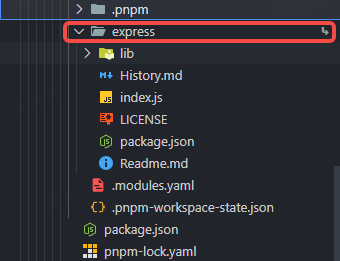

# pnpm
## pnpm 项目初衷
- 节省磁盘空间：依赖会被存储在内容可寻址的存储中
  - 如果你用到了某依赖项的不同版本，只会将不同版本间有差异的文件添加到仓库（变动小）
  - 所有文件都会存储在硬盘上的某一位置（跨项目共享）
- 提高安装速度
  - 依赖解析。 仓库中没有的依赖都被识别并获取到仓库。
  - 目录结构计算。 node_modules 目录结构是根据依赖计算出来的。
  - 链接依赖项。 所有以前安装过的依赖项都会直接从存储区中获取并链接到 node_modules。
- 创建一个非扁平的 node_modules 目录
  - pnpm 使用符号链接将项目的直接依赖项添加到模块目录的根目录中
  - npm 安装express的目录结构
    
  - pnpm 安装express的目录结构
    - node_modules 中的express 是一个软连接
      
    - .pnpm/ 中的express 是一个固定版本，它的node_modules下的express 是一个硬链接，其他包是软连接
      
    - .pnpm/ 中的其他包 也是固定版本，它的node_modules下的自己 是一个硬链接，其他包是软连接
      
  - 参考：
    - [扁平化的 node_modules 并非唯一方法](https://www.pnpm.cn/blog/2020/05/27/flat-node-modules-is-not-the-only-way)
    - [基于符号链接的 `node_modules` 结构](https://www.pnpm.cn/symlinked-node-modules-structure)
    - [pnpm vs npm](https://www.pnpm.cn/pnpm-vs-npm)
    - [pnpm 的严格性有助于避免愚蠢的错误](https://www.kochan.io/nodejs/pnpms-strictness-helps-to-avoid-silly-bugs.html)
- 软连接、硬链接
  - 软连接：一个“指路牌”，指向文件的路径，但它不是真实文件。
  - 硬链接：硬链接是给文件起两个名字，两个名字“是真实的”，都能直接访问文件内容。
    - 1. 硬连接只能创建文件的链接，不能链接文件夹（目录）
    - 2. 硬连接不能跨文件系统：不能让C盘的文件在D盘有另外一个名字
    - 3. 硬连接是指向 inode（相同内容）：inode 其实就是操作系统给文件的“身份证”，里面有文件的各种信息（权限、修改时间、数据位置等），硬连接就是创建了一个新的“文件名”指向和原文件一样的 inode。
  - 参考：[nodejs 创建硬链接和软链接](/back-end/Lang/NodeJs/Base/index.md#link-symlink)
## pnpm command [官方连接](https://pnpm.io/cli/add)
### pnpm install
``` bash
pnpm install
```
content-addressable storage 默认情况下，pnpm 使用一种名为 "content-addressable storage" 的方式来管理依赖
- 全局存储: pnpm 会将所有依赖包存储在一个全局的 content-addressable 存储中。 每个包只存储一次，即使多个项目依赖于同一个包的不同版本。
- 硬链接和符号链接: 在 node_modules 目录中，pnpm 使用硬链接和符号链接来创建依赖关系。 这使得 node_modules 目录非常轻量级，并且避免了重复安装相同的依赖包。
- 非扁平结构: pnpm 创建的 node_modules 目录结构不是扁平的。 每个依赖包只能够访问它在 package.json 文件中声明的依赖项。 这可以防止 "phantom dependencies"（幻影依赖）问题，即代码意外地依赖于未在 package.json 文件中声明的依赖项。
```bash
pnpm install --shamefully-hoist
```
- 会将所有依赖包都提升到 node_modules 目录的顶层，使得所有依赖包都可以被项目中的任何模块访问
- 使用场景（迁移现有项目）: 如果你正在将一个使用 npm 或 yarn 的现有项目迁移到 pnpm，使用 --shamefully-hoist 标志可以更容易地完成迁移，因为它会创建一个与 npm 或 yarn 类似的 node_modules 结构。
```bash
# 恢复到执行 pnpm install --shamefully-hoist 之前的状态
rm -rf node_modules
rm pnpm-lock.yaml
pnpm store prune  # 或者 rm -rf $(pnpm store path)
pnpm install
```
### pnpm remove
Aliases: rm, uninstall, un
```bash
pnpm remove
```
### pnpm link / unlink
- pnpm link \<dir\> 和 pnpm link --dir \<dir\> 之间的区别​
```bash
# The current directory is foo
# 在一个项目下，link到外部的包
pnpm link ../bar
- foo
  - node_modules
    - bar -> ../../bar
- bar
# The current directory is bar
# 在包目录下，将包连接到外部
pnpm link --dir ../foo
- foo
  - node_modules
    - bar -> ../../bar
- bar
```
- global
```bash
cd ~/projects/foo
pnpm install # install dependencies of foo
pnpm link --global # link foo globally
cd ~/projects/my-project
pnpm link --global foo # link foo to my-project
```
- unlink
```bash
# 项目内的所有链接依赖项都将取消链接
pnpm unlink
# pnpm在删除外部链接后重新安装依赖项
# 如果pckageName在package.json 中会重新安装
pnpm unlink <package>
# 彻底删除
pnpm uninstall --global <package>
```
### pnpm update
```bash
# 更新所有依赖项，遵守 package.json 中指定的范围
pnpm up
# 将所有依赖项更新到最新版本
pnpm up --latest 
# v2 的最新版本
pnpm up foo@2
```
### pnpm --filter
多包仓库中精确地控制命令的执行范围
```bash
pnpm --filter "@babel/core" test
pnpm --filter "@babel/*" test
pnpm --filter "*core" test
```
### pnpm patch / pnpm patch-commit / pnpm patch-remove
给软件包添加补丁
```bash
pnpm patch express@^5.1.0
pnpm patch-commit ./node_modules/.pnpm_patches/express@^5.1.0
pnpm patch-remove foo@1.0.0 bar@1.0.1
```
### pnpm store prune
```bash
# 清理 pnpm 存储区（store）中当前项目不再使用的包缓存
pnpm store prune
```
## pnpm-workspace.yaml
pnpm-workspace.yaml 文件用来定义哪些子包属于工作区
```yaml
packages:
  # 指定根目录直接子目录中的包
  - 'my-app'
  # packages/ 直接子目录中的所有包
  - 'packages/*'
  # components/ 子目录中的所有包
  - 'components/**'
  # 排除测试目录中的包
  - '!**/test/**'
# 定义目录和依赖版本号
catalog:
  react: ^18.3.1
  redux: ^5.0.1
```

```json
{
  "name": "@example/app",
  "dependencies": {
		"foo": "workspace:*",  // "foo": "1.5.0",
		"bar": "workspace:~", //"bar": "~1.5.0",
		"qar": "workspace:^", //"qar": "^1.5.0",
		"zoo": "workspace:^1.5.0" //"zoo": "^1.5.0"
	},
  "dependencies": {
    "react": "catalog:",
    "redux": "catalog:"
  }
}
```

| 写法 | 作用说明 | 版本匹配规则 |
| --- | --- | --- |
| "foo": "workspace:*" | 依赖 foo 包的任何版本，始终指向工作区里的本地包的最新版本，不管版本号是多少。 | 允许接受主版本、次版本和补丁版本的任何更新。 |
| "bar": "workspace:~" | 依赖符合 ~ 范围的工作区版本，匹配同一主版本和次版本号，补丁版本允许更新。 | 匹配 ~x.y.z 语义，允许补丁版本升级，不允许次版本和主版本升级。 |
| "qar": "workspace:^" | 依赖符合 ^ 范围的工作区版本，允许次版本和补丁版本更新，主版本必须一致。 | 匹配 ^x.y.z 语义，允许次版本和补丁版本更新，不允许主版本升级。 |
| "zoo": "workspace:^1.5.0" | 依赖版本范围明确为 ^1.5.0 的工作区包版本，维护该语义版本范围的依赖更新。 | 版本范围 >=1.5.0 <2.0.0，兼容 1.x 版本的升级 |
