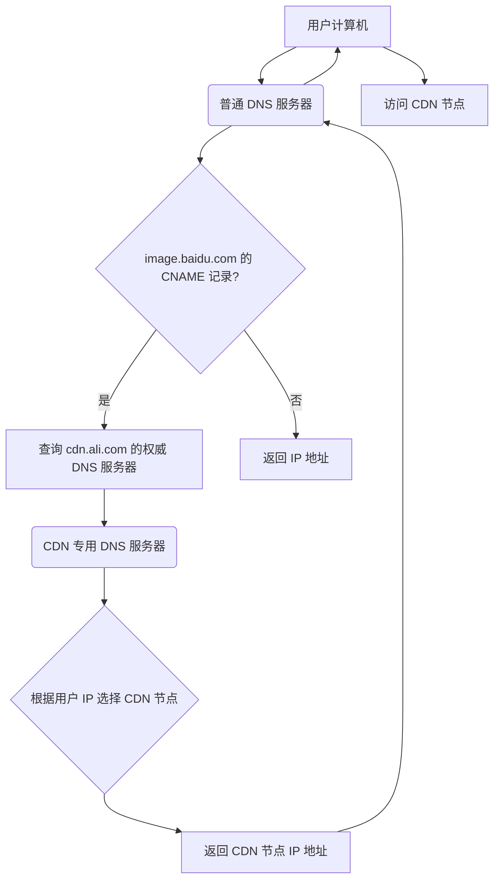

# Cdn
CDN全称叫做“Content Delivery Network”，中文叫内容分发网络。
## CNAME
- 用户使用某个域名来访问静态资源时（这个域名在阿里CDN服务中叫做“加速域名”），
- 比如这个域名为“image.baidu.com”，它对应一个CNAME，叫做“cdn.ali.com”，
- 那么普通DNS服务器（区别CDN专用DNS服务器）在解析“image.baidu.com”时，会先解析成“cdn.ali.com”，
- 普通DNS服务器发现该域名对应的也是一个DNS服务器，普通 DNS 服务器会继续解析 cdn.ali.com，它会向负责 cdn.ali.com 域名的权威 DNS 服务器（通常是 CDN 厂商的 DNS 服务器）发出查询请求。
- 权威 DNS 服务器接收到普通 DNS 服务器的查询请求后，会进行以下操作：
  - 智能解析: 它会根据用户的 IP 地址（通常由普通 DNS 服务器传递过来）等信息，判断用户所在的地理位置和网络环境 。
  - 选择最佳节点: 根据预设的策略（例如，选择距离用户最近、负载最低的节点），从 CDN 的所有边缘节点中选择一个最适合用户的节点。
  - 返回 IP 地址: 将选定的 CDN 边缘节点的 IP 地址返回给普通 DNS 服务器。
- 普通 DNS 服务器收到 CDN 专用 DNS 服务器返回的 IP 地址后，会将这个 IP 地址返回给用户的计算机。用户的计算机使用这个 IP 地址直接访问 CDN 边缘节点（用户即可访问离自己最近的一台CDN服务器了），获取所需的静态资源。

> - A记录：一个域名对应一个IP地址
> - CNAME：一个域名对应另外一个域名
> - NS：将子域名指定其他DNS服务器解析

## 优势
- CDN节点解决了跨运营商和跨地域访问的问题，访问延时大大降低；
- 大部分请求在CDN边缘节点完成，CDN起到了分流作用，减轻了源站的负载。
- 参考：
  - [趣讲CDN](https://juejin.cn/post/6844903742362353677)
  - [程序员要搞明白CDN，这篇应该够了](https://juejin.cn/post/6844903890706661389)
  - [前端必需了解的CDN知识](https://juejin.cn/post/6913704568325046279)
