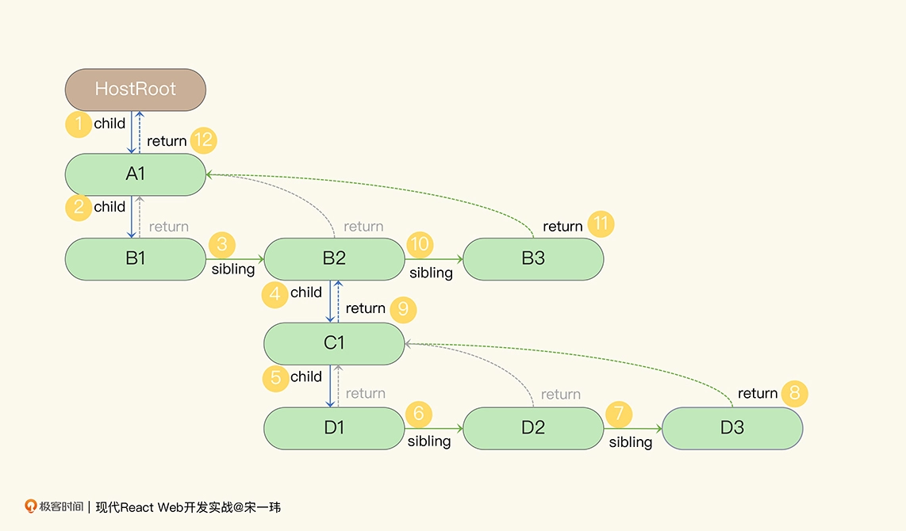
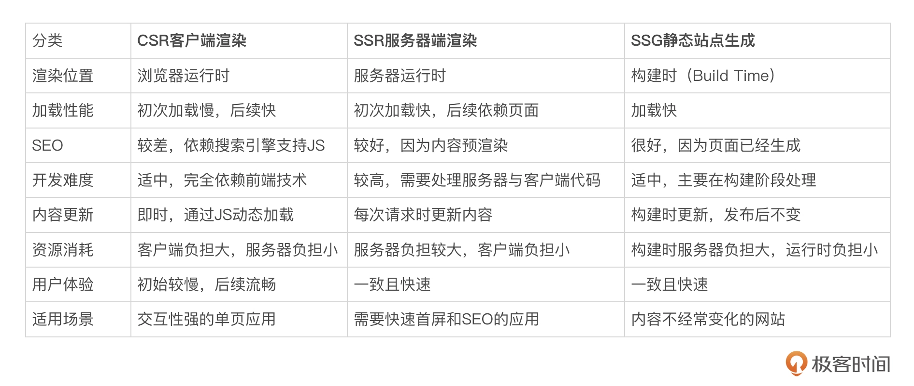

# React
## React 原理
### jsx
- jsx 语法糖
  - createElement (原有的React.createElement是为了类组件设计的)
    - 渲染的内容是用 React.createElement(component, props, ...children) 声明的，
    - JSX 正是createElement函数的语法糖，JSX 编译成由若干createElement函数组成的 JS 代码，然后才能在浏览器中正常执行
  - react/jsx-runtime
    - JSX被编译成了react/jsx-dev-runtime下的jsxDEV，在生产模式下则被编译成了react/jsx-runtime下的jsx或jsxs
- jsx优点：
  - JSX 提供的类 HTML/XML 的语法会让声明代码更加直观，在 IDE 的支持下，语法高亮更醒目，比起纯 JS（createElement） 也更容易维护
  - Java SSH（Spring+Struts2+Hibernate）技术栈, Struts2 用 XML 定义了一套名为标签库的 DSL（Domain-Specific Language，领域特定语言）,JSX 则直接利用了 JS 语句。很明显，JS 表达式能做的，JSX 都能做，不需要开发者再去学习一套新的 DSL。
  ```java
    <s:if test="showAdd">
        <div>KanbanNewCard ...</div>
    </s:if>
  ```
- jsx => JavaScript XML
  - React 元素有三种基本类型
    - React 封装的 DOM 元素，如 `<div></div>`、 `` ，这部分元素会最终被渲染为真实的 DOM；
    - React 组件渲染的元素，如`<KanbanCard />` ，这部分元素会调用对应组件的渲染方法；
    - React Fragment 元素，`<React.Fragment></React.Fragment>` 或者简写成 `<></>`，这一元素没有业务意义，也不会产生额外的 DOM，主要用来将多个子元素分组。
  - 属性统一：React 封装的 DOM 元素将浏览器 DOM 整体做了一次面向 React 的标准化
    - React JSX 中就统一为 `readOnly={true}` 或 `readOnly={false}`
    - className="kanban-card" ，更多是因为 HTML 标签里的class 是 JS 里的保留字，需要避开
  - 子元素的类型包括：
    - 字符串，最终会被渲染成 HTML 标签里的字符串；
    - 另一段 JSX，会嵌套渲染；JS 表达式，会在渲染过程中执行，并让返回值参与到渲染过程中；
    - 布尔值、null 值、undefined 值，不会被渲染出来；
    - 以上各种类型组成的数组。
  - props
    - props 表达式的特殊用法：属性展开， 利用 JS ... 语法把 props 这个对象中的所有属性都传给 KanbanCard 组件。

    <<< @/submodule/play/packages/react/src/base/props/Index.jsx{47}

  - 注释
    - JSX 里加注释，会发现 HTML 注释 根本没法通过编译，这时需要改用 \{/* */\}
  - 变迁
    - 两个大版本 v0.13 和 v0.14（你可以理解成 v13 和 v14）
    ```js
    const KanbanCard = React.createClass({
      render: function() {
        return (<div>KanbanCard ...</div>);
      }
    });
    ```
    - v0.13 中开始推广ES6 class的写法
    ```js
    class KanbanCard extends React.Component {
      render() {
        return (<div>KanbanCard {this.props.title}</div>);
      }
    }
    ```
    - v0.14，React 新加入了一种更为简化的无状态函数组件（Stateless Function Component）：还不能自己处理 state 状态
    ```js
    // ES6箭头函数
    const KanbanCard = (props) => {
      var title = props.title;
      return (<div>KanbanCard {title}</div>);
    };
    // 更简单的箭头函数+参数解构
    const KanbanCard = ({title}) => (
      <div>KanbanCard {title}</div>
    );
    ```
    - 高阶组件的方式补足函数组件缺失的功能
    ```js
    import { withState } from 'recompose';
    const enhance = withState('showAdd', 'setShowAdd', false);
    const KanbanColumn = enhance(({ showAdd, setShowAdd }) => (
      <section className="kanban-column column-todo">
        <h2>
          待处理
          <button onClick={() => setShowAdd(true)}>添加新卡片</button>
        </h2>
        <ul>
          { showAdd && <KanbanNewCard /> }
        </ul>
      </section>
    ));
    ```
  - 函数组件上位的原因包括：
    - React 的哲学 UI=f(state) ；
    - 更彻底的关注点分离（Separation Of Concerns）；
    - 函数式编程的影响；
    - React 内部实现的不断优化；
    - 开源社区的反哺。
  - 灵感
    - 他的灵感是es4里面的e4x，但原本的e4x因为涉及到语法和语义的定义，实现过于复杂所以被弃用。
    - 业界最贴近ES4规范的实现是Adobe Flash中的ActionScript 3语言，随着Flash技术的覆灭，ECMA毅然抛弃了ES4，转而发布了ES5
- [babel try it](https://babeljs.io/repl/#?browsers=defaults%2C%20not%20ie%2011%2C%20not%20ie_mob%2011&build=&builtIns=false&corejs=3.21&spec=false&loose=false&code_lz=GYVwdgxgLglg9mABACwKYBt1wBQEpEDeAUIogE6pQhlIA8AJjAG4B8AEhlogO5xnr0AhLQD0jVgG4iAXyJA&debug=false&forceAllTransforms=false&modules=false&shippedProposals=false&evaluate=false&fileSize=false&timeTravel=false&sourceType=module&lineWrap=true&presets=react&prettier=false&targets=&version=7.18.4&externalPlugins=&assumptions=%7B%7D)
### Component
- 拆分
    - 拆分时需要你理解业务和交互，
    - 设计组件层次结构（Hierarchy），
    - 以关注点分离（Separation Of Concern）原则
- 组件层次结构：
    - 比组件化更进一步的概念是组件层次结构（Hierarchy），指父类子类之间的继承关系
    - React 并没有用类继承的方式扩展现有组件（类组件继承 React.Component类，但类组件之间没有继承关系），所以在 React 中提到 Hierarchy，一般都是指组件与组件间的层次结构
- 真·子组件（Sub-components）的设计模式，
  - 代表性的组件库有Semantic UI React、Recharts
  ```jsx
  // Semantic UI React
  <Message icon>
    <Icon name='circle notched' loading />
    <Message.Content>
      <Message.Header>
        Just one second
      </Message.Header>
      We're fetching that content for you.
    </Message.Content>
  </Message>
  ```
- props
  - children: 这个属性一般不需要显式地传值，在闭合标签内部加入子元素即可，子元素会自动作为 children 传给标签对应的组件
- 基本原则：
  - 单一职责（Single Responsibility）原则。
  - 关注点分离（Separation of Concern）原则。
  - 一次且仅一次（DRY, Don’t Repeat Yourself）原则。
  - 简约（KISS，Keep It Simple & Stupid）原则。
- React 没有组件树（Component Tree），只有元素树（Element Tree）
### 渲染机制
- 几个问题：
    - 为什么我需要关心 React 组件的渲染机制？
    - 为什么数据变了，但组件没重新渲染？
    - 为什么数据没变，但组件也重新渲染了？
- 虚拟dom功能以及优点：
    - React 帮你节省了更多代码量，是作为 React 面向开发者的 API 与 React 内部实现对接的桥梁。
    - React 提供一系列算法和过程，过滤掉没有必要的 DOM API 调用，最终把f() 的成本降下来。
    - 虚拟 DOM 就是这些算法过程的中间模型，它远比 DOM API 轻量，跟最终的 DOM API 分摊成本后，保证 React 组件的渲染效率。
- 协调
    - 每次有 props、state 等数据变动时，组件会渲染出新的元素树，React 框架会与之前的树做 Diffing 对比，将元素的变动最终体现在浏览器页面的 DOM 中。这一过程就称为协调
- diffing 算法
    - 从根元素开始，React 将递归对比两棵树的根元素和子元素；
    - 对比不同类型的元素，如对比 HTML 元素和 React 组件元素，React 会直接清理旧的元素和它的子树，然后建立新的树；
    - 对比同为 HTML 元素，但 Tag 不同的元素，如从 `<a>` 变成 `<div>` ，React 会直接清理旧的元素和子树，然后建立新的树；
    - 对比同为 React 组件元素，但组件类或组件函数不同的元素，如从 `KanbanNewCard` 变成 `KanbanCard` ，React 会卸载旧的元素和子树，然后挂载新的元素树；
    - 对比 Tag 相同的 HTML 元素，如  `<input type="text" value="old" />` 和 `<input type="text" value="new" />` ，React 将会保留该元素，并记录有改变的属性，在这个例子里就是 value 的值从 "old" 变成了 "new" ；
    - 对比组件类或组件函数相同的组件元素，如 `<KanbanCard title="老卡片" />` 和 `<KanbanCard title="新卡片" />` ，React 会保留组件实例，更新 props，并触发组件的生命周期方法或者 Hooks。
    - 如果子元素形成一个列表，那么 React 会按顺序尝试匹配新旧两个列表的元素。`key`
- 触发
    - props 从组件外面传进来，
    - state 则是活跃在组件内部，
    - 至于 context ，在组件外面的 Context.Provider 提供数据，组件内部则可以消费 context 数据
    - 只要这三种数据之一发生了变化，React 就会对当前组件触发协调过程，最终按照 Diffing 结果更改页面。
- Fiber 协调引擎
    - 在 React 的早期版本，协调是一个同步过程，这意味着当虚拟 DOM 足够复杂，或者元素渲染时产生的各种计算足够重，协调过程本身就可能超过 16ms，严重的会导致页面卡顿
    - 而从 React v16 开始，协调从之前的同步改成了异步过程，这主要得益于新的 Fiber 协调引擎。从此在 React 中更贴近虚拟 DOM 的，是在 Fiber 协调引擎中的核心模型 FiberNode
    - FiberNode 
        - 依靠对元素到子元素的双向链表、子元素到子元素的单向链表实现了一棵树，
        - 这棵树可以随时暂停并恢复渲染，触发组件生命周期等副作用（Side-effect），
        - 并将中间结果分散保存在每一个节点上，
        - 不会 block 浏览器中的其他工作
### css
- CSS-in-JS
  - CSS 与 JS 天生就是异构的，对于 React 的组件层次结构，CSS 很难做到一一对应。
  - 此外，不同组件中样式的隔离也是必须的。
- emotion
  - 你可能对 css `args` 这样的函数写法感到陌生，将` `定义的模板字面量（Template Literals）直接拼在函数名后面是 ES6 里新加入的语法，称作带标签的模版字符串（Tagged Templates）
  https://developer.mozilla.org/zh-CN/docs/Web/JavaScript/Reference/Template_literals#%E5%B8%A6%E6%A0%87%E7%AD%BE%E7%9A%84%E6%A8%A1%E6%9D%BF
### 生命周期
- 组件生命周期并不等同于类组件的生命周期方法
#### 类组件
- 类组件生命周期：挂载（Mounting）、更新（Updating）、卸载（Unmounting）以及 错误处理（Error Handling）阶段、render() 方法
```js
class LegacyKanbanCard extends React.Component {
  constructor(props) { super(props);/*...省略 */}
  componentDidMount() { /*...省略 */ }
  // ...其他生命周期方法
  componentWillUnmount() { /*...省略 */ }
  render() { return (<div>KanbanCard {this.props.title}</div>); }
}
```
- 挂载阶段：
  - 1、组件构造函数。如果你需要为类组件的 state 设置初始值，或者将类方法的 this 绑定到类实例上，那么你可以为类组件定义构造函数；如果不需要设置或绑定的话，就可以省略掉构造函数。
  - 2、static getDerivedStateFromProps 。如果类组件定义了这个静态方法，在组件挂载过程中，React 会调用这个方法，根据返回值来设置 state。
  - 3、render ，类组件必须要实现这个方法。通常在返回值中会使用 JSX 语法，React 在挂载过程中会调用 render 方法获得组件的元素树。根据元素树，React 最终会生成对应的 DOM 树。
  - 4、componentDidMount 。当 React 首次完成对应 DOM 树的创建，会调用这个生命周期方法。你可以在里面访问真实 DOM 元素，也可以调用 this.setState() 触发再次渲染，但要注意避免性能问题。

- 更新阶段：（当组件接收到新 props，或者内部调用 setState() 修改了状态）
  - 1、static getDerivedStateFromProps 。这个静态方法不仅会在挂载时被调用，也会在更新时调用，而且无论组件 props 是否有更改，只要渲染组件，都会调用这个方法。这个特性有可能造成组件内部的 state 被意外覆盖，根据 React 官方的建议，应谨慎使用这个方法。
  - 2、shouldComponentUpdate 。如果类组件定义了这个方法且返回值是 false ，则组件在这一次更新阶段不会重新渲染，后续的 render 等方法也不会被执行，直到下一次更新。这在 React 早期版本是最常见的性能优化方法之一，也是最常写出 Bug 的 API 之一。为了尽量避免跳过必要更新，应优先使用 React 的[PureComponent 组件](https://zh-hans.legacy.reactjs.org/docs/react-api.html#reactpurecomponent)。
  - 3、render。是的，只要没有被前面 shouldComponentUpdate 方法返回 false 所取消，render 方法在更新阶段也会被调用，调用的返回值会形成新的 DOM 树。
  - 4、getSnapshotBeforeUpdate 。在本次更新真实 DOM 之前，你有一次访问原始 DOM 树的机会，就是这个生命周期方法，不过不常用。
  - 5、componentDidUpdate 。组件完成更新时会调用这个方法，你可以在这里操作 DOM，也可以处理网络请求，但要注意，你需要通过比对新旧 props 或 state 来避免死循环。
  - （此外，显式调用 forceUpdate() 也可以令组件更新。但很明显，这个接口更偏向命令式，与 React 声明式的开发方式有所区别，因此要尽量减少使用。）

- 卸载阶段。
  - 1、组件即将被卸载时，React 会调用它的 componentWillUnmount 方法，你可以在这个方法中清理定时器、取消不受 React 管理的事件订阅等。

- 错误处理阶段。
  - 1、当组件在渲染时、执行其他生命周期方法时、或者是执行 Hooks 时发生错误，则进入错误处理阶段。
  - 2、本身定义了 static getDerivedStateFromError 和 componentDidCatch 这两个生命周期方法中的一个，或者两个都定义了，这个组件就成为了错误边界（Error Boundary），这两个方法会被 React 调用来处理错误。
  - 3、如果当前组件不是错误边界，React 就会去找父组件；如果父组件也不是，就会继续往上，直到根组件；如果谁都没接住，应用就挂了。
  - 截止到 React v18.2.0，只有类组件才能成为错误边界，函数组件是不行的。
- render
 - 以上所有这些生命周期方法里，只有 render() 是必须实现的，其他均为可选。

- 渲染阶段与提交阶段
  - 这两个阶段与前面介绍的挂载、更新、卸载阶段是重合叠加的关系。
  - 比如组件挂载时调用的构造函数、 render 发生在渲染阶段，而 componentDidMount 发生在提交阶段。
  - 组件更新的 shouldComponentUpdate 、 render 也发生在渲染阶段， componentDidUpdate 发生在提交阶段。
- Fiber 协调引擎：协调从同步过程改进成了异步过程。
  - 渲染阶段
    - 渲染阶段是异步过程，主要负责更新虚拟 DOM（ FiberNode ）树，而不会操作真实 DOM，
    - 这一过程可能会被 React 暂停和恢复，甚至并发处理，
    - 因此要求渲染阶段的生命周期方法必须是没有任何副作用（Side-effect）的纯函数（Pure Function）；
  - 提交阶段
    - 提交阶段是同步过程，根据渲染阶段的比对结果修改真实 DOM，这一阶段的生命周期方法可以包含副作用。
  - 为什么vue不需要fiber，react需要fiber
    - [参考](https://juejin.cn/post/7208129482095165501)

#### Hooks组件
- 1、挂载阶段。
  - 渲染：React 会执行组件函数，在函数执行过程中遇到的 useState 、useMemo 等 Hooks 依次挂载到 FiberNode 上，useEffect 其实也会被挂载，但它包含的副作用（Side-effect，在 Fiber 引擎中称为 Effect）会保留到提交阶段。组件函数的返回值通常会使用 JSX 语法，React 在渲染阶段根据返回值创建 FiberNode 树。
  - 提交：React 更新真实 DOM 之前会依次执行前面定义的 Effect。
- 2、更新阶段。
  - 渲染：当组件接收到新 props，调用 useState 返回的 setter 或者 useReducer 返回的 dispatch 修改了状态，组件会进入更新阶段。组件函数本身会被再次执行，Hooks 会依次与 FiberNode 上已经挂载的 Hooks 一一匹配，并根据需要更新。组件函数的返回值用来更新 FiberNode 树。
  - 提交：React 会更新真实 DOM。随后 React 会先执行上一轮 Effect 的清除函数，然后再次执行 Effect。这里的 Effect 包括 useEffect 与useLayoutEffect ，两者特性很相像。其中useLayoutEffect 的 Effect 是在更新真实 DOM 之后同步执行的，与类组件的 componentDidMount、componentDidUpdate 更相似一些；而 useEffect 的 Effect 是异步执行的，一般晚于 useLayoutEffect 。
- 3、卸载阶段。主要是执行 Effect 的清除函数。
- 函数组件也有错误处理阶段，但没有对应的生命周期 Hooks，错误处理依赖于父组件或祖先组件提供的错误边界。
### Hooks
- Hooks 
  - 就是这样一套为函数组件设计的，用于访问 React 内部状态或执行副作用操作，以函数形式存在的 React API。
- useState
  - 组件的 state 并不是绑定在组件的函数上的，而是组件渲染产生的虚拟 DOM 节点，也就是 FiberNode 上的。
  - 所以在上面的函数中调用 useState ，意味着函数将访问函数本身以外、React 以内的状态，这就让函数产生了副作用，导致函数不再是纯函数
- [Hooks](https://zh-hans.react.dev/reference/react/hooks)
  - useState
  - useEffect
  - useContext
  - useReducer/useMemo/useCallback/useRefuseImperativeHandle/useLayoutEffect/useDebugValue/useDeferredValue/useTransition/useId
- Hooks 掌握
  - 1、掌握 useRef 的一般用法；
  - 2、当需要优化性能，减少不必要的渲染时，学习掌握 useMemo 和 useCallback ；
  - 3、当需要在大中型 React 项目中处理复杂 state 时，学习掌握 useReducer ；
  - 4、当需要封装组件，对外提供命令式接口时，学习掌握 useRef 加 useImperativeHandle；
  - 5、当页面上用户操作直接相关的紧急更新（Urgent Updates，如输入文字、点击、拖拽等），受到异步渲染拖累而产生卡顿，需要优化时，学习掌握 useDeferredValue 和 useTransition
#### useState &I
- 批处理
  - React 18 加入的自动批处理多个 state 更新的功能
  ```js
  const [showAdd, setShowAdd] = useState(false);
  ```
- 更新
  - 当需要更新这个 state 时，则调用 setShowAdd 函数，如 setShowAdd(true) 。
  - 每次组件更新，在渲染阶段都会再次调用这个useState 函数，但它不会再重新初始化 state，而是保证 showAdd 值是最新的。
  - 导致性能隐患 
  ```js
  useState(fibonacci(40))
  ```
- useState：函数作为参数
  - useState 还有另一种设置默认值的方法，就是传一个函数作为参数，useState 内部只在组件挂载时执行一次这个函数，此后组件更新时不会再执行。
  ```js
  useState(() => fibonacci(40))
  ```
- setShowAdd：函数作为参数
  - state 更新函数，即 setShowAdd 也可以传函数作为参数
  - 保证更新函数使用最新的 state 来计算新 state 值
  ```js
  setShowAdd(prevState => !prevState);
  setTodoList(prevState => {
    return [...prevState, aNewTodoItem];
  });
  ```
#### useReducer
- useReducer 适用于抽象封装复杂逻辑
```js
function reducer(state, action) {
  switch (action.type) {
    case 'show':
      return true;
    case 'hide':
    default:
      return false;
  }
}
function App() {
  const [showAdd, dispatch] = useReducer(reducer, false);
  // ...省略
  dispatch({ type: 'show' });
```
- 自动批处理
  - 接连更新两个 state，组件会重新渲染几次呢？
  - 组件只会重新渲染一次，而且这次渲染使用了两个 state 分别的最新值。这就是 React对多个 state 更新的自动批处理。
  - state 更新的自动批处理是 React 确保组件基础性能的重要功能。
  - 而从 React 18 版本起，无论是在事件处理函数、异步回调，还是 setTimeout 里的多个 state 更新，默认都会被自动批处理，只触发一次重新渲染。
#### useRef
- 需要在 React 组件中使用可变值该怎么办？答案是，我们可以使用 useRef 这个 Hook

<<< @/submodule/play/packages/react/src/base/ref/Index.jsx

- 组件重新渲染本身不会影响 current 属性的值；
- 反过来，变更 current 属性值也不会触发组件的重新渲染。
- HTML 元素的 ref 属性。这个属性是 React 特有的，不会传递给真实 DOM。
- 当 ref 属性的值是一个可变 ref 对象时，组件在挂载阶段，会在 HTML 元素对应的真实 DOM 元素创建后，将它赋值给可变 ref 对象的 current 属性，即 inputElem.current；
- 在组件卸载，真实 DOM 销毁之前，也会把 current 属性设置为 null

#### forwardRef

<<< @/submodule/play/packages/react/src/base/forwardRef/Index.jsx

#### useEffect &I
```js
useEffect(func, [])
```
- 保证 func 只在组件挂载的提交阶段执行一次，接下来的组件更新时不会再执行。
- 补充:
  - Hook 规则只在最顶层使用 Hook。不要在循环，条件或嵌套函数中调用 Hook。
  - 只在 React 函数中调用 Hook。不要在普通的 JavaScript 函数中调用 Hook。
  - 因为本质是链表。在各种判断中写 Hook 会导致节点错乱。
    - React Hooks 的实现依赖于一个链表结构 。
    - 每次组件渲染时，React 按照 Hooks 的声明顺序将它们链接起来。
    - 如果在条件语句中调用 Hooks，可能导致每次渲染时 Hooks 的调用顺序不一致，从而破坏链表的结构，导致状态错乱和不可预测的行为 。
  - useRef 中值变化是不会触发重新渲染。useState 中则是会触发渲染。
#### useEffect 2 &I
- 副作用：
  - 当调用函数时，除了返回可能的函数值之外，还对主调用函数产生附加的影响。
  - 例如修改全局变量，修改参数，向主调方的终端、管道输出字符或改变外部存储信息等。
  - 副作用就是让一个函数不再是纯函数的各类操作
- 用法1：在提交阶段才会被调用的，这时副作用回调函数可以访问到组件的真实 DOM。
  ```js
  useEffect(() => {/* 省略 */}); 
  ```
- 用法2（最常用的）：副作用的条件执行。在上面用法的基础上，传入一个依赖值数组（Dependencies）作为第二个参数：
  ```js
  useEffect(() => {/* 省略 */}, [var1, var2]);
  ```
 - 下次渲染时会把依赖值数组里的值依次与前一次记录下来的值做浅对比（Shallow Compare）
 - 依赖值数组里可以加入 props、state、context 值
  - 空数组[]也是一个有效的依赖值数组，由于在组件生命周期中依赖值不会有任何变化，所以副作用回调函数只会在组件挂载时执行一次，之后不论组件更新多少次，副作用都不会再执行
- 用法3：副作用回调函数的返回值也是一个函数，这个返回的函数叫做清除函数
  ```js
  useEffect(() => {/* 省略 */; return () => {/* 省略 */};}, [status]);
  ```
  - 组件在下一次提交阶段执行同一个副作用回调函数之前，或者是组件即将被卸载之前，会调用这个清除函数。
  - 如果依赖值数组是一个空数组，那么清除函数只会在卸载组件时执行。

<<< @/submodule/play/packages/react/src/base/effect/Index.jsx

```js
// 打印结果
useEffect
useEffect1 0
useEffect2 0
useEffect2 return
useEffect
useEffect1 1
useEffect2 1
```

#### useLayoutEffect
- 它的副作用执行时机一般早于前者，是在真实 DOM 变更之后同步执行的，更接近类组件的componentDidMount 、componentWillUnmount 。
- 为保证性能，应尽量使用 useEffect 以避免阻塞。
#### useMemo &I
```js
const memoized = useMemo(() => createByHeavyComputing(a, b), [a, b]);
```

<<< @/submodule/play/packages/react/src/base/meno/UseMeno.jsx

- 是将执行成本较高的计算结果存入缓存，通过减少重复计算来提升组件性能。
- useMemo的回调是在渲染过程中执行(组件执行中)，而useEffect的回调会在提交阶段执行（dom更新，再异步调取）
#### react.memo
- 没有包裹的子组件，父组件渲染，子组件也会渲染
- 使用 React.memo 包裹后子组件，props 相同不重新渲染

<<< @/submodule/play/packages/react/src/base/meno/reactMeno.jsx

#### useCallback
- 只要第二个参数依赖值数组的依赖项不改变，它就会保证一直返回同一个回调函数（引用），而不是新建一个函数
- 当依赖项改变时， useCallback 才会更新回调函数及其闭包。
```js
const memoizedFunc = useCallback(() => {/*省略*/}, [a, b]);
```
- useCallback 是 useMemo 的一个马甲，相当于：
```js
const memoizedFunc = useMemo(() => () => {/*省略*/}, [a, b]);
```
- 使用useCallback
  - 纯组件的特性：当组件的 props 和 state 没有变化时，将跳过这次渲染。
  - 而你在函数组件内频繁声明的事件处理函数，比如 handleSubmit ，在每次渲染时都会创建一个新函数。
  - 如果把这个函数随着 props 传递给作为子组件的纯组件，则会导致纯组件的优化无效，因为每次父组件重新渲染都会带着子组件一起重新渲染。
  - 这时就轮到useCallback 出马了，使用妥当的话，子组件不会盲目跟随父组件一起重新渲染，这样的话，反复渲染子组件的成本就节省下来了。
#### hooks 使用
- 第一，只能在 React 的函数组件中调用 Hooks。
  - 目的是保证 Hooks 能“勾”到 React 的虚拟 DOM 中去
- 第二，只能在组件函数的最顶层调用 Hooks。
  - 都要保证每个 Hook 的执行顺序，这样 React 才能识别每个 Hook，保持它们的状态
### 合成事件
- 合成事件
  - 底层仍然是 DOM 事件，但隐藏了很多复杂性和跨浏览器时的不一致性
  - 当用户点击按钮时，handleClick 会被调用，传入一个描述点击事件的对象作为函数的第一个参数。
  - 而这个对象就是 React 中的合成事件（SyntheticEvent）。
  - 合成事件是原生 DOM 事件的一种包装，
  - 它与原生事件的接口相同，根据 W3c 规范，React 内部规范化（Normalize）了这些接口在不同浏览器之间的行为，开发者不用再担心事件处理的浏览器兼容性问题。
#### 合成事件与原生 DOM 事件的区别
- 注册事件监听函数的方式不同
  - 监听原生 DOM 事件基本有三种方式
  ```html
  <!-- - 1、以内联方式写在 HTML 标签中 -->
  <button id="btn" onclick="handleClick()">按钮</button>
  <script>
    // 2、在 JS 中赋值给 DOM 元素的事件处理属性：
    document.getElementById('btn').onclick = handleClick;
    // 3、在 JS 中调用 DOM 元素的 addEventListener 方法（需要在合适时机调用 removeEventListener 以防内存泄漏）：
    document.getElementById('btn').addEventListener('click', handleClick);
  </script>
  ```
  - jsx
  ```jsx
  // 1
  const Button = () => (<button onClick={handleClick}>按钮</button>);
  // 编译为
  const Button = () => React.createElement('button', {
    onClick: handleClick
  }, '按钮');
  // 2
  () => (<div onClickCapture={handleClick}>...</div>);
  ```
- 特定事件的行为不同
  - 范化了一些在各个浏览器间行为不一致，
  - 甚至是在不同元素上行为不一致的事件
- 实际注册的目标 DOM 元素不同
  ```js
  evt.currentTarget 
  // button
  evt.target 
  // button
  evt.nativeEvent.currentTarget 
  // 根容器 DOM 元素
  // React 使用了事件代理模式。
  // React 在创建根（ createRoot ）的时候，会在容器上监听所有自己支持的原生 DOM 事件。
  // 当原生事件被触发时，React 会根据事件的类型和目标元素，找到对应的 FiberNode 和事件处理函数，创建相应的合成事件并调用事件处理函数。
  evt.nativeEvent.target 
  // button
  
  ```
#### 什么时候使用原生 DOM 事件？
1、需要监听 React 组件树之外的 DOM 节点的事件，这也包括了 window 和 document 对象的事件。
  - 注意注意的是，在组件里监听原生 DOM 事件，属于典型的副作用，所以请务必在 useEffect 中监听，并在清除函数中及时取消监听。
2、很多第三方框架，尤其是与 React 异构的框架，在运行时会生成额外的 DOM 节点
### 组件表与里
#### 数据流
React 的数据流主要包含了三种数据：属性 props、状态 state 和上下文 context
- Props
- State
  - Object.is() 来判断两个值是否不同的。
  - 尤其注意，当新旧值都是对象、数组、函数时，判断依据是它们的值引用是否不同。
#### Context
- 用于组件跨越多个组件层次结构，向后代组件传递和共享“全局”数据。

<<< @/submodule/play/packages/react/src/base/context/UseContext.jsx

- MyContext.Provider 是可以嵌套使用的。
- MyGrandchildComponent 组件会去到组件树，从它的祖先节点中找到离它最近的 MyContext.Provider 即 MyComponent ，读取后者的 value 值；
- 当 MyComponent 的 state1 ，也就是 MyContext.Provider 的 value 值发生更改时，会通知到它后代组件中所有消费者组件重新渲染。
- 只能从声明了 Context.Provider 的当前组件传递给它的子组件树
```jsx
// 不要这样写
function MyComponent() {
  const [state1, setState1] = useState('文本');
  // ...
  return (
    <MyContext.Provider value={{ key1: state1 }}>
      <MyChildComponent />
    </MyContext.Provider>
  );
}
// 可以利用state
function MyComponent() {
  const [obj, setObj] = useState({ key1: '文本' })
  // ...
  return (
    <MyContext.Provider value={obj}>
      <MyChildComponent />
    </MyContext.Provider>
  );
}
// 也可以利用useMemo
function MyComponent() {
  const [state1, setState1] = useState('文本');
  const obj = useMemo(() => ({ key1: state1 }), [state1]);
  // ...
  return (
    <MyContext.Provider value={obj}>
      <MyChildComponent />
    </MyContext.Provider>
  );
}
```
重构
- 重构而重构，除非我们很清楚重构的目标范围、预期收益、成本和存在的风险。
补充：
- redux
  - [react-redux的发展史](https://blog.isquaredsoftware.com/2018/11/react-redux-history-implementation/)
  - [redux源码解读](https://juejin.cn/post/6844904191228411911)
#### 状态提升
- 状态提升
  - 这时我们就认为，这四个 state 是 App 标题栏和 KanbanBoard 的共享应用状态，
  - 需要放在 App 标题栏和 KanbanBoard 共同的父组件中（虽然我们没有把 App 标题栏抽取成独立的组件，但逻辑上是一样的）。
  - 这个过程被称作状态提升（Lifting State Up），也是我们在做 React 组件设计开发时会经常用到的一个技巧。
- 属性钻取
  - 这一层一层传有点累吧？也没有什么额外逻辑，就是透传。
  - 这个现象就被称作属性钻取（Props Drilling）。
  - 虽然显式的传递一目了然，但给开发过程还是带来了些许繁琐，我们看看该怎么解决这个问题。
  - context 来解决
### 工程化
npm run eject
### attr
#### dangerouslySetInnerHTML &I
- 将一段 HTML 字符串插入到 React 组件中
- 本质：将提供的 HTML 字符串设置为对应 DOM 元素的 innerHTML 属性
```jsx
function MyComponent({ htmlContent }) {
  return (
    <div dangerouslySetInnerHTML={{ __html: htmlContent }} />
  );
}
```
### fiber &I
- fiber 产生
  - React 组件会渲染出一棵元素树……每次有 props、state 等数据变动时，组件会渲染出新的元素树，React 框架会与之前的树做 Diffing 对比，将元素的变动最终体现在浏览器页面的 DOM 中。这一过程就称为协调（Reconciliation）。
  - 在 React 的早期版本，协调是一个同步过程，这意味着当虚拟 DOM 足够复杂，或者元素渲染时产生的各种计算足够重，协调过程本身就可能超过 16ms，严重的会导致页面卡顿。
  - 而从 React v16 开始，协调从之前的同步改成了异步过程，这主要得益于新的 Fiber 协调引擎。
- 工作
  - 在协调过程中存在着各种动作，如调用生命周期方法或 Hooks，这在 Fiber 协调引擎中被称作是工作（Work）。
  - Fiber 中最基本的模型是 FiberNode，用于描述一个组件需要做的或者已完成的工作，每个组件可能对应一个或多个 FiberNode。（每个 FiberNode 的数据都来自于元素树中的一个元素）
- 过程
  - 渲染
    - 当第一次渲染，React 元素树被创建出来后，Fiber 协调引擎会从 HostRoot 这个特殊的元素开始，遍历元素树，创建对应的 FiberNode 。
    - FiberNode 与 FiberNode 之间，并没有按照传统的 parent-children 方式建立树形结构。
      - 而是在父节点和它的第一个子节点间，利用child 和 return 属性建立了双向链表。
      - 节点与它的平级节点间，利用 sibling 属性建立了单向链表，同时平级节点的 return 属性，也都被设置成和单向链表起点的节点 return 一样的值引用
      
      - 这样做的好处是，可以在协调引擎进行工作的过程中，避免递归遍历 Fiber 树，而仅仅用两层循环来完成深度优先遍历，这个用于遍历 Fiber 树的循环被称作 workLoop。
      ```js
      let workInProgress;
      function workLoop() {
        while (workInProgress && !shouldYield()) {
          const child = workWork(workInProgress);
          if (child) {
            workInProgress = child;
            continue;
          }
          let completedWork = workInProgress;
          do {
            if (completedWork.sibling) {
              workInProgress = completedWork.sibling;
              break;
            }
            completedWork = completedWork.return;
          } while (completedWork);
        }
      }
      ```
      - 更狠的一点是，这个循环随时可以跑，随时可以停。这意味着 workLoop 既可以同步跑，也可以异步跑，当 workLoop 发现进行中的 Fiber 工作耗时过长时，可以根据一个 shouldYield() 标记决定是否暂停工作，释放计算资源给更紧急的任务，等完成后再恢复工作。
    - 当组件内更新 state 或有 context 更新时，React 会进入渲染阶段（Render Phase）。
      - 这一阶段是异步的，Fiber 协调引擎会启动workLoop ，从 Fiber 树的根部开始遍历，快速跳过已处理的节点；
      - 对有变化的节点，引擎会为 Current（当前）节点克隆一个 WorkInProgress（进行中）节点，将这两个 FiberNode 的 alternate 属性分别指向对方，并把更新都记录在WorkInProgress 节点上
    - 函数组件的 Hooks 也是在渲染阶段执行的。除了useContext ，Hooks 在挂载后，都会形成一个由 Hook.next 属性连接的单向链表，而这个链表会挂在 FiberNode.memoizedState 属性上。
    - 在此基础上，useEffect 这样会产生副作用的 Hooks，会额外创建与 Hook 对象一一对应的 Effect 对象，赋值给 Hook.memoizedState 属性。此外，也会在 FiberNode.updateQueue 属性上，维护一个由 Effect.next 属性连接的单向链表，并把这个 Effect 对象加入到链表末尾。
  - 提交
    - 当 Fiber 树所有节点都完成工作后，WorkInProgress 节点会被改称为 FinishedWork（已完成）节点，WorkInProgress 树也会被改称为 FinishedWork树。
    - 这时 React 会进入提交阶段（Commit Phase），这一阶段主要是同步执行的。
      - 变更前（Before Mutation）子阶段。
        - 这个子阶段会调用类组件的 getSnapshotBeforeUpdate 方法。
      - 变更（Mutation）子阶段。这个子阶段会更新真实 DOM 树。
        - 递归提交与删除相关的副作用，包括移除 ref、移除真实 DOM、执行类组件的 componentWillUnmount 。
        - 递归提交添加、重新排序真实 DOM 等副作用。
        - 依次执行 FiberNode 上 useLayoutEffect 的清除函数。
        - 引擎用 FinishedWork 树替换 Current 树，供下次渲染阶段使用。
      - 布局（Layout）子阶段。
        - 这个子阶段真实 DOM 树已经完成了变更，会调用 useLayoutEffect 的副作用回调函数，和类组件的 componentDidMount 方法。
    - 在提交阶段中，引擎还会多次异步或同步调用 flushPassiveEffects() 。
      - 这个函数会先后两轮按深度优先遍历 Fiber 树上每个节点：
      - 第一轮：如果节点的 updateQueue 链表中有待执行的、由 useEffect 定义的副作用，则顺序执行它们的清除函数；
      - 第二轮：如果节点的 updateQueue 链表中有待执行的、由 useEffect 定义的副作用，则顺序执行它们的副作用回调函数，并保存清除函数，供下一轮提交阶段执行。
    - 协调引擎的 Diffing 算法在哪里？其实从渲染到提交阶段，到处都在利用 memoizedProps 和 memoizedState 与新的 props、state 做比较，以减少不必要的工作，进而提高性能。
- 其他
  - 任务优先级和饥饿问题的处理（packages/scheduler，即任务优先级和调度相关的内容）
  - [React 工作流程](https://pomb.us/build-your-own-react/)
  - [v18.2.0 react-reconciler 源码](https://github.com/facebook/react/tree/v18.2.0/packages/react-reconciler)
## React19
### Action 和 表单相关API
#### useTransition
React 18 加入的 transition，可以用来定义非关键的 state 更新。
自动批处理多个 state 更新操作，如果其中某个 state 更新导致的渲染代价较大，则会拖累其他的 state 更新，具体来说，可能会导致录入文字变“卡”。
把代价大的 state 更新标记为非关键的 transition
在 transition 执行过程中，调度器每 5 毫秒都会把控制权交还给主进程，检查是否有其他更重要的工作单元，如果有就暂停 transition，这样就可以进一步避免阻塞 UI。
```js
startTransition(() => {/* 省略 */});
//              -----------------
//                      ^
//                      |
//                 scope回调函数包含的 state 更新会被标记为 transition；
//                 React 18 要求上面的回调函数整体是同步的，如果异步不会被标记


const [isPending, startTransition] = useTransition();
//     ---------  ---------------
//         ^                  ^
//         |                  |
// 是否存在待执行的transition  与startTransition API相同的函数
```
#### action
React 19 新版本，transition 可以是异步函数
- 提升组件性能
- 解决竞态问题
- 维护其待定（pending）状态
伴随着 transition 的进化，React 19 将用于触发 transition 的函数，无论是异步还是同步，统称为 action（动作）。
在 React 19 中，一个 action 可以有多种调用方法，
- 一种是作为参数传给startTransition ，
- 另一种是传给标签的 action 属性。后者就是我们接下来会介绍的表单 action。
#### formAction

<<< @/submodule/play/packages/react/src/react19/action/FormAction.jsx

#### useFormStatus
表单 action 会作为 transition 执行
useFormStatus 可以返回最近的表单提交的状态信息

<<< @/submodule/play/packages/react/src/react19/action/UseFormStatus.jsx

#### useActionState
```js
const [state, formAction, pending] = useActionState(action, initState);
//     -----  ----------  -------                   ------  ---------
//       ^        ^            ^                      ^         ^
//       |        |            |                      |         |
// state变量  用于form的action  待定状态            action函数  state初始值
```

<<< @/submodule/play/packages/react/src/react19/action/UseActionState.jsx

#### useOptimistic
乐观更新，就是在用户操作表单后的第一时间更新 UI，在 transition 结束后再将最终的 state 同步到 UI
```js
const [optimisticState, addOptimistic] = useOptimistic(state, updater);
//     ---------------  -------------                  -----  -------
//           ^                ^                          ^       ^
//           |                |                          |       |
//      乐观state       触发乐观更新的函数              原始state    ｜
//                                                    乐观state更新函数
```
<<< @/submodule/play/packages/react/src/react19/action/UseOptimistic.jsx
### use 以及其他API
#### Suspense 等待
自定义组件的懒加载：主要用途是配合React.lazy() API 实现自定义组件的懒加载

<<< @/submodule/play/packages/react/src/react19/use/Suspense.jsx

#### use
- 与hook对比
  - 与 Hook 相同的是，它必须被用在 React 组件函数或者自定义 Hook 中；
  - 与 Hook 不同的是，它可以用在条件分支或循环中。
- 它的参数 resource 即资源
  - Promise
  - context
- use(Promise)

  <<< @/submodule/play/packages/react/src/react19/use/Use-Promise.jsx

- use(Context)

  <<< @/submodule/play/packages/react/src/react19/use/Use-Context.jsx

#### ref
从 React 19 开始，ref可以像其他 props 一样，直接在函数组件参数里定义，无需再调用forwardRef。

<<< @/submodule/play/packages/react/src/react19/ref/Index.jsx

#### 新支持的 HTML 标签
用`<title>`、`<link>`、`<meta>`定义文档元数据
用 `<style>` 和 `<link>` 编写和加载样式表
用 `<script>` 加载和执行 JS 脚本

<<< @/submodule/play/packages/react/src/main.tsx

### SSR、Next.js与服务器组件
#### SSR
服务器端渲染（Server-Side Rendering，后文简称 SSR）
```jsx
// 直接将组件渲染出来的完整 HTML 直接返回给用户浏览器
import { renderToString } from 'react-dom/server';
const html = renderToString(<App />);
// 但这样的 HTML 页面暂时不具有动态交互性，诸如 onClick 等逻辑在服务器端渲染时会被忽略
```
等到 HTML 在浏览器端加载后，浏览器会继续加载 React 项目构建产物中的 *.js 等文件，待加载完成
会调用 ReactDOM 客户端 API 的 hydrateRoot 方法，在浏览器端重建虚拟 DOM 树，并把 onClick 等逻辑关联到对应的 DOM 元素上去，
这样一来 React 应用就被还原成了“完全体”，而这个还原过程被称为“水合”（hydrate）。
```jsx
import { hydrateRoot } from 'react-dom/client';
hydrateRoot(document.getElementById('root'), <App />);
```
- CSR、SSR 与 SSG
  - 客户端渲染（Client-Side Rendering，简称 CSR）
  - 服务器端渲染（Server-Side Rendering，简称 SSR）
  - 静态站点生成（Static Site Generation，简称 SSG）
  

## react 源码
### react 源码学习
#### 整体
- [React 18 源码解析：从入门到精通](https://juejin.cn/post/7504578226007900186)
#### Scheduler
- Scheduler的“感知”流程（AI）
  - React通过在每个小更新单元完成后调用shouldYield，询问是否有更高优先级任务。
  - 用户输入事件是通过React事件系统捕获的，并加入高优先级任务队列。
- 当执行到下一个中断点shouldYield，调度器就能感知新加入的高优先级用户输入任务，从而停止当前任务调度，转而执行用户输入处理。
### react 源码调试
- 1、`react 18 / vite / 引入源码 / flow-remove-types`
  - [React 18 debugger 源码分析配置](https://www.skillgroup.cn/framework/react/scanalysis/react-debugger.html)
- 2、`react 18 / create-react-app / yarn build / yarn link` 不能调试源码
  - [react源码调试](https://juejin.cn/post/7168821587251036167#heading-1)
- 3、`react 18 / create-react-app / npm run eject / webpack / alias` 可以调试源码
  - [react源码调试](https://juejin.cn/post/7168821587251036167#heading-8)
  - [React17源码解析(开篇) —— 搭建 react 源码调试环境](https://juejin.cn/post/7014775797596553230)
- 4、开箱即用（同上，不需要配置）
  - [react-sourceCodeDebug](https://github.com/luxi-record/react-sourceCodeDebug)
- 5、`react 19|18 create-react-app / npm run eject / pnpm i / webpack alias` （思路同3）
  - [react源码调试](https://juejin.cn/post/7424458358466035750)
  - [react-debug](https://github.com/220529/react-debug)
- 6、`react18 | sourcemap | yarn build | pnpm link ` （我使用了此方法，但是一直报错没有成功）
  - [React 源码调试技巧](https://www.twotwoba.site/blog/frame/react-source-debug)
- 参考：
  - react中文官网调试（此站点不再更新）[开发工作流程](https://zh-hans.legacy.reactjs.org/docs/how-to-contribute.html#development-workflow) 
## 比较旧的一些教程
- 阮一峰 React 入门实例教程 https://www.ruanyifeng.com/blog/2015/03/react.html
- React Router http://react-guide.github.io/react-router-cn/docs/Introduction.html
- 分享 50 个完整的 React Native 项目 https://www.jianshu.com/p/470606826b12
- 阮一峰 Redux 入门教程（一）：基本用法 https://www.ruanyifeng.com/blog/2016/09/redux_tutorial_part_one_basic_usages.html
- redux-saga https://redux-saga-in-chinese.js.org/docs/introduction/BeginnerTutorial.html
