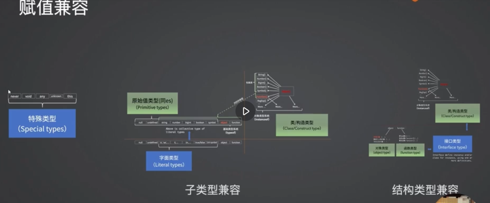
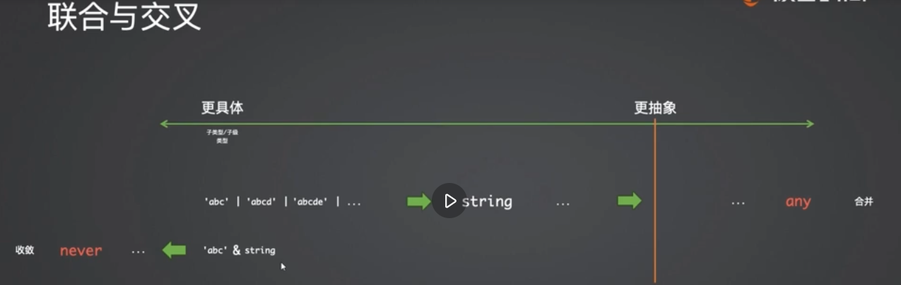
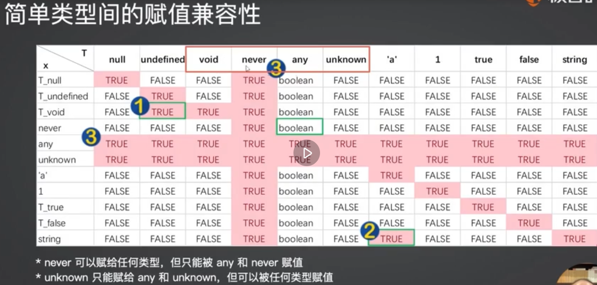
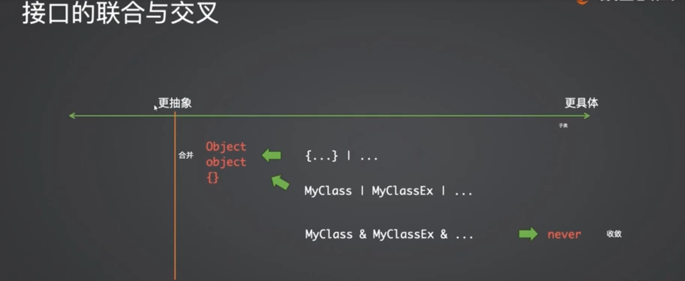

# typescript
## tsc
```bash
npm install -g typescript
tsc --init --target es2020 --module es2020 --lib es2020
```
## 基础
### 类型标注
const/var/let/function/class
### 类型兼容
子类型可以赋值给父类型

| 字面类型 | 原始类型 | 包装类型 | Object(祖先类) | Empty{}(空接口/空白对象)  |
| ------ | --------| ------ | -------------- | ---------------------- |
| 'abc'  | string  | String | Object         | Empty                  |
| \{...\}  | object  | Obejct |                | Empty                  | 

- 特殊类型 this/nerver/void/any/unknown
- 字面类型：原始值类型、类/构造兼容（子类型兼容）（赋值兼容）
- 接口类型：对象类型、函数类型、类/构造兼容（结构类型兼容）（赋值兼容）


### 交叉、联合类型
- 基础类型的交叉联合


  - 联合：往合并方向 -> any (并集)
  - 交叉：收敛方向 -> never (交集)
- 接口类型的交叉联合

  ```ts
  /*
    接口的联合
      - 1、接口联合类型可以被求值（结果是“Bird与Horse的公共父类”）
      - 2、求值并不一定有意义
      - 3、 type Animal = Omit<T, never> 获得是属性的交集
  */
  interface Animal {
      weight: string | number;
      leg: number;
  }
  interface Bird extends Animal {
      weight: number;
      wings: number;
  }
  interface Horse extends Animal {
      weight: string;
      id: string;
  }
  type T = Bird | Horse;
  // type Animal = Omit<T, never>; // clone
  let bird!: Bird;
  let horse!: Horse;

  let x1: T = bird;
  let x2: Animal = bird;
  let x3: Bird | Horse = bird;
  ```
  ```ts
  /*
    接口的交叉
      - 1、会深度遍历每一个成员的交叉（例如weight的类型交叉结果是never）
      - 2、交叉类型总是尽量向never收敛的
      - 3、 type BirdAndHorse = Omit<T, never> 获得是属性的并集
  */
  interface Bird {
      weight: number;
      leg: number;
      wings: number;
  }
  interface Horse {
      weight: string;
      leg: number;
      id: string;
  }
  type T = Bird & Horse; // & undefined & void & null & ...
  type BirdAndHorse = Omit<T, never>; // clone 
  // class MyClass implements T {
  // class MyClass implements Bird, Horse {
  class MyClass implements BirdAndHorse {
      weight: never;
      leg: number;
      id: string;
      wings: number;
  }

  let x:MyClass = new MyClass;
  ```
### 接口&类型别名
- 接口与类型别名区别
  - 相同：
    - 描述对象的形状和函数签名，被拓展
  - 不同：
    - 类型别名：用于一些其他类型，比如原始类型、联合类型和元组
    - 接口可以定义多次，会被自动合并为单个接口
```ts
//  type（功能更多）
type Name = string;
// tuple
type Data = [number, string];
// object
type PartialPointX = { x: number };
type PartialPointY = { y: number };
// union
type PartialPoint = PartialPointX | PartialPointY; // 联合类型
const obj:PartialPoint = {
  x:1
}
const obj2:PartialPoint = {
  y:1
}
const  obj3 : PartialPoint = {
  x:1,
  y:2,
}
// 接口（自动合并）
interface Point {
  x: number;
}
interface Point {
  y: number;
}
const point: Point = { x: 1, y: 2 };
```
### 类
```ts
// @ts-nocheck Disables semantic checking in a JavaScript file.
class MyClass {
  // private instance fields, TS3.8, `Class Fields` feature family in ES2022
  #a = 10;
  #f() { };
  get #f2() { return 'a'}
  // private class fields
  //   - Static and instance elements cannot share the same private name
  static #a2 = 10;
  static #foo2() { };
  // public instance fields
  b1 = 100;
  b2 = 'a';
  b3 = ()=>{ };
  // public class fields
  static d1 = 100;
  static d2 = 'a';
  static d3 = ()=>{ };
  constructor() { }
  c1() { }
  // get/set, async and/or *
  get c2() {
    return 1;
  }
  // static members, and more
  // ...
  // class static block, TS4.4, ES2022
  static { }
  // auto-accessor, TS4.9, ES proposal stage 1
  accessor x = 100;
}
```
### 类实现接口 implements
```ts
interface Point {
  x: number;
  y: number;
}
class SomePoint implements Point {
  x = 1;
  y = 2;
}
type Point2 = {
  x: number;
  y: number;
};
class SomePoint2 implements Point2 {
  x = 1;
  y = 2;
}
// A class can only implement an object type or intersection of object types with statically known members.
type PartialPoint1 = { x: number } | { y: number };
class SomePartialPoint implements PartialPoint1 { // 与类型别名有不同
  // Error
  x = 1;
  y = 2;
}
// ok
type PartialPoint2 = { x: number } & { y: number };
class SomePartialPoint implements PartialPoint2 {
  x = 1;
  y = 2;
}
```
- implements 实现：class专有
- extends 继承：class、interface都可以
### 联合类型
```ts
// 1
let num: 1 | 2 = 1;
type EventNames = "click" | "scroll" | "mousemove";
// 2 可辨识联合
type PartialPointX = { x: number };
type PartialPointY = { y: number };
type PartialPoint = PartialPointX | PartialPointY; 
let point: Point = {
  x: 1,
  y: 1,
};
let point1: Point = {
  x: 1,
};
let point2: Point = {
  y: 1,
};
```
### 交叉类型
```ts
// 接口
interface X {
  c: string;
  d: string;
}
interface Y {
  e: string;
}
type XY = X & Y;
let value: XY = {
  c: "1",
  d: "1",
  e: "1",
};
// 类型
type PartialPointX = { x: number };
type Point = PartialPointX & { y: number };
let point: Point = {
  x: 1,
  y: 1,
};
```

### 泛型
```ts
interface activity {
  activityName: string;
  activityId: string;
}
//数组泛型表示数组
const nodeList: Array<activity> = [];
const nodeList: Ref<Array<activity>> = ref([]);
```
### 高级类型操作符
- Awaited 获得Promise返回的类型
```ts
type A = Awaited<Promise<string>>;
// type A = string
type B = Awaited<Promise<Promise<number>>>;
// type B = number
type C = Awaited<boolean | Promise<number>>;
// type C = number | boolean
```

- Partial属性设置为可选
```ts
interface Person {
  name: string;
  age: number;
  address: string;
}
type PartialPerson = Partial<Person>;
const partialPerson: PartialPerson = {
  name: "Alice"
};
console.log(partialPerson); 
// 输出：{ name: "Alice" }
```
- ReturnType 获取函数类型的返回值类型
```ts
function add(a: number, b: number): number {
  return a + b;
}
type AddReturnType = ReturnType<typeof add>; // number
const result: AddReturnType = add(3, 5);
console.log(result); // 输出：8
```
- Record 给每一个属性赋值
```ts
type CatName = "miffy" | "boris" | "mordred";
interface CatInfo {
  age: number;
  breed: string;
}
const cats: Record<CatName, CatInfo> = {
  miffy: { age: 10, breed: "Persian" },
  boris: { age: 5, breed: "Maine Coon" },
  mordred: { age: 16, breed: "British Shorthair" },
};
```
- Pick 选出你要的属性
```ts
interface Todo {
  title: string;
  description: string;
  completed: boolean;
}
type TodoPreview = Pick<Todo, "title" | "completed">;
const todo: TodoPreview = {
  title: "Clean room",
  completed: false,
};
```
- Omit 排除你要的属性
```ts
interface Todo {
  title: string;
  description: string;
  completed: boolean;
  createdAt: number;
}
type TodoPreview = Omit<Todo, "description">;
const todo: TodoPreview = {
  title: "Clean room",
  completed: false,
  createdAt: 1615544252770,
};
```
- Exclude 排除联合类型/排除key
```ts
type T0 = Exclude<"a" | "b" | "c", "a">;
// type T0 = "b" | "c"
type T1 = Exclude<"a" | "b" | "c", "a" | "b">;
// type T1 = "c"
type T2 = Exclude<string | number | (() => void), Function>;
// type T2 = string | number
type Shape =
  | { kind: "circle"; radius: number }
  | { kind: "square"; x: number }
  | { kind: "triangle"; x: number; y: number };
type T3 = Exclude<Shape, { kind: "circle" }>
// type T3 = {
//     kind: "square";
//     x: number;
// } | {
//     kind: "triangle";
//     x: number;
//     y: number;
// }
```
### 类型断言
- as const
```ts
declare function handleRequest(url: string, method: "GET" | "POST"): void;
const req = { url: "https://example.com", method: "GET" };
handleRequest(req.url, req.method);
// Argument of type 'string' is not assignable to parameter of type '"GET" | "POST"'.
// req.method 被推断为字符串，而不是“GET”
```
```ts
// Change 1:
const req = { url: "https://example.com", method: "GET" as "GET" };
// Change 2
handleRequest(req.url, req.method as "GET");
// Change 3
// 您可以使用 as const 将整个对象转换为类型文字
const req = { url: "https://example.com", method: "GET" } as const;
// const req: {
//     readonly url: "https://example.com";
//     readonly method: "GET";
// }
handleRequest(req.url, req.method);
```
- satisfies 自动推导出来的类型
```ts
type Route = { path: string; children?: Routes }
type Routes = Record<string, Route>
const routes:Routes = {
  AUTH: {
    path: "/auth",
  },
}
routes.AUTH.path     // ✅
routes.AUTH.children // ✅
routes.NONSENSE.path // ✅
```
```ts
// satisfies
type Route = { path: string; children?: Routes }
type Routes = Record<string, Route>
const routes = {
  AUTH: {
    path: "/auth",
  },
} satisfies Routes
routes.AUTH.path     // ✅
routes.AUTH.children // ❌ routes.auth has no property `children`
routes.NONSENSE.path // ❌ routes.NONSENSE doesn't exist
```
- as const & satisfies
```ts
// 只用 satisfies
function navigate(path: '/' | '/auth') { ... }
const routes = {
  HOME: { path: '/' }
} satisfies Routes
navigate(routes.HOME.path) 
// ❌ Argument of type 'string' is not assignable to parameter of type '"/" | "/auth"'
// as const & satisfies
```
```ts
const routes = {
  HOME: { path: '/' }
} as const satisfies Routes 
navigate(routes.HOME.path) // ✅ - as desired
navigate('/invalid-path')  // ❌ - as desired
```
- 参考：https://article.juejin.cn/post/7240805459288113208
- 参考：https://cloud.tencent.com/developer/article/2212264
## 实践
### 兼容旧代码
- 场景：
    - 项目迁移，新项目使用ts，为了兼容旧项目的代码，
    - 兼容windows：全局变量、全局方法
- 解决思路：
    - 一个框架，在IIEF模式中使用，方法全部为暴露在window上的，继承其类型 `interface Window extends p5`
    - 自定义方法，则添加到 interface Window 中
```ts
import type p5 from "p5"
declare var read: () => void;
declare var write: (code:string) => void;
declare global {
  interface Window extends p5 {
      read: () => void;
      write:(code:string) => void;
  }
}
export {};
```
### 泛型使用
- 泛型是什么
    - 泛型其实就是封装相同操作的包裹体
    - 重复实现的过程，进行抽离，每次传入不同的类型值
- 场景：
    - 在react中父组件定义一个响应式的对象
    - 多个子组件对其中部分属性进行更新（非常常见的操作）
- 解决：
    - 更新的操作都是一样的，定义泛型
    - 更新的对象的属性不一样，进行传入
    - 多个地方都可以使用定义的泛型
```ts
// 定义 type 泛型
export type UpdateStateType<T> = (newState: Partial<T>)=> void;
export interface StatePropsType <T>{
    updateState: T
}
// 类型值
export type OrderStateType = { 
    aaa: string ; 
    bbb: number ; 
    ccc: string   
}
// 传入
export type UpdateOrderStateType = UpdateStateType<OrderStateType>
export type OrderStatePropsType  = StatePropsType<UpdateOrderStateType>
```

```ts
// 在react中使用
// 父组件 page.tsx
import Home from "./Home";

import {OrderStateType,UpdateOrderStateType} from "@/type/State"
export default function Home() {
    const [state,setState] = useState<OrderStateType>({
        aaa:"",
        bbb:0,
        ccc:""
    })
    const updateState:UpdateOrderStateType =  (newState) => {
        setState(prevState => ({ ...prevState, ...newState }));
      };
    return (
        <Home updateState={updateState}>
            <div>{state.aaa}</div>
        </Home>
    );
}
// 子组件 Home.tsx
import {OrderStatePropsType} from "./State"

const Home: React.FC<OrderStatePropsType> = ({updateState}) => {
    const handle =  () => {
        updateState({aaa:"111"})
    }
    return <div></div>
}
export default Home
```
### 函数声明 vs 箭头函数
- 场景
    - react中一个组件可以是函数声明导出，也可以是箭头函数导出
    - 有什么区别吗
- 区别 (写法区别)
```ts
// React.FC<OrderStatePropsType> 是Home这个方法的类型
const Home: React.FC<OrderStatePropsType> = ({updateState}) => {
    const handle =  () => {
        updateState({aaa:"111"})
    }
    return <div></div>
}
export default Home
```
```ts
// 函数声明写法
// 使用 ReturnType<React.FC<OrderStatePropsType>> 函数类型的返回值类型
// 参数类型判断 {updateState}:OrderStatePropsType
export default function Home ({updateState}:OrderStatePropsType):ReturnType<React.FC<OrderStatePropsType>>{
    const handle =  () => {
        updateState({aaa:"111"})
    }
    return <div></div>
}
```
### jsDoc
- JSDoc 是在 js 的注释里通过 @type、@typedef、@template、@param 等来定义类型，然后开启 checkJS 和 allowJS 的配置之后，tsc 就可以对 js 做类型检查
参考：https://cloud.tencent.com/developer/article/2351090

